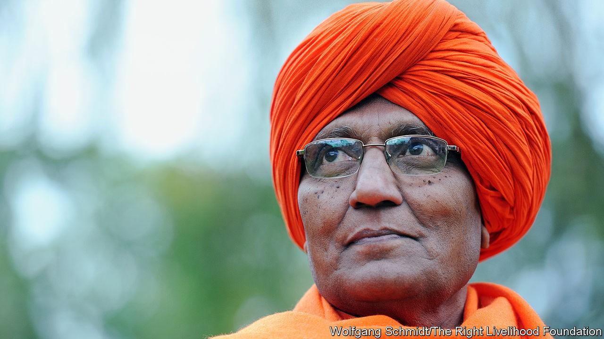

## Of human bondage

# Swami Agnivesh died on September 11th

> The liberator of India’s bonded labourers was 80

> Oct 10th 2020

THE HINDU life-stage of sanyasa, or renunciation, is traditionally the last. The elderly lay aside their material possessions and take up a spiritual existence, perhaps in some remote ashram in the forest or the hills. Vepa Shyam Rao, as he was then, was only 30 when he took the title of Swami, or monk, put on saffron robes and travelled to Haryana, in northern India. His mission was still not quite in focus, but his philosophy was. He had gladly renounced his life as a lawyer and lecturer in management studies in Kolkata, reducing what he owned to his robes and a bagful of books. His career and his things he could lightly put aside. But the world and its problems, no.

His life from that moment was focused on some of the hardest parts of that world. The stone quarries outside Delhi, for example, where men, women and children were paid five rupees a day to dig out, shift and break great blocks of stone, as though they were beasts of burden. The unventilated, deafening carpet workshops where labourers were sometimes chained to the looms and locked in at night. Silk factories where hands already white with blisters plunged repeatedly into scalding water to reel the fibres from the cocoons, and tanneries where arms were burned with toxic chemicals. Outside his penetrating gaze, but mentioned in whispers, were the punishments for working slowly: a blow on the head from a brick, a beating while tied to a neem tree, or simply non-payment of the pitiful few coins that were supposed to have been earned.

Almost all this labour, he discovered in Haryana—which was a hotbed of it—was indentured servitude. The workers were landless Dalits or their children, forced to borrow to pay for medicines or dowries from a local, higher-caste moneylender. The average loan was around 2,000 rupees, or $27, but at interest rates of 40% or more it could seldom be paid back. Payment was made in the form of labour from which workers could not escape, and the debt was passed down the generations.

Many of these enslaved workers were therefore children, some as young as four or five. By his own estimates, of perhaps 60m bonded workers, 15m were under 14. Once he was on the watch for them he saw them everywhere: bending all day over tobacco baskets to hand-roll beedis, gathering broken cups outside teashops, picking rags. Their small, soft hands were thought ideal for delicate jobs such as knotting threads, dozens to each square centimetre, in carpet-making. But their bodies were deformed by it, and their lives shortened. There were laws against this, as against bonded labour in general. They were rarely enforced, because servitude was accepted as part of the natural order.

He did not accept it. In 1981 he set up the Bonded Labour Liberation Front, raising money to buy the freedom of as many workers as possible and to teach the rest what their rights were. Almost recklessly, because his bright robes advertised him everywhere, he and his helpers slipped into the wretched shanty-villages to encourage the labourers to organise. Eventually unions were created for stone-cutters, builders and brick-kiln workers; meanwhile, he battled employers in the courts. Those workers he managed to rescue—around 178,000 in all, roughly 26,000 of them children—were trained for new jobs or sent, for the first time, to school.

Much of this, especially the shouts of “Revolution!” after some of his worker meetings, seemed more political than priestly. But he did not see a distinction. He had decided early, under the influence of the Arya Samaj movement and the works of Gandhi and Marx, that his dharma or spiritual duty was to go among the poor, serving them. He called this “Vedic socialism”; and though completely guided by the Vedas, the most sacred texts of Hinduism, it had to involve political action. When followers treated him as a monk, bending to touch his feet in respect, he would tell them to stop; he might recite a verse from an Upanishad one moment, but the next he would be quoting, by paragraph number, an article of national law. In the late 1970s he actually became a politician in Haryana, and briefly education minister. But he fell out with the government when police fired on protesting bonded workers, and after that he was a one-man political party.

As such, he cast his interests wide. He took up the cause of tribal peoples without land rights and of farmers who could not get fair prices. He campaigned for better treatment of Dalits overall and pushed for laws empowering women, leading marches across India to protest against sati and female foeticide. In the villages, where he explained that God had created the Sun and Moon for men and women alike, he was feted as a celebrity, garlanded with marigolds and led round on elephants. The attention embarrassed him, but the publicity was good: the same reasoning that led him to appear in 2011 on the reality-TV show “Bigg Boss”, where he hoped he could bring peace to the other contestants in the house.

In that role of peacemaker, he also trekked in 2011 into the forests of Chhattisgarh to oversee the handover by Maoist rebels of five abducted policemen. (In general, he thought the Maoists had been driven to violence by injustice, and urged the Indian government to talk to them.) He called often for dialogue with Muslims, too. This sort of thing got him regularly beaten up as anti-Hindu, a suggestion with which he had no patience. Certainly he rejected barbarisms such as sati, or the superstitious worship of stone idols. But the true enemies of Hinduism were elsewhere, in the Hindutva movement championed by the prime minister, Narendra Modi: fundamentalists who had perverted the sacred, inclusive power of Hinduism for partisan and nationalist ends. He saw nothing but calamity in the growth of that ideology in India.

His work with bonded labourers also caused him disappointment. Relatively speaking, he had rescued few, and the practice went boldly on. He might have taken heart, though, from the number who came to his funeral, shyly recounting to reporters the horror of their work before, and their hopes now. They, in particular, were glad he had not made his sanyasa in some remote mountain or forest but with them, in the weariness and pain and dust. ■

## URL

https://www.economist.com/obituary/2020/10/10/swami-agnivesh-died-on-september-11th
