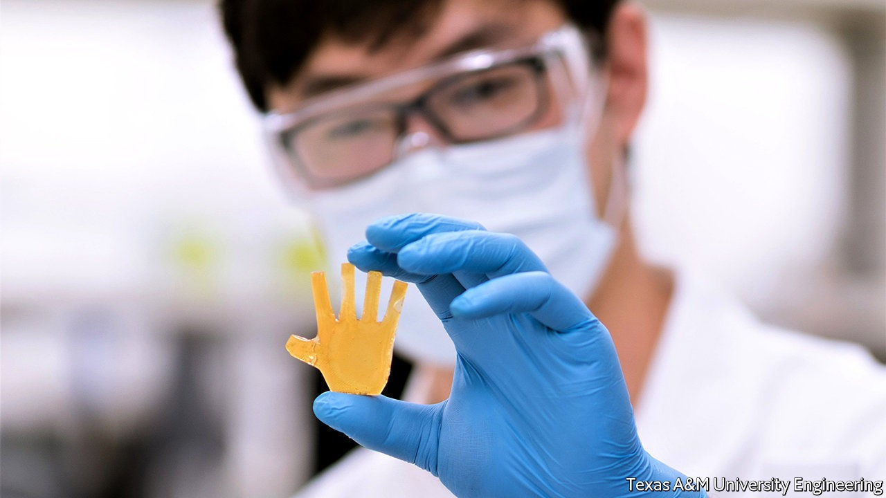

## New materials

# A novel polymer should make 3D printing more effective

> A joint approach

> Oct 10th 2020

MATERIALS SCIENTISTS have long sought to emulate biology’s trick of joining materials that have wildly different properties into seamless functional units with no weak points, in the way that bones, connective tissue and skin are joined into limbs. Conventional manufacturing techniques, in which components of different composition are first created, and only then fitted together, make such emulation hard. However, three-dimensional (3D) printing, which permits materials to be blended as they are applied to a growing structure, offers a way to do this in principle. And a group of researchers at America’s Army Research Laboratory and Texas A&M University, in College Station, now think they have turned principle into practice.

The materials they are interested in are called interbonding polymer networks, and those they have lighted on in particular share the same underlying chemistry. A simple polymer is a molecular chain, the links of which are called monomers. Interbonding polymer networks involve a second set of monomers that form chemical links with the first. Crucially, these second monomers are symmetrical molecules, so both ends can make such links. This means they can bind polymer chains together by forming cross-links at numerous places between chains, to create a structure resembling a net. The physical properties of this net will depend on the density of cross-links. And that density is under the control of the chemists doing the mixing.

According to Svetlana Sukhishvili, who leads the Texas A&M side of the project, the pair of monomers the team has chosen can be used thus to make materials with stiffnesses ranging from the consistency of soft rubber to the sort of hard plastic used for car bumpers and aircraft canopies. Crucially, the pre-polymerisation mixtures of these monomers have the same viscosity regardless of the final mechanical properties of the polymer networks they result in. This means that, if printed together, they blend easily with one another when they come into contact rather than suffering what is known as weak interlayer adhesion—a bane of standard 3D printing that can cause objects so printed to split apart when stressed. The results are strong enough to act as load-bearing members.

Obtaining the desired variety of properties in an object is simply, therefore, a question of loading a set of printing nozzles with different pre-polymerisation mixtures and swapping them around as needed. Doing so can create, for example, a wheel with a hard-wearing outer surface and a shock-absorbing interior, or a rotor blade that is flexible but has a rigid supporting spine for strength. Interbonding polymer networks could also make better surgical prosthetics.

On top of this, if components made of the new material get damaged, any small cracks will seal up spontaneously, even without heating. Cracks propagate through the stuff by pulling the cross-links apart. Once the crack-causing force has gone, these links reform spontaneously. At room temperature, according to Frank Gardea, Dr Sukhishvili’s opposite number at the Army Research Laboratory, fractures disappear and the material heals itself within 12 hours. Dr Gardea says that with stiffer versions of the material, heat may need to be applied for full healing, and they are looking at ways of doing this. Continuous self-repair could greatly extend the life of components which otherwise succumb to normal wear and tear.

The new materials also have “shape memory”. If they are deformed, heat will cause them to revert to their original configuration. Conversely, an object in its original preferred shape can be reprogrammed to adopt a new one by heating, deforming and cooling it.

One early application of the new materials will be to make components for American army robots. As a prototype of this approach the researchers have built a miniature hand, the fingers of which employ the material’s shape-memory effects to move without motors. Dr Gardea suggests that another application might be to create shape-changing drones which could, like birds, alter their wing conformations in flight to switch between efficient cruising, high-speed sprints and extreme manoeuvrability. Dr Sukhishvili, meanwhile, is looking into programming the new materials to respond to light. By adding photosensitive molecular units to the polymer networks it might, she thinks, be possible to change their properties, including stiffness and shape, merely by illuminating them appropriately. That would, as it were, give a whole new meaning to the idea of photo manipulation. ■

## URL

https://www.economist.com/science-and-technology/2020/10/10/a-novel-polymer-should-make-3d-printing-more-effective
