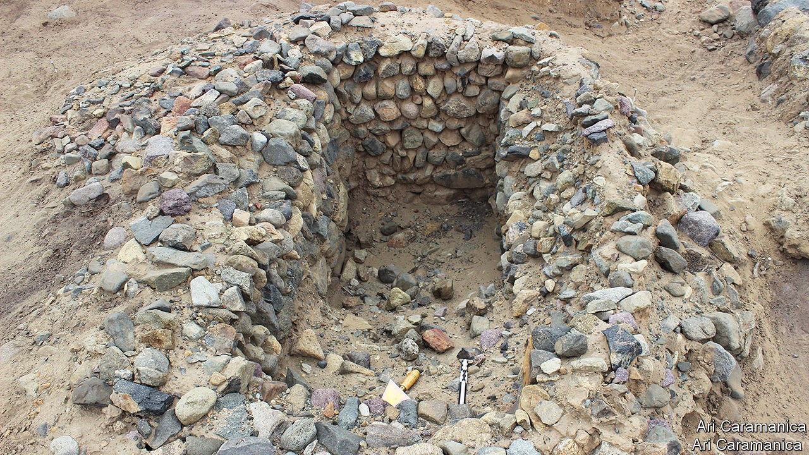

## South American agriculture

# Farmers of old relied on El Niño

> Modern ones simply put up with it

> Oct 10th 2020

EVERY FOUR or five years, vast quantities of warm water build up along the west coast of South America. This phenomenon, El Niño, creates storms that cause devastating floods. The result is costly. In 2017, for instance, El Niño shut down northern Peru’s sugar-cane business.

Modern farmers view El Niño stoically. They use money saved in good years to rebuild in bad ones. But history suggests it need not be like that. In a paper published recently in the Proceedings of the National Academy of Sciences, Ari Caramanica, an archaeologist at University of the Pacific, in Lima, shows how it used to be done. And the answer seems to be, “better”.

Dr Caramanica and her colleagues have been studying the Pampa de Mocan, a coastal desert plain in northern Peru. Pampa de Mocan is not ideal for farming. Its soil contains little organic matter and the annual rainfall in non-Niño years is usually less than two centimetres. Today’s farmers therefore depend on canals to carry water from local rivers to their fields.

It had been assumed that ancient farmers had a similar arrangement—and so they did. But Dr Caramanica also found eight canals that could carry water far beyond the range of modern farms. Since the climate was similar to the present day’s when these canals were dug, and the river no higher, she hypothesises that they were intended to guide the floodwaters arriving during Niño years. Around a quarter of the ancient agricultural infrastructure of this area seems to have been built solely for managing Niño-generated floodwaters.

Evidence from pollen supports this theory, revealing that Pampa de Mocan produced lots of crops in some years, while remaining nearly barren in others. The team also uncovered two cisterns in the area serviced by the extended canals. These, presumably, were used to store surplus floodwater. They excavated one (pictured) and found it had a capacity of 300-400 litres.

These findings suggest that, rather than resisting El Niño, early farmers in Pampa de Mocan were ready to make use of it when it arrived. Precisely how they managed their fields in Niño years remains to be discovered. But it seems likely that farmers only sowed seeds in flood fields in preparation for the deluges to come in years when they had first noticed coastal waters warming. Given that these farms remained productive until just before the conquistadors arrived—a period of nearly 2,000 years—modern farmers might do well to learn from them. ■

## URL

https://www.economist.com/science-and-technology/2020/10/10/farmers-of-old-relied-on-el-nino
