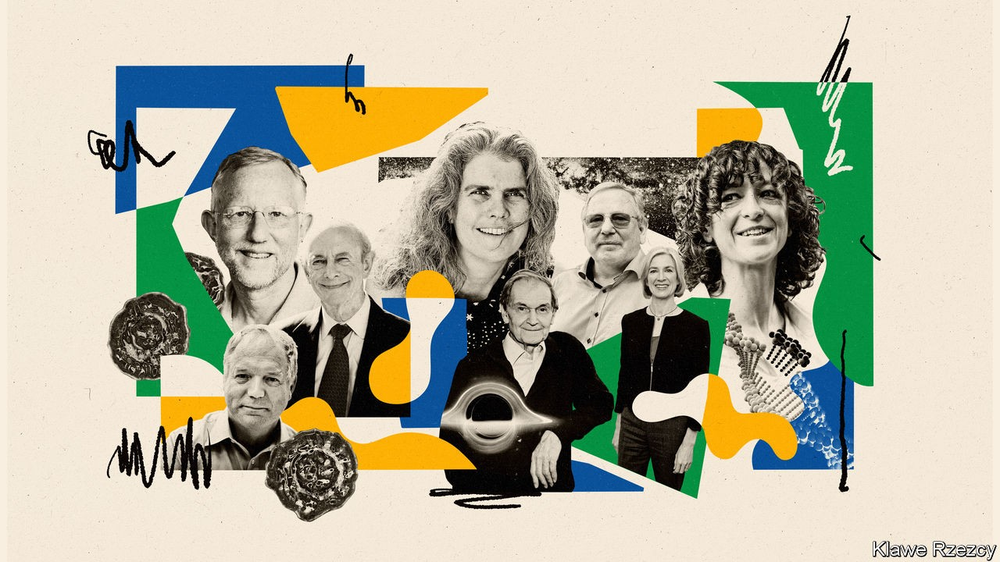
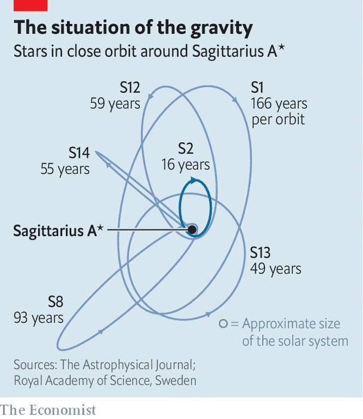

## Scientific awards

# Who won this year’s Nobel science prizes?

> The laureates proved black holes are real, created a new form of gene editing and identified the hepatitis C virus

> Oct 8th 2020

OCTOBER’S FIRST week is a nervous time for scientists with serious accomplishments under their belts—for this is when the phone might ring from Stockholm. Those who give out the Nobel science prizes (the Karolinska Institute for the physiology or medicine award, and Sweden’s Royal Academy of Science for the awards in physics and chemistry) are known neither for offering the winners more than an hour or two’s notice of the public announcement of their success, nor for respecting time zones. New laureates in North America receive the news in the dead of night. That, though, is normally reckoned a small price to pay for what is still seen as science’s most prestigious honour.

Britain being in a more convenient time zone from the Swedish point of view, Sir Roger Penrose, of Oxford University, was not actually asleep when his own phone rang. But he was, he says, in the shower. He was one of three winners of the physics prize, the others being Andrea Ghez and Reinhard Genzel, of the University of California’s Los Angeles and Berkeley campuses respectively. Their prize was for the theoretical explanation and subsequent discovery of some of the strangest objects in the universe: black holes.

Black holes are, famously, so dense that nothing, not even light, can escape their immense gravitational pull. A black hole’s centre is thought to be a point of infinite density, called a singularity, where the known laws of physics break down. Though the possibility that they existed was hypothesised a century ago, as a consequence of Einstein’s general theory of relativity (which is actually a theory of how gravity shapes the structure and contents of the universe), early work suggested that they could form only from the collapse of perfectly symmetrical stars or gas clouds. That is hardly realistic, and Einstein himself doubted that they actually existed.

They therefore remained a theoretical curiosity until 1965, when an as-yet-unknighted Dr Penrose worked out the specifics of how real matter could collapse in a way that would form one. He showed, using a mathematical concept which he called a trapped surface, that even asymmetric, clumpy stars and dust clouds could become black holes. This work provided the tools needed by observational astronomers to go out hunting for them.

By definition, it is impossible to see a black hole directly. Instead, physicists glean insights into them by studying the effect of their gravity on the motion of their stellar neighbours. Dr Ghez and Dr Genzel used this idea to gather evidence that Sagittarius A*—a bright source of radio waves at the centre of the Milky Way, Earth’s home galaxy—is actually a supermassive black hole around which all the stars in the galaxy, the Sun included, orbit.

Dr Ghez and her team employed the Keck Observatory telescope, in Hawaii, with its ten-metre-wide primary mirror, to make their observations. Dr Genzel’s group used a series of eight-metre-wide telescopes high in the mountains of the Atacama desert, in Chile, for theirs. These instruments were all sensitive enough to peer through the clouds of dust that otherwise obscure the heart of the Milky Way.

Over three decades both sets of researchers, working independently, tracked around 30 of the brightest stars at the galactic centre (see chart). A star called S2, for example, takes 16 years to complete an orbit of Sagittarius A*, and, at its closest approach, comes within 17 light-hours of it. These measurements have permitted astronomers to piece together a picture of Sagittarius A* as a black hole of around 4m solar masses, packed into a region of space that is about the size of the solar system.

April 2019 saw the release of the first-ever image of a black hole (Sagittarius A*’s local equivalent at the centre of a galaxy called M87, 53m light-years from Earth). This was taken, in radio frequencies, using the Event Horizon Telescope, a collaboration that links eight existing radio telescopes all around Earth and thus permits far higher resolution than any single instrument could manage. As technology improves, the Event Horizon Telescope could also one day provide a more detailed image of the region around Sagittarius A*.

As is often the way, the chemistry prize went for a discovery that might equally well have been handed out for medicine—CRISPR-Cas9 gene editing. The winners were Emmanuelle Charpentier of the Max Planck unit for the science of pathogens, in Berlin, and Jennifer Doudna of the University of California, Berkeley.

CRISPR-Cas9 is derived from a bacterial defence mechanism that snips small sequences of DNA from viral interlopers and copies them into a bacterium’s own genome, thus creating a scrapbook by which to recognise such aggressors, should they come again. The laureates’ prize is not, though, for the mere discovery of a novel bacterial immune system. It is for the adaptation of that discovery into the most important gene-editing tool yet invented—one that is already helping to design disease-resistant crops and new therapies for cancer, and which may, perhaps, end hereditary disease in human beings.

If an organism’s collective DNA can be thought of as the book of its life, CRISPR-Cas9 allows for any specific sequence of words within that book to be identified, selected, removed and replaced. This is done by creating a molecule called a guide RNA, which matches a target DNA sequence, and pairing it with an enzyme, Cas9, that is capable of snipping the DNA helix at this point. Then, if so desired, a new piece of DNA can be inserted.

The laureates’ path to Stockholm began at a café in Puerto Rico in 2011. That was when Dr Charpentier, who had discovered intriguing and unexplained RNA fragments in a bacterium, engineered a meeting with Dr Doudna, an expert in the DNA-snipping capability of Cas proteins. Since this collaboration bore fruit in 2012, progress has been rapid. By February 2013 Feng Zhang of the Broad Institute in Cambridge, Massachusetts and George Church of Harvard Medical School had independently demonstrated the technique’s effectiveness in mouse and human genomes, paving the way for the treatment of human diseases. Clinical trials are now under way to test its power against sickle-cell anaemia and certain cancers, with animal experiments showing promising results in the treatment of muscular dystrophy.

There has also been controversy. In 2018 He Jiankui of the Southern University of Science and Technology, in Shenzhen, China, announced the birth of twin girls whose embryos he had edited with the help of CRISPR-Cas9. Dr He’s stated goal was to induce immunity to HIV, by disabling the gene for a protein which that virus uses to gain admission to cells. This was too much for the authorities. Even ignoring the issues of consent involved when a procedure is carried out on an embryo, making genetic edits so early in life means that they will be incorporated into germ cells, and thus passed down the generations. That raises serious ethical questions, and what Dr He did was declared illegal by the Chinese government. Dr He is now in prison.

Nor is germ-line editing the only controversy surrounding CRISPR-Cas9. A further complication concerns who gets the patents that will monetise it. The University of California and the Broad have been involved for years in a legal battle over the matter. By giving the prize to Dr Doudna and Dr Charpentier the Royal Academy of Science may have put its thumb on the scales. In picking them it has also, for the first time, awarded a Nobel science prize to an all-female group. Dr Charpentier, via a phone link to the room where the announcement was made, said “I hope this provides a positive message to young girls. Women in science can also be awarded prizes. But more importantly, women in science can also have an impact.”

Regardless of which category it truly fits into, the creation of CRISPR-Cas9 was a high-end piece of technowizardy. The actual prize for medicine, however, went for a piece of old-fashioned medical detective work—the identification of hepatitis C, a virus that causes life-threatening liver infections and is passed on by exposure to contaminated blood. Though other widespread diseases, such as malaria and HIV/AIDS, gain more attention, the World Health Organisation (WHO) reckons that around 70m people are infected with hep C and that it kills 400,000 people a year. Hep C has also, in the past, turned the business of blood transfusion into a lottery, since there was no way to tell whether a particular batch of blood harboured it. That this is no longer the case is, in no small measure, thanks to the work of this year’s laureates—Harvey Alter, Michael Houghton and Charles Rice.

Dr Alter’s work came first. In the 1960s he was a colleague of Baruch Blumberg, who discovered the hepatitis B virus (for which he won a Nobel prize in 1976). Hepatitis viruses are labelled, in order of discovery, by letters of the alphabet. “A”, a waterborne pathogen, causes an acute infection that passes after a few weeks and induces subsequent immunity. The effects of “B” and “C”, though, are chronic and may result eventually in cirrhosis and cancer. Blumberg’s discovery led him to a vaccine for hep B, and also meant that blood intended for transfusion could be screened. But it became apparent that such screened blood still sometimes caused hepatitis, albeit at lower rates. Since hep A was also being screened for by this time, that suggested a third virus awaited discovery.

In 1978 Dr Alter, then working at America’s National Institutes of Health, proved this was true by injecting into chimpanzees blood from recipients of transfusions screened for the known viruses who had nevertheless developed hepatitis. These animals sometimes then went on to develop the illness. It took until 1989 to clone the new virus. That was done by Dr Houghton, who was then working at Chiron, a Californian biotechnology firm subsequently bought by Novartis, a Swiss pharmaceutical giant.

Dr Houghton amplified viral genetic material drawn randomly from chimpanzees infected with the as-yet-unidentified virus and tested this against antibodies from infected humans. Antibodies are proteins crafted by the immune system to stick specifically to parts of particular pathogens. By looking at which chimpanzee-derived material the antibodies in question attached themselves to, Dr Houghton was able to isolate the virus and identify it as a type of flavivirus, a group that also includes yellow fever and dengue. He also thus provided a way of screening blood intended for transfusion.

Dr Rice, working at Washington University, in St Louis, Missouri, eliminated lingering uncertainties about whether the flavivirus Dr Houghton had identified was the sole cause of hep C. Attempts to use cloned, purified versions of it to infect chimpanzees had not worked, leading to doubts about whether it was acting alone. Dr Rice identified part of the viral genome which looked crucial to the process of infection, but was highly mutable. He suspected that this mutability was hindering successful infection in the laboratory, and was able to eliminate it by genetic engineering. The stabilised virus was, indeed, infectious to chimps.

The consequence of all this is that blood for transfusion can now be screened routinely for hep C, and drugs to treat it have now been developed. Unfortunately, this has not stopped the march of the illness. Those in rich countries have benefited. Deaths in Britain, for example, fell by 16% between 2015 and 2017. But the wider picture is grim. Some countries, such as Egypt, have recently done well. Others, less so.

One reason is that, besides transfusion, hep C is spread by drug users sharing needles. It can also be spread sexually. This stigmatises it in the eyes of some. And unlike HIV/AIDS, which spreads in similar ways but quickly developed a political lobby to find a treatment once it was discovered, no one spoke up at the beginning for those suffering from the effects of hep C.

That is starting to change. In 2016 the WHO published a strategy for the elimination of all forms of hepatitis. The tools are there to do this. Whether the will to use them also exists remains to be seen.■

## URL

https://www.economist.com/science-and-technology/2020/10/08/who-won-this-years-nobel-science-prizes
