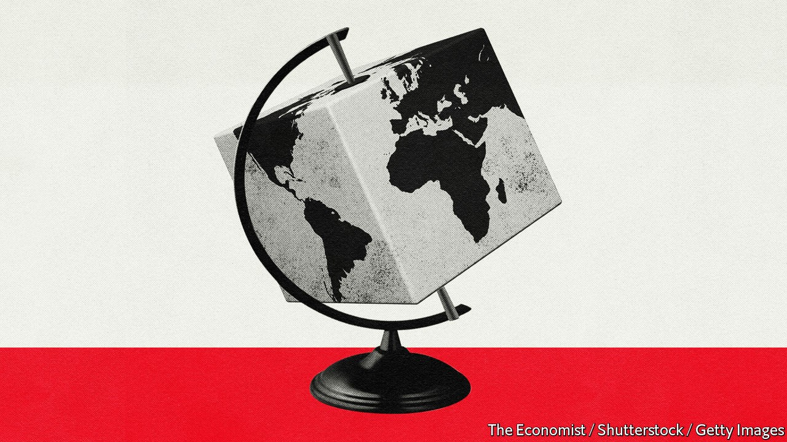
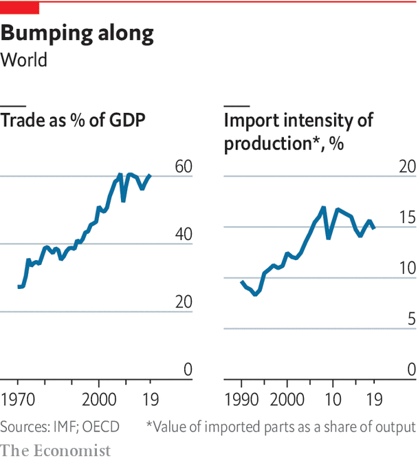

## International trade

# Changing places

> The pandemic will not end globalisation, but it will reshape it

> Oct 8th 2020

FOR A TIME economic contagion seemed more threatening than the pathological kind. Though the spread of covid-19 was mainly in China, the damage was appearing along supply chains that produce the world’s goods, notably cars and consumer electronics. China is the world’s second-biggest exporter of parts, so as its factories shut down, manufacturers everywhere faced delays. Even before the virus took off in South Korea, Hyundai had halted production because of a shortage of imported parts. The World Economic Forum (whose annual bash in Davos epitomises globalisation) advised companies to bring production closer to customers.

As the pandemic spread, location ceased to matter much. There was no escaping the disease: the world economy saw its deepest, most synchronised collapse on record. Some of the least globalised economic activities—restaurants, cinemas, fitness classes and other services—suffered most. More than goods, people stopped crossing borders; Davos 2021 was postponed. However, the supply-chain panic has left a lasting impression. For business, it is further evidence of the risks of distant disruption. For governments it offers more reasons to turn inward. The result is to accelerate changes to globalisation that were already in train.

Global supply chains were forged in the period from the mid-1980s until the financial crisis 25 years later. Trade surged in volume and changed in nature. It grew nearly twice as fast as global output, as emerging markets in Asia were bedded in to the world economy. After China joined the World Trade Organisation in 2001, its share of world exports of many parts and capital goods grew from under 10% to over 30%. Countries often specialised not in specific goods, but in bits of them. Taiwan, South Korea and Japan made semiconductors for the consumer-electronics industry. China supplied parts to German carmakers. The rise of computing made such complexity manageable. Globalisation brought cheaper goods to the rich world and, thanks to what Ben Bernanke, then Fed chairman, called a “global saving glut”, low interest rates. It also displaced many workers. Perhaps a million Americans lost their jobs to Chinese competition.

The 2010s slammed on the brakes. Trade stagnated as a share of GDP; foreign direct investment fell. As China’s middle class grew, it consumed domestically more of what it produced. Its share of world exports stopped rising in 2015, but its share of world imports continued to grow. As manufacturing became more automated, savings from locating production where workers were cheapest shrank. The rise of social media made consumer fads more volatile, necessitating faster production and shipment to satisfy impatient buyers. “Just in time” delivery of parts worked better with closer suppliers. And disasters highlighted the risk of a specialised economy. The tsunami that hit Japan in 2011 cut Toyota’s production in America by nearly a third because of a shortage of parts, while flooding in Thailand inundated factories producing a quarter of the world’s hard drives. Firms began to see long supply chains as unwieldy and risky. Trade started to concentrate in regional blocks. Globalisation became slowbalisation.

Then Donald Trump was elected in November 2016, and a trade war began between America and China. Companies realised they were exposed to political risk from economic nationalism, as much as from distant disruption. In 2019, as average American tariffs on Chinese imports rose from 12% to 21%, and tariffs in the other direction rose from 17% to 21%, America’s share of Chinese imports and exports fell to its lowest in 27 years, before China’s WTO entry. America circumvented and then sabotaged the WTO, stopping the nomination of judges to its appeal board and thus its ability to adjudicate trade disputes. In Europe Britain voted for Brexit in June 2016. Many European leaders grew frustrated with unfettered markets, wishing to have national champions that could compete with China’s state-backed giants.

The blow struck by covid-19 has made supply chains a “CEO and board level topic,” says Susan Lund of McKinsey, a consultancy. Until this year, she says, many firms did not realise how much their supply chains depended on China. In a survey conducted by McKinsey in May, some 93% of firms reported plans to make supply chains more resilient. The firm finds 180 products for which a single country accounts for over 70% of exports and reckons the production of 16-26% of goods exports could change location in the next five years. Firms are worried not just about trade wars and other shocks, but about their environmental footprint and labour standards. These are easier to monitor closer to home.

Covid-19 has also given politicians a chance to indulge their protectionist instincts. The origin of the virus in Wuhan gave Mr Trump a stick with which to beat China, and another multilateral institution, the World Health Organisation, on which to pour scorn (and, in this case, begin withdrawing from). There has been an upsurge in government intervention to protect jobs and rescue firms; by the end of April the EU had approved more than €2.2trn ($2.6trn) in state aid. Even before the pandemic France and Germany wanted Europe’s state-aid and competition rules loosened in the name of promoting national champions.

Politicians have also come to realise how much health-care systems depend on trade. Shortages of personal protective equipment (PPE) spurred many to limit or block exports of these and similar goods. The IMF counts 120 new export restrictions this year. For many medical goods production is highly concentrated: China accounts for 60% or more of exports of antibiotics, sedatives, ibuprofen and paracetamol. Britain has launched “Project Defend”, which will try to reduce reliance on Chinese production of critical products with a mix of reshoring and guarantees that supplies pass through friendly countries.

Unhappily, the political appeal of protectionism grows during slumps. When economies lack demand, governments covet spending that leaks overseas on imports. This is what led to a devastating round of protectionism in the 1930s. Protection also rose after the financial crisis. It does not help that China’s stimulus has tried to keep production going, whereas rich-world governments have supported household incomes. Brad Setser of the Council on Foreign Relations, a think-tank, notes that China’s current-account surplus, which was shrinking, has exploded this year. Its exports have recovered strongly, outward flows of tourists have all but stopped and commodity prices have fallen, making imports cheaper. Were China’s trade surplus in July sustained for a year it would add up to $700bn, surely enough to worsen the trade war with America even if Joe Biden replaces Mr Trump.

Such is the confluence of forces bearing down on global trade—organic slowbalisation, trade wars, suspicion of supply chains—that some draw comparisons between today and the early 20th century. Then, a peak in globalisation collapsed under the weight of the first world war, Spanish flu and then the 1930s depression.

The comparison is too pessimistic. Trade has not done as badly as feared. In April the WTO forecast that goods trade would fall by 13-32% this year; today it seems more likely to be just 10%. The IMF says the decline in trade will be commensurate with the slump in demand from the recession. That is in contrast to the aftermath of the financial crisis, when trade fell by more than its usual relationship with GDP suggested. It also shows that supply chains have not been wholly wrecked. They were crucial for the response to PPE shortages, argues Sébastien Miroudot of the OECD club of mostly rich countries. South Korea, which has been exporting millions of test kits to America and Europe, was uniquely placed to ramp up production using existing supply chains and relationships.

The logic of turning inward in response to the pandemic is shaky. A recent working paper by Barthélémy Bonadio of the University of Michigan and three co-authors studies 64 countries and finds that one-quarter of the drop in GDP this year was transmitted along supply chains, but that reshoring production would not have reduced the damage. Mr Miroudot distinguishes a supply chain’s robustness (the ability to keep working through a crisis), from its resilience (the ability to bounce back from one). The history of supply chains is that they are not robust but they are resilient, because companies are quick to find workarounds. Their robustness could be improved, but not by repatriating production, since disaster can strike at home as well. Had New York been the centre of mask production when covid-19 struck, the result would have been a “real big mess”, argues Shannon O’Neil of the Council on Foreign Relations.

Governments might choose to ignore all this in favour of protection. But most firms are not about to abandon their cross-border investments. A survey by the US-China Business Council shows little change in the number of American firms saying they have moved or plan to move out of China. The survival of the “phase one” trade deal struck in 2019 suggests that even the Trump administration knows there are limits to the desirability of decoupling from China. Rather than a wholesale break, covid-19 is likely to cause an acceleration of forces already in motion. Firms will trade off a bit of efficiency for more robustness, realising that in the long run the robotisation of manufacturing may lead to more local production anyway. Governments will shorten and diversify supply chains for medical equipment. But America and China will trade under a darker cloud of mutual suspicion, balancing commercial and geopolitical interests.

Further ahead the future of globalisation will be determined less by goods than by services. Before covid-19 services trade was not suffering from slowbalisation: it was growing faster than GDP. Exports of services account for around a fifth of all trade, according to the WTO (although what exactly counts as services trade is a matter of some debate). Like trade in goods, trade in services has suffered this year as tourist flows have collapsed. But consumers are unlikely to have suddenly lost their taste for travel, and countries have little long-term incentive to close borders to tourists. It seems likely that tourism will eventually rebound.

Meanwhile, the surge of investment in remote working during 2020 might open the door to more trade in digital services. When work is carried out remotely, it does not matter where it is done. On the more futuristic end, this involves remote presence. Whereas the export of repair services previously required high-skilled engineers to cross borders, virtual- and augmented-reality technologies now allow experts in one country to help lower-skilled workers fix machines in another, says Ms Lund. Richard Baldwin of the Graduate Institute in Geneva points to the potential for remote workers in poor countries to carry out basic office tasks for firms in the rich world. Before the pandemic the WTO was already talking up the potential for more trade in digital services, predicting that if developing countries adopted digital technologies, they could reap the rewards of a higher share of international services trade.

Services trade is hard to liberalise because it often means harmonising regulations. Fields such as education, health care, accounting and finance are littered with barriers to entry and requirements for local credentials. The most successful model for remotely provided services is India’s IT sector, which faces few regulatory hurdles. But disputes over cross-border data flows and the taxation of internet giants augur badly for faster digital integration. Digital trading, just like trade in goods, is increasingly concentrated in regional regulatory blocks. Yet Mr Baldwin argues that the rise of online services trade will bypass tensions between East and West, because it will take place within time zones: South America will supply cheap digital services to North America, Africa to Europe, and South-East Asia to North-East Asia.

The increased digitisation brought on by covid-19 can only help services trade, even as goods trade continues to slowbalise. But the extent of that help depends on how much the pandemic reshapes labour markets, the subject of the next chapter.■

See next article: [The transition to remote work is welcome. But it will be painful](https://www.economist.com//special-report/2020/10/08/zoom-and-gloom)

## URL

https://www.economist.com/special-report/2020/10/08/changing-places
