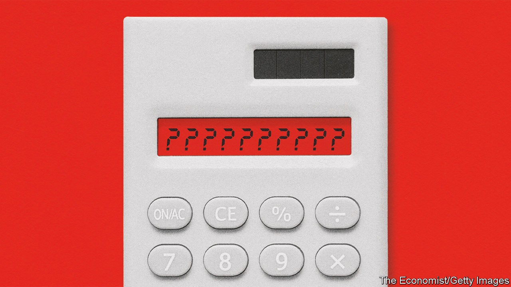

## Emerging markets

# Prognosis uncertain

> Covid-19 has not brought on an emerging-market crisis—but it could

> Oct 8th 2020

POORER countries depend on trade more than rich ones, especially on exports of tourism and commodities. They have fewer professional jobs that can be done from home, making social distancing costlier. Because their governments and companies often borrow in dollars, they suffer in times of economic stress, when their currencies usually fall against the greenback. That creates inflation, making it harder to cut interest rates to support their economies. And their governments have less capacity to borrow for emergency health-care spending or to bail out workers and firms. The pandemic seemed certain to send them into financial turmoil.

Yet it has proved easier to contain the financial crisis than the disease. The virus has run rampant in some middle-income countries such as Brazil, India and South Africa, colliding with poverty and patchy health care. Emerging markets’ GDP will probably shrink this year by the largest amount on record; in the second quarter India’s output was, astonishingly, nearly a quarter lower than in 2019. But they have mostly kept access to capital markets, raising $124bn during the first half of 2020, according to the IMF. Their currencies and foreign-exchange reserves have been under less pressure than during the financial crisis, the “taper tantrum” of 2013 or the sell-off in 2018. The IMF has lent $89bn to countries in financial distress—a lot, but only a fraction of its $1trn firepower that, in the spring, some warned might run out.

Much of the credit for such resilience goes to the Fed, which ameliorated a global crunch in dollar markets in the spring. It did so in part by providing dollars directly to some emerging markets: Brazil, Mexico, Singapore and South Korea were given currency swap lines, and most central banks were allowed temporarily to exchange American Treasuries for cash. As with many of the Fed’s interventions, the mere presence of a lifeline may have shored up confidence, rendering its exercise unnecessary. The Treasuries programme has hardly been used.

The easing of dollar strains has created space for stimulus. Emerging markets have deployed fiscal programmes worth around 3% of GDP, about a third as large as rich countries. Brazil has been dispersing a 600 reais ($110) monthly handout to nearly a third of its population. But most striking has been the use of unconventional monetary policy, inspired by rich-world central banks. Thirteen have undertaken some sort of bond-buying programme. This is a little strange; it has happened in countries such as Turkey, Mexico and South Africa which still have room to cut interest rates. But a report by the Bank for International Settlements suggests that bond purchases have eased financial conditions and supported emerging-market currencies rather than undermining confidence.

Yet it is too early to be sanguine. Many economists continue to fear a wave of sovereign- and corporate-bond defaults and possible funding crises in some big emerging markets. Their experiments with unconventional policy could yet turn sour. Or the virus could continue to wreak havoc. “History shows that it is not unusual that countries can keep borrowing even when default risk is high,” warn Jeremy Bulow, Carmen Reinhart, Kenneth Rogoff and Christoph Trebesch in a recent article. And the IMF says that the poorest countries face losing a decade’s worth of progress fighting poverty without more help.

See next article: [How the pandemic should change the role of the state](https://www.economist.com//special-report/2020/10/08/the-right-kind-of-recovery)

## URL

https://www.economist.com/special-report/2020/10/08/prognosis-uncertain
