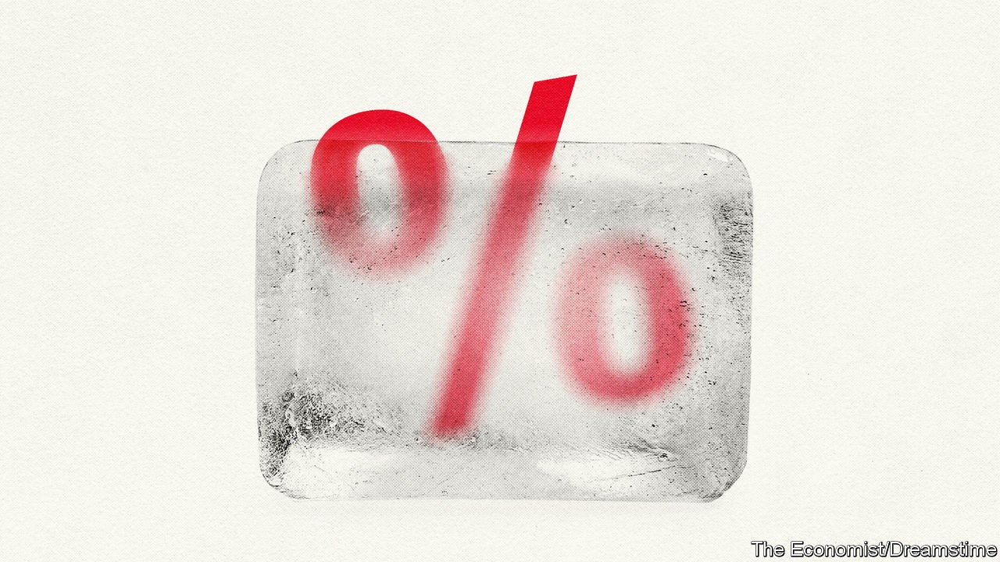

## Interest rates

# The eternal zero

> The pandemic will leave a legacy of even lower interest rates—and even higher asset prices

> Oct 8th 2020

FOR FINANCIAL markets the 2010s were a time when it was hard to tell good news from bad. Even as the world laboured to shake off the financial crisis, the prices of stocks and bonds—not to mention houses—kept climbing. But good news, such as wage growth picking up, could cause markets to wobble. The reason was uncertainty over how far growth would go before central banks, especially the Federal Reserve, raised interest rates. Anything presaging monetary tightening caused bearishness. In the link between economy and markets, monetary policy was a signal dampener.

When covid-19 struck, there was no such ambiguity. Global stockmarkets tanked in March. For a time even American Treasury bonds, the world’s safest asset, fell in price amid a scramble for cash and dysfunctional money markets. But eventually the signal dampener kicked in. The Fed cut interest rates and unleashed a torrent of liquidity to keep dollar markets functioning, preventing a credit crunch, mass bankruptcies and lay-offs. Other central banks followed suit. Since January central banks in America, Britain, Japan and the euro area have created new money worth $3.8trn, much of which has kept yields on long-term government debt close to zero.

Markets were not just calmed: they began a bull run that defied gloomy forecasts. Between the start of April and the end of August, with central banks pinning bond yields down, global stockmarkets rose by 37%, fuelled by rising technology shares. America’s corporate-bond markets saw record issuance in the first half of the year. Many housing markets also defied gravity. In August house prices in Sydney were 10% higher than a year earlier; and Britain’s house prices hit an all-time high, said the Nationwide building society. Tech stocks had a torrid start to September but the market shed only about a month of gains. Asset prices remain high.

The show of force by central banks, and the divergence between high financial markets and the real economy, marks the apotheosis of trends that began in the 2010s. Before covid-19, central banks were already accused of keeping so-called “zombie” firms alive, exacerbating wealth inequality and putting home ownership beyond the reach of young renters, even amid weak economic growth. Since the pandemic hit these side-effects of monetary policy have all, in a short space of time, got worse.

This is not central banks’ fault. They have no choice but to respond to the economic conditions they face. For decades interest rates—both short- and long-term—have been on a downward trend as central banks have fought shocks to the economy. That monetary stimulus has not provoked much inflation in consumer prices demonstrates only that central banks have been reacting to market forces, not distorting them; the global desire to save has grown faster than the desire to invest.

When interest rates are low, the arithmetic of discounting makes future income streams, and hence assets, more valuable. A recent paper by Davide Delle Monache of the Bank of Italy, Ivan Petrella of Warwick University and Fabrizio Venditti of the ECB finds that the decline in the “natural” rate of interest, which balances saving and investment without causing unsustainable recessions or booms, can explain most of the rise in the ratio of prices to dividends in America’s financial markets all the way back to the 1950s.

The pandemic is just the latest shock bearing down on the natural rate of interest. In America, the 30-year interest rate has fallen by almost a percentage point since January. This fits the historical pattern. Recent research by Òscar Jordà of the Federal Reserve Bank of San Francisco, and Sanjay Singh and Alan Taylor, both of the University of California, Davis, studies 19 pandemics since the 14th century and finds that they have suppressed interest rates long afterwards—longer, even, than financial crises. Twenty years after a pandemic, they estimate, interest rates are about 1.5 percentage points lower than they would otherwise be. Covid-19 is not entirely comparable to episodes that include the Black Death and Spanish flu, because it is killing few young workers. But an effect even half as large would still be significant, given how low interest rates were already.

There are several ways in which covid-19 is strengthening structural forces pulling interest rates down. One is by boosting the desire of households and firms to hoard cash. Savings rates have surged as economies locked down and it became hard to spend. Some see the resulting swollen bank balances of consumers as potential fuel for an inflationary boom. But it is more likely that damage to the labour market leads to a prolonged period of “precautionary” saving, as is normal after recessions.

This is not a typical recession. It might have depressed interest rates by drawing attention to the danger of massive disasters, when the world was already becoming more attuned to the risks of climate change. Economists have long suspected that the risk of disasters weighs on interest rates by buoying demand for safe assets. (Decades ago, some were arguing that disaster risk explains the “equity premium puzzle”: the outsized gap between safe interest rates and the returns from shares.) In a recent paper, Julian Kozlowski of the Federal Reserve Bank of St Louis, Laura Veldkamp of Columbia University and Venky Venkateswaran of NYU Stern model the effect of covid-19 on beliefs about risk and estimate that it might depress the natural rate of interest by two-thirds of a percentage point. “Whatever you think will happen over the next year,” they write, “the ultimate costs of this pandemic are much larger than your short-run calculations suggest.”

A third way in which the pandemic may depress the natural rate of interest is by boosting income inequality. Before it, many economists were arguing that, because the rich save a higher proportion of their incomes than the poor, higher rates of income inequality in America and other rich countries had, over a period of decades, contributed to a decline in the natural rate of interest. One estimate by Adrien Auclert of Stanford University and Matthew Rognlie of Northwestern University finds that nearly a fifth of the decline in the natural rate of interest since 1980 is attributable to rising inequality. The pandemic could compound this effect if it leaves labour markets less equal.

Against these forces is an enormous rise in government debt. One explanation for low interest rates and weak growth after the financial crisis was that there was a shortage of safe assets to absorb the world’s savings. But the pandemic has seen a flood of such assets created as governments have issued debt to fund emergency spending. In June the IMF projected that global public debt would rise from a weighted average of 83% of GDP in 2019 to 103% in 2021. Covid-19 has even seen the creation of a new safe asset: the EU plans to issue €750bn ($875bn) of joint debt. In theory, new debt should soak up savings, pushing up the natural rate of interest.

Yet there is little sign of these huge deficits eliminating the shortage of safe assets. That is partly because central banks have bought public debt in a bid to create growth and inflation by keeping long-term interest rates low. Oxford Economics, a consultancy, projects that safe-asset supply will decline in the next five years to just over a quarter of world output, against two-fifths before the financial crisis. The upshot is that the world economy increasingly resembles Japan, where even decades of deficits and net public debts of over 150% have not broken a low-inflation, low-interest-rate equilibrium.

This does not guarantee stagnation. Japan’s economic woes are often overstated because its growth is weighed down by ageing. In the 2010s its GDP per working-age person grew faster than America’s. But Japanification does create a dilemma: whether to increase deficits in an attempt to break the low-inflation, low-rate spell, or to rein in borrowing in the knowledge that the debt-to-GDP ratio cannot rise for ever. Low rates make it easier for politicians to pay for all sorts of demands on the public finances, including more spending on health care and pensions as societies age and on fighting climate change. But they also leave governments dependent on loose monetary policy and vulnerable to rising interest rates, should they ever return. During the pandemic governments and inflation-targeting central banks have been working hand in hand, but the question of what happens if their goals diverge is an open one.

Low interest rates also mean that high asset prices are all but guaranteed. This will reinforce complaints about wealth inequality and intergenerational unfairness—complaints that carry more bite given the unequal distribution of job losses this year. Homeowners, mostly drawn from the professional classes, will benefit as they can take advantage of cheaper mortgages. So will homebuyers. One reason why housing markets are holding up is that the downturn has not hit the typical house-hunter. Those without wealth or access to finance will feel understandably aggrieved.

Most significantly, central banks will be deprived of their traditional tool for fighting recessions: cutting short-term interest rates. The recovery from covid-19, and from future recessions, will instead hinge on the willingness of governments to provide an adequate fiscal response. Even central-bank bond-buying is of declining importance, because long-term rates are close to zero. The most that monetary policy can do is to stop long-term rates rising. The Fed’s recent promise to allow inflation to overshoot its 2% target during the recovery will take effect only if fiscal stimulus brings about more inflationary conditions.

If there is an overarching impact of low interest rates, it is fragility. The public indebtedness they allow might cause problems when circumstances change. It becomes harder to fight recessions. Investors find it harder to hedge risk, because with yields near zero, bond prices cannot rise much further, however bad the news. And high asset prices, especially when accompanied by income inequality, threaten the social contract. It is against this background that economic policy needs a fundamental rethink.■

See next article: [Covid-19 has not brought on an emerging-market crisis—but it could](https://www.economist.com//special-report/2020/10/08/prognosis-uncertain)

## URL

https://www.economist.com/special-report/2020/10/08/the-eternal-zero
