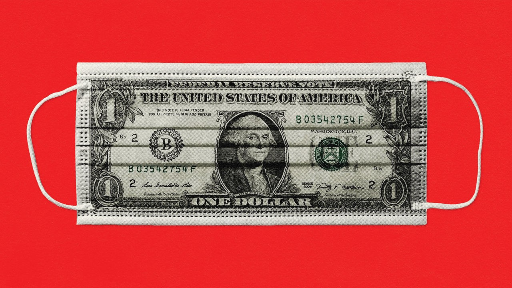
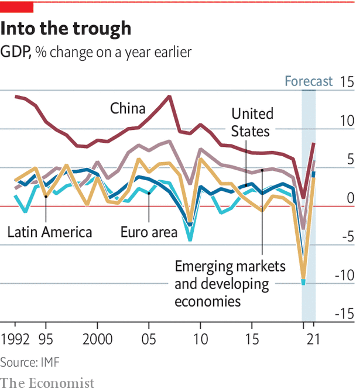

## The world economy

# The peril and the promise

> The covid-19 pandemic will accelerate change in the world economy. That brings both opportunity and danger, says Henry Curr

> Oct 8th 2020

THE THEORY of “black swans” says that unpredictable high impact events play a vastly greater role than most people realise. Long before 2020 scientists feared that a zoonotic respiratory disease might originate in Asia and spread globally. But hardly anybody foresaw the consequences. The story told by a casual inspection of most economic data is this: little happened for decades, and then in 2020 covid-19 upended everything.

Before 2020 the most sophisticated modelling suggested that a pandemic comparable to the Spanish flu of 1918 might kill 71m people worldwide and trim 5% off GDP. The death toll from covid-19 seems far lower, but the hit to GDP has been bigger. According to IMF forecasts in June, due to be updated after this report went to press, by the end of 2020 world output may be about 8% lower than it would have been without the pandemic. Instead of growing by about 3% it will have shrunk by about 5%—the biggest contraction since the second world war. By comparison, in 2009 the “great recession” shrank the world economy by just 0.1%.

The knock-on effects have been seismic. At the employment trough in April, the proportion of American 25- to 54-year-olds in work fell below 70% for the first time in nearly 50 years. In the second quarter one-sixth of young people worldwide lost their jobs. Working hours fell by nearly a quarter for the rest, says the International Labour Organisation. In June the World Bank forecast that low- and middle-income economies will shrink this year for the first time in at least 60 years, and 89m people will be pushed into extreme poverty, a rise of 15%. The effects of shutting schools for months are likely to persist for decades. And lockdowns have damaged mental health: more than 10% of Americans say they have given serious consideration to suicide.

When China locked down Wuhan in January, it was seen as something only an authoritarian, technologically sophisticated government could do. For a while Britain’s scientists did not consider calling for a lockdown because they assumed it was politically infeasible. Yet the readiness of almost all governments to close their economies almost entirely was just one of many surprises. In the rich world covid-19 has led to unprecedented government interventions in labour and capital markets. In Europe’s five largest economies, more than 40m workers were placed on government-funded furlough schemes. America boosted unemployment benefits so much that they exceeded the wages they replaced for more than two-thirds of claimants. The Federal Reserve has in effect backstopped the market for American corporate debt; Germany has offered its firms loan guarantees worth nearly a quarter of GDP.

None of this comes cheap. Public borrowing is soaring. In June the IMF forecast that the overall gross public-debt-to-GDP ratio of advanced economies would rise from 105% in 2019 to 132% by 2021. The rising burden has fostered a new financial activism. Central-bank balance sheets have ballooned as they have created trillions of dollars to soak up government debt, and the European Union is jointly issuing debt at scale for the first time to pay for its recovery fund. Policies of a decade ago, after the financial crisis, were seen as radical at the time but now look paltry by comparison.

At first the response was framed as temporary. “What we’re trying to do is to freeze the economy,” said Peter Hummelgaard, the Danish employment minister, in March. (Denmark can claim to have inspired other furlough schemes.) Experience suggested that rich-world economies could unfreeze quickly after a disaster. After Hurricane Katrina ravaged New Orleans in August 2005, unemployment shot up from around 6% to over 15%, but it fell back below 6% by February 2006. And indeed it looks as if, as well as being the deepest recession on record in many countries, this will be one of the shortest. The recent decline in American unemployment suggests that the worst of the crisis was mercifully brief.

Yet unlike the situation after a hurricane, there is no fleeing to better economic climes. Just as after the financial crisis, this downturn is notable for its breadth as much as its depth. And covid-19 continues to spread. As this report was being written, the seven-day moving average of global infections hit new highs. America and Australia had been through two rounds with the virus; France, Spain and Britain were bracing for a second wave; India was on an upward slope; and nobody knew how pervasive covid-19 was in the poorer world. Though hopes are high for a vaccine in 2021, it is not certain to prove both safe and effective. Economies could yet be trying to operate around the constraints of social distancing for years to come.

It has indeed become clearer that many changes brought about by covid-19 will be long-lasting. This special report argues that the pandemic will strengthen forces that were already acting on the world economy, accelerating changes in trade, technology, finance and economic policy.

Conditions before the pandemic were forged by the three biggest economic shocks of the 21st century: the integration of China into the world trading system, the financial crisis and the rise of the digital economy. As Chinese workers left rural poverty for factories, cheap goods flowed west and financial assets flowed east, helping to create low inflation, low interest rates and lost rich-world manufacturing jobs. The financial crisis caused a collapse in demand that further depressed interest rates even as globalisation stalled. The rise of technology contributed to a decline in competition, bumper corporate profits and a fall in the share of national income flowing to workers as superstar firms reaped the rewards of network effects and natural monopolies.

The covid-19 pandemic is a fourth big shock. The collapse in demand greatly exceeds that after the financial crisis. Saving may be elevated for years. Low and even negative interest rates are more likely to last. This will prop up asset prices even as economies are weak. Firms are more aware of the risks of supply chains that are both sprawling and fragile; covid-19 will increase the desire to bring them closer to home, and to diversify suppliers. And the pandemic is hastening digitisation. Consumers’ switch from physical retail towards e-commerce has quickened, and they have got used to getting some health-care and education services online.

The share prices of tech giants have soared. Even after a slump in September, the New York Stock Exchange’s “FANG+” index of technology stocks had produced a year-to-date return of about 60%. Companies have adapted to remote work with astonishing speed, stepping up investments in technologies that facilitate remote presence.

The pandemic will mark a turning-point in politics and geopolitics as well as economics. The world will emerge from 2020 into an era of more intense great-power competition. The spread of covid-19 has coincided with, and to an extent exacerbated, escalating tensions between China and America. They have got worse than even the most hawkish observer predicted a few years ago. Trade disputes, with their strange focus on trade deficits and soyabean purchases, are now part of a broader battle. America has lobbied the world to reject Chinese 5G technology, ramped up scrutiny of foreign investors, imposed sanctions to restrict Chinese access to its semiconductor technology and is forcing TikTok, China’s most successful consumer-technology export, to sell itself. Chinese investment in America has collapsed. Both countries are diversifying away from each other in trade. The two economies are too integrated to decouple entirely, but they now combine far-reaching economic ties with pervasive mutual suspicion.

For domestic politics in the rich world, the pandemic represents a challenge to the status quo. Unlike the financial crisis, this is not Wall Street’s fault. But the juxtaposition of a weak economy with high asset prices that result from low interest rates could provoke public anger, especially if it coincides with unemployment concentrated among poorly paid service-sector workers. Low interest rates will make possible substantial prolonged deficit spending. How recessions are fought will change, partly because near-zero interest rates neuter monetary policy, but also because of this year’s experiments with large-scale cash transfers to households. There will be both the appetite and the conditions to facilitate a rewriting of the social contract in ways that many hoped might follow globalisation and the financial crisis. The question will be whether today’s politics is up to the job; or whether it is doomed to channel dissatisfaction with change into another round of backward-looking populism.

What changes are necessary depends on an understanding of just how substantial a structural economic shift the pandemic is likely to bring about. The story begins with trade.■

See next article: [The pandemic will not end globalisation, but it will reshape it](https://www.economist.com//special-report/2020/10/10/changing-places)

## URL

https://www.economist.com/special-report/2020/10/08/the-peril-and-the-promise
