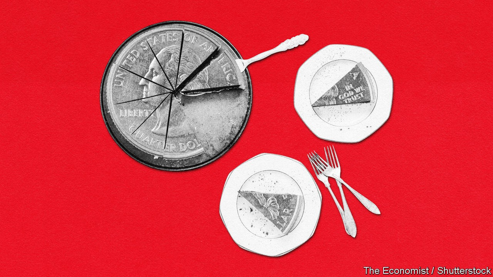

## The role of government

# The right kind of recovery

> How the pandemic should change the role of the state

> Oct 8th 2020

EVERY FEW decades in the 20th century the relationship between the state and the individual was reforged in the fire of crisis. Liberal reformers in Britain won the election of 1906 amid a loss of confidence in conservatism. In America the 1930s depression was followed by the New Deal. The second world war preceded the trente glorieuses, never-had-it-so-good Keynesianism, the expansion of welfare states and government-guaranteed full employment. In the 1980s Ronald Reagan and Margaret Thatcher banished stagflation and statism with a philosophy of individualism and economic discipline that gave birth to third-way politics.

Before covid-19 the big economic shocks of the 21st century—the rise of China, technological advances and the financial crisis—had not led to any such change. Many voters felt they had lost control to nameless forces. The gains from growth were insufficiently spread, and most governments did not think about how to ease the blows faced by people and places on the losing side of change. That the financial crisis led to incremental not fundamental reform might have been defensible, had it not been followed by too rapid a tightening of fiscal and monetary policies.

The result was a wave of angry politics. In many countries older voters are nostalgic for an economy that, whatever governments do, is never coming back. Young people are frustrated by declining social mobility and high asset prices, and fear the effects of climate change. Though there is fierce debate about how much they have changed over time, almost everyone laments inequalities of income, wealth or opportunity. And there is rising concern for the precarious position of service-sector workers in rich-world labour markets, exposed by covid-19.

This report has argued that the virus will hasten changes in the economy. That presents a risk: that governments will again fail to respond adequately to the depth of the transformation. If inequality rises, asset prices boom, urban service-sector jobs shrink, technology firms grow more dominant and governments turn to austerity too fast, politics will become more toxic, further polarising between the right’s unhinged economic nationalism and the left’s naive millennial socialism. The pandemic has created conditions ripe for misguided interventionism that tries to prevent change rather than adapt to it. Massive government loans to firms, central banks offering blank cheques for fiscal stimulus and government backstops for jobs look like a recipe for stasis. Bailing out every failing firm and protecting jobs indefinitely can only make societies poorer in the long term. The same goes for mistaken retreats to protection and the promotion of national champions.

Rather than trying to restore yesterday’s economy, governments must adapt to change, ensure it does not expose people to outsized losses, and seek to share the fruits more widely.

Goods trade is crucial to living standards today but, thanks to automation, it will keep declining in importance. A future of digital services trade promises more gains, but politicians must lift the regulatory obstacles in its way. This will be hard. It means exposing more white-collar workers, often protected by strict licensing, to the kind of competition that blue-collar workers have faced for decades, solving cross-border spats about digital tax and ensuring that rules on the cross-border flow of data, which are proliferating, do not act as barriers to trade. The gains could be substantial. A global digital labour market, spurred by firms’ investments in technology, might unleash a new wave of innovation. Governments could themselves take advantage: health care and education are two sectors ripe for disruption by cross-border providers.

Voters will not support more disruption without more risk-sharing. Governments should be more willing to act as insurer-of-last-resort for household incomes, as they have this year. Emergency support for households has borne out the libertarian mantra that governments are better at moving money around than at running things. Income support has been quicker, more transparent and less vulnerable to capture than other forms of fiscal stimulus. Governments should be readier to shield workers’ incomes from events beyond their control. Lockdowns fall into this category, but so do recessions and technological disruption. Automating payments to households during downturns would prevent suffering and guarantee that economies get the stimulus they need when interest rates are stuck near zero. Structural change also counts: those laid off should be supported with grants and retraining subsidies. It is right to worry about encouraging joblessness, but the solution does not have to be a stingy safety net. Better to raise taxes to finance an adequate welfare state than to lay poverty traps and distort incentives with poorly designed eligibility tests.

The final aim of spreading the benefits of growth is the hardest to achieve. The late 2010s demonstrated the wonders of tight labour markets. Between 2014 and 2019 real median American household incomes grew faster than in the much-vaunted late 1990s. Governments should seek to create another jobs boom, avoiding a premature turn to the fiscal austerity and tight monetary policy seen after the financial crisis. But there is no escaping that, in the long term, income distribution is shaped more by structural factors than by the economic cycle. The premium the labour market places on technological skills is an indictment of modern education. Not everyone can spend their days writing machine-learning algorithms, but workers and firms could do better in implementing existing technology (it should not have been a surprise that working from home has been such a success). Governments must fight to make the digital economy more competitive. That means promoting common data standards and portability and loosening intellectual-property rules. That superstar firms thrive online makes it even more important to tear down barriers to entry.

The prospects might seem grim, given many countries’ recent dysfunctional politics. But 2020 could be the start of an era in which populism wobbles while economic policymaking escapes from a rut. Plenty of orthodoxies have been upended. But with the right response, some old ones—such as the merits of free-market capitalism—might yet be restored.■

## URL

https://www.economist.com/special-report/2020/10/08/the-right-kind-of-recovery
