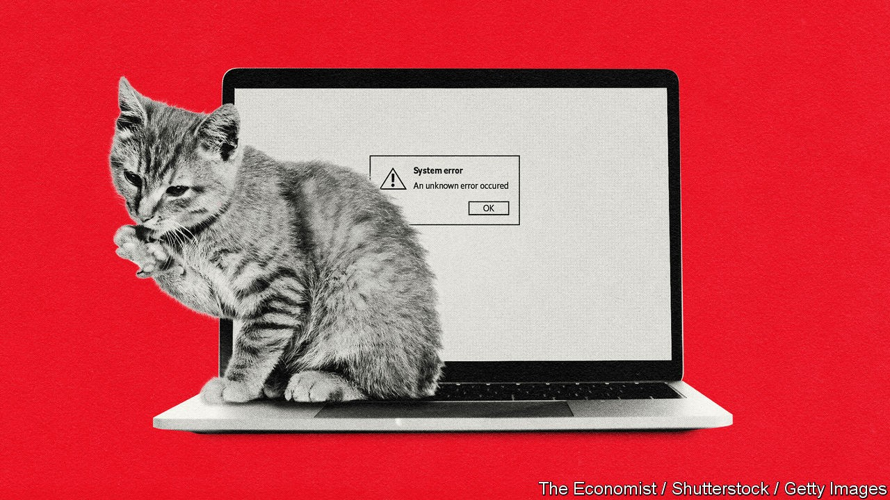
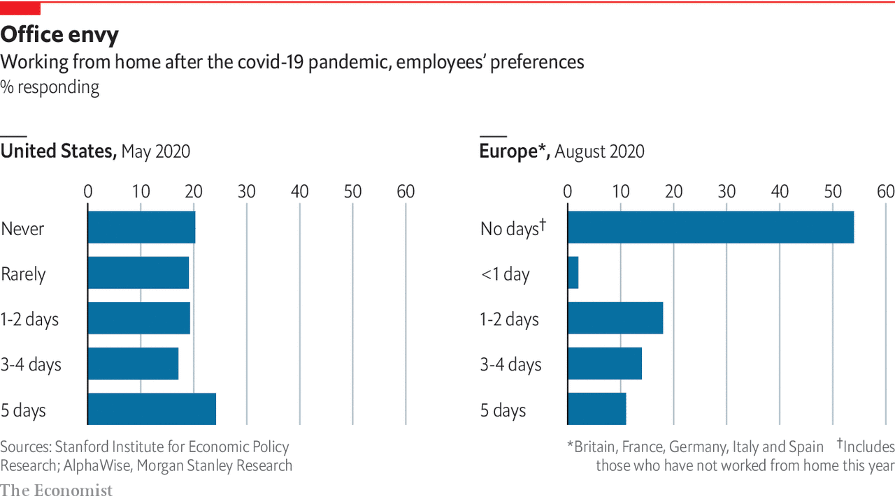
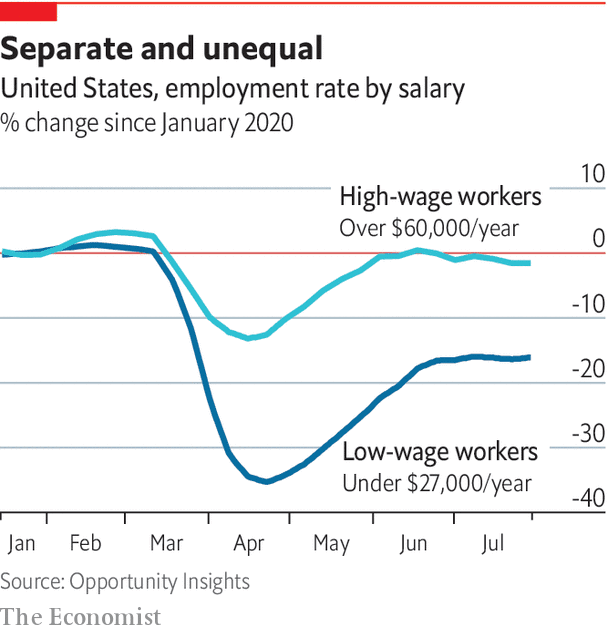

## Labour markets

# Zoom and gloom

> The transition to remote work is welcome. But it will be painful

> Oct 8th 2020

IN 1973 THE Eldfell volcano, long-dormant, erupted on Heimaey, an island off Iceland. The eruption destroyed about 400 homes, a third of the total (Heimaey’s seaport was saved by pumping seawater into the lava). The Icelandic government compensated the unlucky people who lost their homes, many of whom never returned. But when Emi Nakamura and Jon Steinsson of the University of California at Berkeley and Josef Sigurdsson of the Norwegian School of Economics studied how they fared later, they discovered a reversal of fortunes. Among people less than 25 years old at the time of the eruption, those who had moved averaged four more years of schooling and earnings $27,000 greater per year than those from families who had kept their home. Being forced to move had its advantages.

The covid-19 pandemic is a disaster orders of magnitude worse than a volcanic eruption. Yet it too has created an experiment. In a matter of weeks professional workers abandoned their offices en masse in favour of working from home. Meetings were replaced with Zoom calls, and commutes with longer hours at the desk. And just as for the Icelanders, the experiment has turned out to be an improvement for many. Seven out of ten affected Americans say it has gone better or much better than they expected, according to a survey carried out by Jose Maria Barrero of ITAM, Nick Bloom of Stanford University and Steven Davis of the University of Chicago. Mr Bloom reckons that two-thirds of American GDP in May was produced from peoples’ houses, a shift in production techniques unmatched in peacetime.

The idea that disruption can lead to improvement is a voguish one, promoted by such writers as Tim Harford, who advocates “messiness”, and Nassim Nicholas Taleb, who terms things that get better after disruption “antifragile”. The evidence is summarised in a forthcoming paper by Michele Acuto of the University of Melbourne and three co-authors. Cities built to exploit a locational advantage that has disappeared tend to persist unless they are swept away by disaster. When faced with tube strikes in 2014, enough London commuters found new ways of getting to work that the strike is estimated to have saved more commuting time than it cost. Recessions, too, typically bring on Schumpeterian creative destruction: American firms in areas hit most by the financial crisis restructured production towards greater use of technology, leaving a mark on labour markets that persisted even after unemployment had returned to normal levels. But the scale and consequences of this year’s work from home experiment go beyond any previous example.

That firms and workers have suddenly discovered the benefits of remote work seems counterintuitive. The technology allowing it is not new. And it seems to contradict a popular idea about how the world economy functions. In 1997 Frances Cairncross, then of The Economist, wrote “The Death of Distance”, arguing that communication technology was making location ever less relevant to business and personal life. The next two decades seemed to defy her thesis, as economic activity concentrated in successful cities like San Francisco, New York, London, Tokyo and Sydney. The explanation, many thought, lay in the agglomeration effects of bringing together knowledge workers. Productive contacts between people grow exponentially with the numbers gathered in one place. And that is before considering the taste workers may have for the culture and services that cluster in big cities.

Could all this change as the result of one event? Believe surveys of firms and workers and the answer is: partly. The pandemic, they say, has reduced the stigma of working from home. It has spurred firms to invest in the kit needed to make remote collaboration possible. And it has proved that the combination of software and hardware that allows working from home is, for the most part, reliable (if risky; the top prize in the Chess Olympiad, one of the world’s top chess tournaments, had to be shared after two players lost their connections mid-game). According to Mr Bloom and his colleagues, American firms forecast that the proportion of days worked at home will jump from 5% before covid-19 to about 20%, a number that chimes with the average desire of workers. It seems likely that many firms will adopt a model in which large numbers split their working hours between solitary work at home and collaboration in the office.

That will hardly kill off superstar cities or end agglomeration effects. Companies need offices to integrate recruits, monitor performance, build relationships and spread knowledge. Many people, especially the young, still want to cluster together and party, as packed concerts in Wuhan demonstrate. And people still need to meet in person. Recent research by Michele Coscia of the IT University of Copenhagen, and Frank Neffke and Ricardo Hausmann of Harvard University, finds that a permanent shutdown of international business travel would shrink global gross product by an astonishing 17% by hindering flows of knowledge across borders. The shift in favour of remote work also looks curiously like an anglosphere phenomenon; workers in mainland Europe have been swifter to return to the office than those in Britain and America.

Nonetheless, the shift will lead to significant structural changes. One is that many jobs lost to covid-19 will not return, because the labour market will adjust to a world with less spending in cities and more in suburbs and online. Based on surveys and share prices, Mr Bloom and his colleagues predict that one-third or more of all job losses during the pandemic will be permanent. That will come as a nasty shock to many who still expect their jobs to return. Only 19% of total American lay-offs since March have been reported as permanent, yet by August overall employment had recovered less than half its losses this year.

A second implication is a period of higher inequality. Recessions are usually worse for the poor and unskilled than for others, but the pandemic has been bad for them even accounting for the severity of the hit to the labour market, according to a working paper by Ippei Shibata of the IMF. Job losses have been heavy among service workers (who are more likely to be young, female and black) whose employment depends on the spending of high-earning professionals. Data from Opportunity Insights, a team of researchers at Harvard University, reveal that by the end of July there were 2% fewer jobs in America paying more than $60,000 a year than in January. But jobs paying under $27,000 were 16% scarcer. Those who feed, transport, clothe and entertain people who are out-and-about account for about a quarter of American employment, note David Autor and Elisabeth Reynolds of MIT. The large number of low-paid service jobs is often lamented, but “having too few low-wage, economically insecure jobs is actually worse than having too many”.

The enormous sums that governments have spent replacing (or more than replacing) lost wages has suppressed the uneven effect of job losses on household incomes. In the early months of the pandemic America’s poverty rate probably fell, according to Jeehoon Han of Zhejiang University, Bruce Meyer of the University of Chicago and James Sullivan of the University of Notre Dame, as Americans received $1,200 cheques and unemployment benefits were boosted by $600 per week. In August consumer spending in low-income zip codes was barely down on its January level, despite the jobs collapse. But Congress has let that support expire. As governments cease replacing household incomes, a veil will be lifted, revealing a more unequal labour market.

This may not last. New service jobs—home delivery, suburban restaurants—will eventually replace those lost in city centres. But such transitions are painful, and it matters who bears the burden of them. Even if you exclude all workers who insist optimistically that they are on temporary lay-off, America’s unemployment rate in August was still about 6.6%, say Jason Furman of the Peterson Institute, a think-tank, and Wilson Powell III of Harvard University. That is roughly equivalent to the unemployment levels in early 2014, long before the labour market could be said to be healthy. Even if unemployment now falls rapidly, as it did after the recession of the early 1980s, it would take well over a year to work off just those job losses.

A third implication of the shift could boost growth and reduce inequality in the long run. It is that a drag on the world economy from housing shortages in and around successful cities will bind less tightly. Such shortages have limited growth by slowing the agglomeration effects on which it relies, as well as acting as barriers to opportunity by making it harder for the poor and young to move to better jobs. They have also widened divides between homeowners, who have enjoyed windfall gains in house prices, and renters. By one estimate American GDP would be 3.7% higher were regulatory constraints on building as loose in New York, San Jose and San Francisco as in the median American city.

But the increase in remote working will spread opportunity across the economy regardless of housing costs. The best case is that the internet ends up beating cities at their own game. In principle, greater numbers of people can gather and interact online than in physical proximity, notes Adam Ozimek, an economist at Upwork, a freelancing website. Moreover, if it becomes possible for employers to hire not just anyone located in a city, but anyone with an internet connection, the pool of possible candidates vastly increases. The resulting better matches between employers and employees should increase growth—perhaps at last unleashing the measured productivity gains that the technological improvements of the 21st century long promised but failed to deliver.

What will it take to realise this optimistic vision? Firms will need to continue experimenting with change rather than getting into a new rut. Some see the future of remote collaboration not in stilted video conferencing but in immersive virtual environments comparable to the computer games on which many people already spend hours of leisure time without suffering from “Zoom fatigue”. Such environments can create a fuller sense of shared experience, spontaneous human interaction and thus relationship building. (Mr Bloom recently spoke at a conference on the future of work hosted on QUBE, a game-like platform complete with a virtual conference hall and spaces in which virtual avatars can mingle.) That might allow more firms to operate completely virtually, rather than in the split-time model that many now expect.

For policymakers, the challenge is to ensure that the structural transitions already under way are not inhibited by a prolonged slump like the one that followed the financial crisis. That means economies must be given enough stimulus to encourage firms to create new jobs to replace those that are now redundant. The pandemic, however, has thrown up a challenge to this: a further reduction of interest rates.■

See next article: [Could the pandemic leave markets more concentrated?](https://www.economist.com//special-report/2020/10/08/survival-of-the-fittest)

## URL

https://www.economist.com/special-report/2020/10/08/zoom-and-gloom
