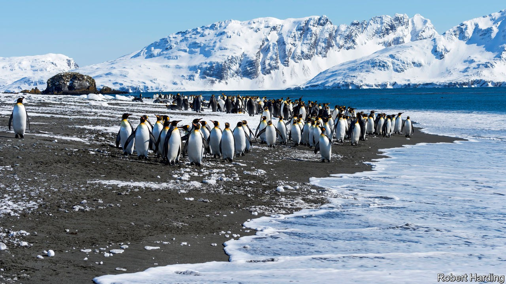
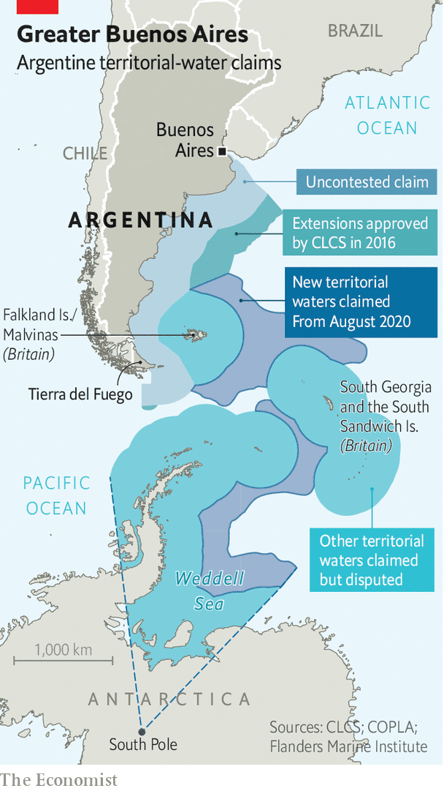

## Alberto of the Antarctic

# Argentina doubles in size, or so it claims

> The government takes advantage of a UN ruling to extend the country’s territorial waters

> Oct 10th 2020BUENOS AIRES

ARGENTINA’S PRESIDENT, Alberto Fernández, has plenty to worry about: a soaring covid-19 caseload and a depressed economy. So it must have been delightful for the government to change the subject on September 21st by issuing a map showing that the country’s territory is nearly double its former size. It illustrates the effect of a law Mr Fernández signed in August, which expands Argentina by 1.7m square km (650,000 square miles), an area three times the size of metropolitan France. Argentina now bestrides South America and Antarctica, from the Tropic of Capricorn to the South Pole. Its territory includes some of the world’s richest fishing grounds and possibly oil and gas. The Falkland islands, which Argentines call the Malvinas, lie within it.

This is not entirely based on fantasy. In 2016 the UN’s Commission on the Limits of the Continental Shelf (CLCS) issued a ruling, based on the UN Convention on the Law of the Sea, that fixes the edge of the vast shelf that juts out from Argentina’s coast. There the seabed is shallow enough—less than 2,500 metres deep—to count as an extension of Argentina’s mainland. The effect of the ruling is to extend Argentina’s territorial waters beyond the normal 200 nautical miles (370km).

Mauricio Macri, Argentina’s then-president, a conservative, celebrated the ruling in 2016 as a diplomatic victory but did not write it into law. His priority was friendly relations with the rest of the world, including Britain. In 1982 Britain fought a war to expel Argentina’s armed forces, which had invaded the Falklands that year.

Mr Fernández, a left-leaning Peronist, is more assertive. The law he signed in August, and the borders on his map, take in far more than the area to which CLCS said Argentina was entitled. In sending the territorial-expansion bill to Congress this year, Mr Fernández insisted on “Argentina’s claim to the Malvinas”, which has long been part of its law and is endorsed by nearly all Argentines.

The new official map shows South Georgia and the South Sandwich islands (also British), as part of Argentina, too, and adds areas that had it not claimed in law before. The British are mainly interested in the water’s riches, Argentina’s government thinks. That explains the “stubbornness of British colonialism”, suggested Daniel Filmus, the government’s secretary for the Malvinas, Antarctica and South Atlantic. The map asserts Argentine sovereignty over the Antarctic peninsula, an ice-cream cone poking into the Weddell sea, which is also claimed by Chile and Britain. In fact, the UN commission avoided taking a position “in a case where a land or maritime dispute exists”. The areas it awarded Argentina are a fraction of the country’s claim.

Argentina does not plan to try to reconquer the islands, but it does hope to use its interpretation of the commission’s ruling to press Britain to negotiate. “The UN is saying that the Malvinas is a matter of dispute,” contends an adviser to the president. “The British always try to say there is no dispute over the islands.” Argentina’s foreign ministry put out a video calling for “dialogue” under UN auspices. Britain is unlikely to agree.

So Mr Fernández may have to be content with smaller satisfactions. Argentine oceanographers are now in demand from other countries. They are being consulted by specialists from Brazil, Germany, Denmark and even Chile, despite the peninsular dispute. Schoolchildren will be taught that Tierra del Fuego, Argentina’s southernmost province, is now the country’s centre. The country’s population of emperor penguins and leopard seals has greatly expanded. In tough times, that may cheer Argentines up a bit.■

## URL

https://www.economist.com/the-americas/2020/10/10/argentina-doubles-in-size-or-so-it-claims
