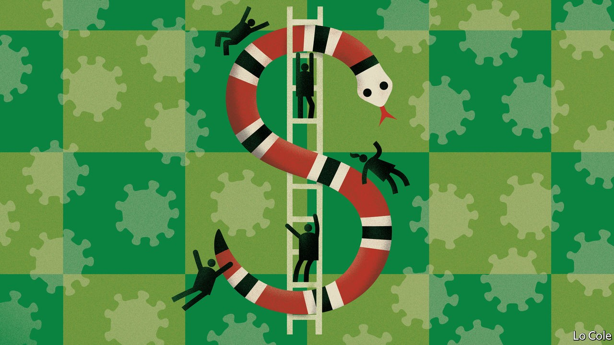

## Bello

# Latin America’s new poor

> The pandemic is reversing years of progress on poverty and inequality

> Oct 10th 2020

WHEN THE pandemic struck Piura, a city in northern Peru, Daniel Zapata had a part-time job with a market-research firm. The 250 soles ($70) he earned each month paid his fees for a three-year course in business administration. The covid-19 recession put paid to all that. The firm closed, and Mr Zapata, who is 20 and lives with his parents and a sister, has dropped out of his course. The family received 760 soles in emergency aid from Peru’s government. With the lockdown over, they must now rely on his sister’s income as a teacher and his father’s pension from his years working in a textile factory. Having lived in the lower tier of the middle class, Mr Zapata is staring into the abyss of poverty. He expects little from a general election next April. The politicians “just squabble instead of working”, he says.

The covid-19 recession is wiping out years of progress in Latin America in reducing poverty and inequality. Economists are starting to map just how big the social impact of the pandemic is. Many governments imposed long lockdowns. These hit the half of Latin Americans who work in the informal economy especially hard. Many countries, like Peru, offset part of the lost income by expanding aid programmes for the poor. That has helped, but not enough, and the effort may not be sustainable.

The region’s economy is set to contract by 9.1% this year, according to the UN Economic Commission for Latin America and the Caribbean. It says this means that 45m people will fall back into poverty (taking the total to 37% of the population). The unemployment rate has risen by 2.2 percentage points to 11% in nine countries for which data are available, reports the International Labour Organisation. Income from wages in Latin America has fallen by 19.3%, compared with a global average of 10.7%.

These estimates assume that everyone loses a similar percentage of their income. Nora Lustig, an Argentine economist, and her team at Tulane University in New Orleans have used household surveys to figure out which groups lost most income and received most from the government in Brazil, Mexico, Colombia and urban areas of Argentina, which together account for two-thirds of Latin America’s total population. They think that the biggest losers will be among the region’s lower-middle classes, because social-assistance programmes provide an income floor for many of the poor. Although women, people of African descent and indigenous people are more likely to lose income, they get more help from the government.

Ms Lustig thinks the year may end with up to 21m new poor in those four countries. The impact is much bigger in Mexico than in Brazil, because of contrasting government policies. Mexico’s president, Andrés Manuel López Obrador, claims to be of the left and his campaign slogan was “First, the poor”. Yet he has done little to help the poorest. Brazil’s president, Jair Bolsonaro, is of the hard right. But his government has made an emergency payment of $107 per month for five months, from which 53m people have benefited. The payment has been extended, though at a lower amount. Poverty could even decline slightly in Brazil, while in Mexico there will be at least 10m new poor.

The damage will last. Even though the pandemic is at last starting to wane in the region, at least for now, and many economies have opened up again, demand will remain depressed because firms and workers are poorer. Researchers at the Inter-American Development Bank have found that in past recessions when GDP contracted by 5% or more unemployment took an average of nine years to return to its previous level.

If the pandemic-induced recession is like previous ones it will reverse much of Latin America’s recent progress in reducing inequality. The causes of that progress included the spread of education and more demand for unskilled workers in service businesses. The hard-up are much less likely to be able to work remotely. The many low-skilled workers whose jobs require personal contact—waiters, hairdressers, etc—may see their wages fall.

Even before the pandemic Latin America was highly unequal. Frustration at slow economic growth, lack of opportunity and a discredited political class showed in the election of populist presidents and in street protests in several countries. The tens of millions of new poor have reasons for resentment. They may not accept their fate quietly. That is likely to shape the region’s politics for years to come.

## URL

https://www.economist.com/the-americas/2020/10/10/latin-americas-new-poor
