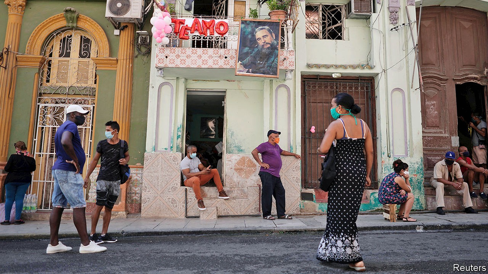

## Welcome to Queueba

# With shop shelves bare, Cuba mulls economic reforms

> The government hints it may scrap its dotty dual-currency system

> Oct 10th 2020

LONG QUEUES and empty shelves are old news in Cuba. Recently, though, the queues have become longer and the shelves emptier. Food is scarcer than it has been since the collapse in 1991 of the Soviet Union, which supported the island’s communist regime. Now shoppers queue twice: once for a number that gives them a time slot (often on the next day). They line up again to enter the store.

Once inside, they may find little worth buying. Basic goods are rationed (for sardines, the limit is four tins per customer). Shops use Portero (Doorman), an app created by the government, to scan customers’ identity cards. This ensures that they do not shop in one outlet too often. Eileen Sosin recently tried but failed to buy shampoo and hot dogs at a grocery store near her home in Havana. She was told that she could not return for a week.

Queues at grocery stores are short compared with those outside banks. They are a sign that, under pressure from food shortages and the pandemic, the government is moving closer towards enacting a reform that it has been contemplating for nearly two decades: the abolition of one of its two currencies. In July state media began telling Cubans that change was imminent. Cubans are eager to convert CUC, a convertible currency pegged to the American dollar, into pesos, which are expected to be the surviving currency. If they do not make the switch now, Cubans fear, they will get far fewer than 24 pesos per CUC, the official exchange rate for households and the self employed.

Cuba introduced the CUC in 1994, when it was reeling from the abrupt end of Soviet subsidies. The government hoped that it would curb a flight into dollars from pesos, whose worth plunged as prices rose.

The system created distortions that have become deeply entrenched. The two currencies are linked by a bewildering variety of exchange rates. Importers of essential goods, which are all state-owned, benefit from a rate of one peso per CUC. That lets them mask their own inefficiencies and obtain scarce dollars on favourable terms. This keeps imports cheap, when they are available at all. But it also discourages the production of domestic alternatives. Foreign-owned earners of hard currency, such as hotels, do not profit from the artificial gap between revenues and costs. That is because instead of paying workers directly they must give the money to a state employment agency, which in turn pays the employees one peso for every CUC (or dollar). The rule is, in effect, a massive tax on labour and on exports.

The dual-currency regime is an obstacle to local production of food, which already faces many. Farmers must sell the bulk of their output to the Acopio (purchasing agency) at prices set by the state. It gives them seeds, fertiliser and tools, but generally not enough to produce as much as their land will yield.

A farmer from Matanzas, east of Havana, recently complained on social media that the Acopio, which required him to provide 15,000lbs (6,800kg) of pineapples, neither transported them all the way to its processing facility nor paid him. Instead, they were left to rot. When the Acopio does manage to provide lorries, it often fails to deliver boxes in which to pack farmers’ produce. They can sell their surplus to the market, but it is rarely enough to provide a decent income. No wonder Cuba imports two-thirds of its food.

It is becoming more urgent to free the economy from such burdens. Although Cuba has done a good job of controlling covid-19, the pandemic has crushed tourism, a vital source of foreign exchange. The Trump administration, which imposes sanctions on Cuba in the hope that they will force the Communist Party out of power (and, perhaps more important, that they will please Cuban-American voters in Florida), recently tightened them. In September the State Department published a “Cuba prohibited accommodations list”, which blacklists 433 hotels controlled by the regime or “well-connected insiders”. Venezuela, Cuba’s ally, has cut back shipments of subsidised oil. The economy is expected to shrink by around 8% this year.

As it often does when times are tough, Cuba is improvising. To hoover up dollars from its citizens, since last year the government has opened many more convertible-currency shops. As these usually have the best selection of goods, demand for dollars has rocketed. Banks have none left. Cubans either get them from remittances, sent by relatives abroad, or on the black market, where the price can be double the official rate of one per CUC.

The government is now sending signals that it wants to scrap the economy-warping dual-currency regime. “We have to learn to live with fewer imports and more exports, promoting national production,” said the president, Miguel Díaz-Canel, in July.

But it has signalled before that such a reform was imminent only to decide against it. That is because the change, when it comes, will be painful. Importers with artificial profits may lay off workers en masse. If they have to pay more for their dollars, imports will become more expensive, sparking a rise in inflation. Pavel Vidal, a Cuban economist at the Pontifical Xavierian University in Cali, Colombia, expects the value of Cubans’ savings to drop by 40%. The government has said that it will raise salaries and pensions after a currency reform, but it has little cash to spare. This year’s budget deficit is expected to be close to 10% of GDP. That could rise when the government is forced to recognise costs now hidden by the twin-currency system.

The government may yet wait until it has built up bigger reserves of foreign exchange to help it cushion the shock. It may hope that Joe Biden will win the White House and reverse some of the sanctions imposed by the Trump administration. That would boost foreign earnings.

The economic crisis makes other reforms more necessary. Under Raúl Castro, who stepped down as president in 2018 (but still heads the Communist Party), a vibrant private sector started up. It has gained more freedoms, but at a slow pace.

The government has recently promised faster action. It said it would replace lists of the activities open to cuentapropistas, as Cuba’s entrepreneurs are called, with negative lists, which specify in which sectors they cannot operate. The new rules have yet to be published. The government recently let cuentapropistas import supplies through state agencies, but prices are prohibitive. In July it opened a wholesale market, where payment is in hard currencies. Firms that use it no longer have to buy from the same bare shops as ordinary citizens.

Cuentapropistas have been lobbying since 2017 for the right to incorporate, which would enable them to sign contracts and deal normally with banks, and to import inputs directly rather than through state agencies. The government has yet to allow this. Until it frees up enterprise, Cubans will go on forming long queues outside shops with empty shelves. ■

## URL

https://www.economist.com/the-americas/2020/10/10/with-shop-shelves-bare-cuba-mulls-economic-reforms
