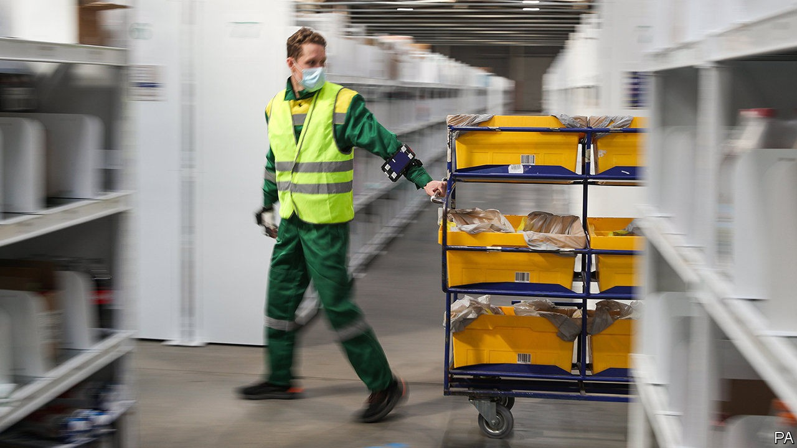

# Business this week

> Oct 10th 2020

The IMF urged governments in rich countries to step up spending on investment, pointing out that, even before covid-19, public-investment-to-GDP ratios were declining. The rates of return from spending on adaptation to climate change in particular are often greater than 100%, it said. Meanwhile, Kristalina Georgieva, the IMF’s managing director, described the path to economic recovery after the pandemic as “the long ascent—a difficult climb that will be long, uneven and uncertain. And prone to setbacks.”

Jerome Powell, the chairman of the Federal Reserve, once again called for more fiscal stimulus measures. He described the policy risks of supporting the American economy as asymmetric: providing too little help will be worse than providing too much. Donald Trump said he would not agree to a stimulus package until after the election. Employers created 661,000 jobs in September, a much smaller number than in each of the previous four months, when firms rehired as lockdowns eased. See [article](https://www.economist.com//united-states/2020/10/08/the-reasons-behind-americas-new-wave-of-lay-offs).

OurCrowd, an investment platform based in Jerusalem, struck a partnership with a business-development company backed by Al Naboodah Investments of Dubai. It is the first big alliance between investment firms in Israel and the United Arab Emirates after the recent normalisation of relations between the two countries.

There was more consolidation in the payments industry with the announcement that Nexi, Italy’s biggest provider of digital payments, would buy SIA, a smaller rival that is owned by the Italian government. Through a development bank, the government will retain a 25% stake.

Companies aiming to increase staff diversity may be drawing more legal scrutiny from the American government. Microsoft and Wells Fargo, who have both promised to double their number of black executives, were both contacted by the Department of Labour recently to inquire whether their plans comply with laws that forbid hiring practices based on race.

America’s Supreme Court heard arguments from Google and Oracle in a closely watched case concerning how copyright law should apply to computer code. Oracle argues that Google unlawfully reused parts of Java, a programming language, in its Android smartphones. Google retorts that such reuse has been common industry practice for decades, and is vital for interoperability between software. A lower court’s ruling in Oracle’s favour in 2018 alarmed the rest of the tech industry, which mostly takes Google’s side.

A committee in America’s House of Representatives accused Amazon, Apple, Facebook and Google of exploiting their monopoly power, comparing them to oil and railway tycoons in the 19th century, and recommended sweeping reforms to antitrust laws. That could spell trouble for the tech giants if the Democrats win both chambers of Congress next month. See [article](https://www.economist.com//business/2020/10/07/how-best-to-regulate-big-tech).

Boeing’s annual outlook for the overall aerospace industry forecast an 11% drop in demand for commercial planes over the next decade, compared with last year’s forecast. Over the next 20 years, it predicts passenger-traffic growth will return to pre-pandemic levels of 4% a year.

Walmart at last found a buyer for Asda, a British supermarket chain that it bought in 1999 and has been trying to sell for more than two years. The new owner in the £6.8bn ($8.7bn) deal is a consortium led by Zuber and Mohsin Issa. The brothers run EG Group, which operates petrol stations and food concessions across ten countries, and owns many Kentucky Fried Chicken franchises in Britain.

Bristol-Myers Squibb made another big acquisition, agreeing to pay $13.1bn for MyoKardia, a clinical-stage biopharmaceutical company specialising in treatments for heart disease. Last year Bristol-Myers Squibb bought Celgene for $90bn, one of the largest-ever deals in the drug industry.

Facebook said it had started to remove all pages across all its platforms that are linked to QAnon, a far-right conspiracy theory that thinks Donald Trump is battling a cabal of Satan-worshipping paedophiles. The company had been criticised for not doing enough to counter the surge in fake news from QAnon adherents.

Cineworld decided to close all its cinemas in America and Britain until next year, after the release date of “No Time To Die”, the next James Bond film, was again postponed, until April. Already struggling as social-distancing keeps the crowds away from its venues, Cineworld was banking on what would have been this year’s biggest box-office draw. Other films have been delayed, some have gone straight to streaming. Many in the industry believe lavish blockbusters need to be seen in cinemas first in order to create the all-important buzz. See [article](https://www.economist.com//business/2020/10/06/as-audiences-gingerly-return-cinemas-face-a-new-problem).

## URL

https://www.economist.com/the-world-this-week/2020/10/10/business-this-week
