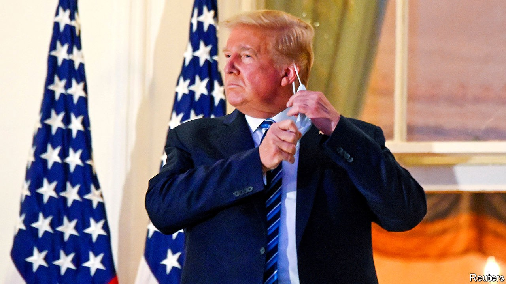
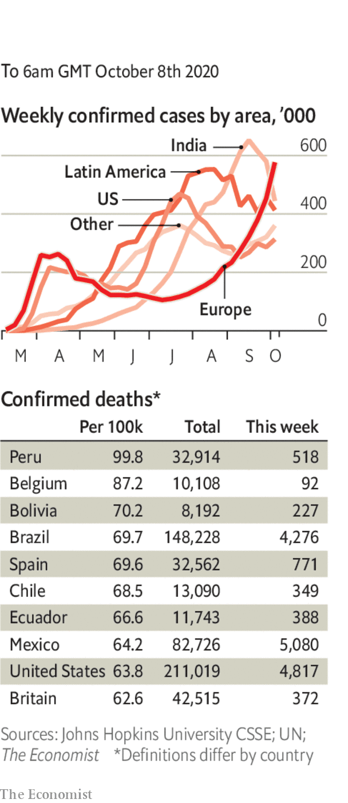

# Politics this week

> Oct 8th 2020

Donald Trump’s  doctors were keeping a close eye on their patient, after the 74-year-old president checked out of hospital just three days after being admitted for treatment for covid-19. Around 20 other people in Mr Trump’s circle have also tested positive, including his wife, Melania, Stephen Miller, an adviser, and Chris Christie, a former governor who helped Mr Trump prepare for his first debate. The president described catching the virus as a “blessing from God”. The Commission on Presidential Debates said that the next debate between Mr Trump and Joe Biden should be held virtually. See [article](https://www.economist.com//node/21792696).

Covid-19 featured large in the vice-presidential debate between Kamala Harris and Mike Pence, a more orderly affair compared with the fireworks of the Biden-Trump encounter a week earlier. See [article](https://www.economist.com//united-states/2020/10/08/mike-pence-v-kamala-harris-ends-in-a-normal-sort-of-a-draw).

The Department of Homeland Security said that white supremacists are “the most persistent and lethal” terrorist threat to America, as foreign groups are “constrained” in their ability to conduct attacks. Since 2018 white racists have carried out more lethal assaults in the United States than any other extremist group, targeting racial and religious minorities, gay people and fans of globalisation.

Thirty-nine countries called on China to respect human rights in Xinjiang. A similar statement last year gained the backing of only 23. However, 45 countries said China’s policies towards Uighurs were just fine. Human Rights Watch called the pro-China group a “Who’s Who of leading rights abusers”.

Parties backing the president appeared to have swept elections in Kyrgyzstan. Protesters said the voting was crooked, and freed a former president from jail. The government offered to hold a new vote and the prime minister resigned. See [article](https://www.economist.com//asia/2020/10/07/angry-kyrgyz-rebel-against-a-tainted-election-for-the-third-time).

Indonesia’s parliament approved a law to cut red tape and stimulate investment. The measure had been championed by the president, Joko Widodo. Left-wing activists fret that it will weaken protections for workers and the environment.

Authorities in Vietnam arrested Pham Doan Trang, a prominent democracy activist, for “anti-state activities”. Her arrest came hours after America and Vietnam concluded a “human-rights dialogue”.

A British appeals court ruled in favour of Nicolás Maduro’s regime in Venezuela in a dispute over who controls nearly $2bn-worth of gold stored at the Bank of England. The court overturned a decision by the High Court, which said that because Britain recognises the leader of the opposition, Juan Guaidó, as the country’s interim president, he is in charge of the gold. The appeals court said that Britain’s recognition of Mr Guaidó is ambiguous and sent the case back to the High Court for a clearer ruling on which man is Venezuela’s president in the eyes of British law.

Guatemalan security forces stopped 3,500 Hondurans from heading towards America. Guatemala’s president, Alejandro Giammattei, said they might spread covid-19. The group was the first big migrant caravan to form since the pandemic began.

Tanzania barred Tundu Lissu, the opposition leader, from campaigning for president for seven days, claiming that his speeches criticising the government were “unethical”. Elections are on October 28th. Opposition offices have been firebombed.

West Africa’s regional bloc, ECOWAS, blinked in its stand-off with the leaders of a coup in Mali and lifted sanctions on the country. It had previously insisted that power be handed to a civilian government and that it would not accept the appointment as president of Bah Ndaw, a former defence minister.

Prince Bandar bin Sultan, a senior member of the royal family of Saudi Arabia, accused Palestinian leaders of betraying their people, in an interview on Saudi-owned television. The comments were seen as a signal of declining Saudi support for the Palestinians and a possible first step towards closer relations between Israel and the kingdom.

Fighting intensified in and around the disputed enclave of Nagorno-Karabakh. At least 200 people have been killed. Azerbaijan is trying to wrest back territory seized from it by neighbouring Armenia after the collapse of the Soviet Union. Turkey has armed Azerbaijan and encouraged it to break a fragile peace that has mostly held since 1994. See [article](https://www.economist.com//node/21792678).

The leaders of Golden Dawn, a neo-fascist Greek political party, were convicted in Athens of running a criminal organisation, after a party member murdered a rapper in 2013. The party itself has not been banned, but lengthy prison terms are now expected for those who incited violence.

If the British government was wondering what the next clanger in its handling of covid-19 would be, then outdated software provided the answer. Public Health England’s developers chose to use an old version of Microsoft’s Excel program to collate testing results, missing some 16,000 over several days. The version of software used by PHE was superseded over a decade ago and is not used in any serious data-gathering exercise. Meanwhile, with infections up sharply, further restrictions in England were being mooted.

The governor of New York state, Andrew Cuomo, refused a request from the mayor of New York City, Bill de Blasio, to close non-essential businesses in parts of Brooklyn and Queens that have become virus hotspots, but imposed his own new restrictions.

Bars and cafés in Paris were ordered to close again, this time for two weeks.

The Irish government rejected a plea from senior scientific advisers to place the country in a strict lockdown, saying that the risk to jobs of closing the economy was too great. Some restrictions were reimposed; people were again told to work remotely.

October 16th was set as the date for a travel bubble between Australia and New Zealand to begin. It will be limited to New Zealanders at first; New Zealand recently declared itself free of coronavirus, for the second time.

## URL

https://www.economist.com/the-world-this-week/2020/10/08/politics-this-week
