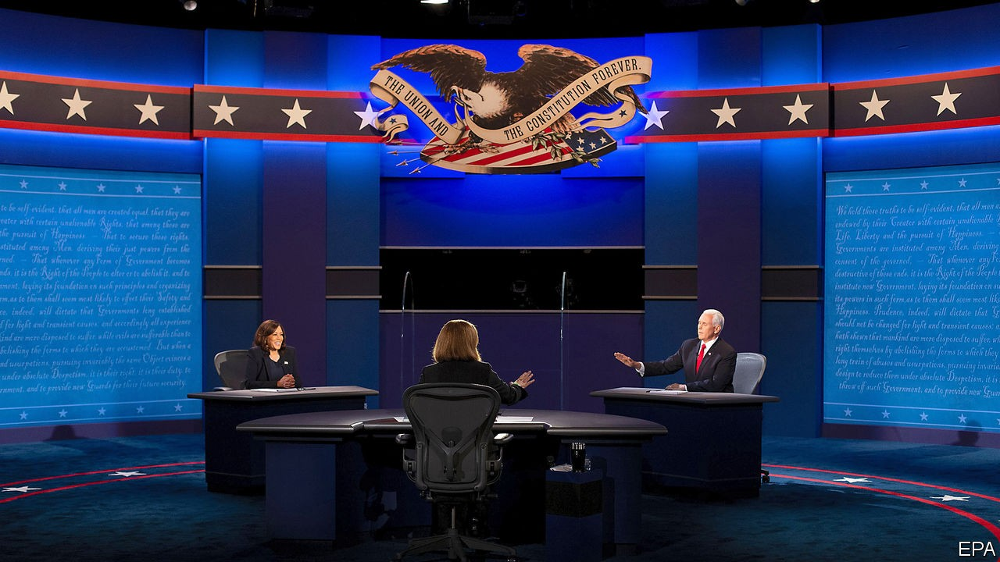

## The Veep debate

# Mike Pence v Kamala Harris ends in a normal sort of a draw

> The battle of the understudies casts them as plausible presidential successors

> Oct 8th 2020WASHINGTON, DC

THE TELEVISED debate between Mike Pence and Kamala Harris on October 7th had been ballyhooed even before the president’s covid-19 diagnosis underlined the mortality of the election’s top billing. Donald Trump and Joe Biden are both vying to be the oldest newly elected president. Mr Trump is 74 and obese; Mr Biden is 77 and can seem older. It follows that the winner’s deputy, Mr Pence or Ms Harris, will assume the role of presidential understudy with an unusually good chance of being suddenly promoted to the top job.

From that narrow perspective, the vice-president and the senator from California both cleared the bar. Over the course of a 90-minute debate that was mostly pro-forma, occasionally illuminating and fundamentally normal compared with the ill-tempered shouting match that was last week’s presidential encounter, both projected professionalism and competence. Mr Pence, a skilful performer, who comes across as far more mainstream than a reputation for religious zealotry might suggest, would be a more than acceptable stand-in for Mr Trump. Ms Harris, a charismatic figure with solid government experience, appears equally up to the job of first reserve.

No “Veep” face-off has ever had a significant electoral impact. Even so, Mr Pence and Ms Harris will both feel they had modest success in shoring up their ticket’s weaknesses. The Democrat’s task was easier. She has no record to defend and Mr Trump’s handling of the coronavirus—“the greatest failure of any presidential administration in the history of our country”, she called it—was an unmissable target. One of the Trump campaign’s scare stories, that she is the radical pulling Mr Biden’s strings, was always likely to dissolve in contact with her pragmatism.

Ms Harris appears far more comfortable relaying Mr Biden’s centrist message, of a helping hand to the working guy and nothing too crazy, than pushing the leftist platform that she ill-advisedly compiled for her own presidential run. She also boasted of Mr Biden having assembled “one of broadest coalitions of folks you’ve ever seen in a presidential race”, including “seven members of George W. Bush’s cabinet”. That is not something a true leftie would want to advertise.

Yet nobody makes a better fist of selling Mr Trump’s record than his polished deputy. On the coronavirus disaster, Mr Pence scored points merely by sounding sympathetic to those who have suffered. He also made a better case against Mr Biden and his party by restricting his criticisms to the bounds of reality. Mr Trump has failed to paint Mr Biden as a deranged socialist. Mr Pence’s pressing of Ms Harris on the implications of his vow to scrap the Trump tax cuts for its middle-class beneficiaries seemed likelier to impress swing voters.

Yet as this proceeded, it began to feel no more relevant than the usual constrained, forgettable “Veep” debate. An inevitable sense that both debaters are mainly trying to avoid messing up is unexciting. It reflects the central truth that the importance of the vice-president has not risen remotely in step with the ever-swelling powers and mystique of the presidency. If anything, it has come to seem more nondescript by comparison—as brilliantly satirised in the eponymous HBO show that spanned Mr Biden’s second term in the job and most of Mr Pence’s. The peculiar dynamics of this year’s election have also to some degree accentuated this effect.

Some Democrats feared Ms Harris’s charisma might put Mr Biden in the shade. Yet his party chose him precisely because his blandness felt appropriately low-risk for the big push against Mr Trump. There is no demand for pizzazz on the left currently.

Similarly, if Mr Pence’s policy smarts and cogency might impress some of the tiny number of undecided voters that remain, they also underline how little demand there is for those qualities in the president’s party currently. Their day will come again. And when it does it will be interesting to see what survives of Mr Pence’s odd patchwork of small-government verities and America First sabre-rattling. For the meantime, however, it was all too easy to become distracted from the vice-president’s claimed convictions by a fly that settled, for more than two minutes, atop his snow-white head.■

Dig deeper:Read the [best of our 2020 campaign coverage](https://www.economist.com//us-election-2020) and explore our [election forecasts](https://www.economist.com/https://projects.economist.com/us-2020-forecast/president), then sign up for Checks and Balance, our [weekly newsletter](https://www.economist.com//checksandbalance/) and [podcast](https://www.economist.com//podcasts/2020/01/24/checks-and-balance-our-new-weekly-podcast-on-american-politics) on American politics.

## URL

https://www.economist.com/united-states/2020/10/08/mike-pence-v-kamala-harris-ends-in-a-normal-sort-of-a-draw
