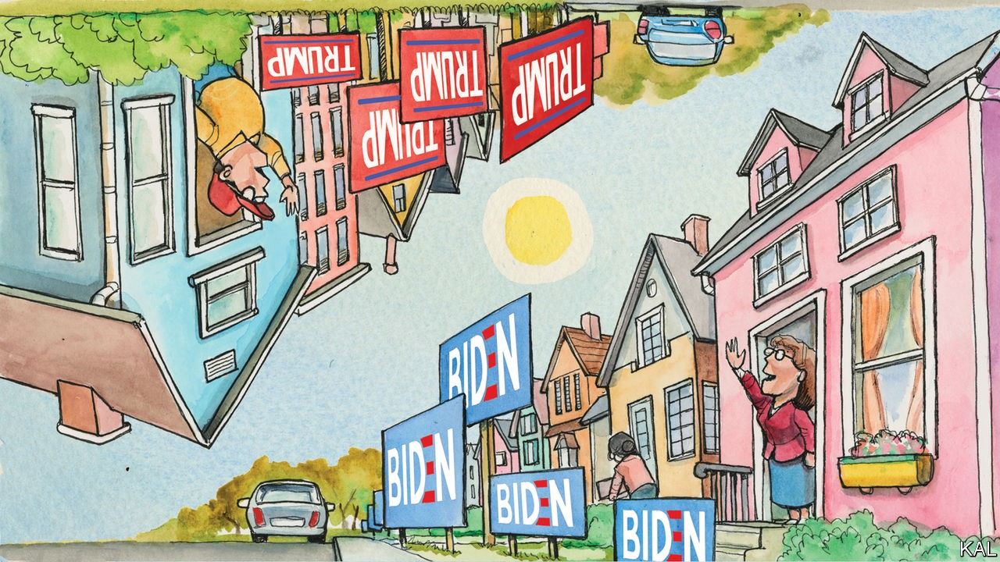

## Lexington

# The battle in miniature

> A small town in Pennsylvania depicts a microcosm of the election—and how Americans are handling it

> Oct 10th 2020

A MODERN-DAY Alexis de Tocqueville might find talk of America’s painful divisions baffling at first blush. Up close, as Bill Bishop wrote in “The Big Sort”, the country has never looked more cohesive. The leafy suburbs of America’s fast-growing, diverse cities are so uniformly Democratic it can be hard to find two people in serious disagreement. Republicans, an older, less mobile group, live equally clustered, farther out. The country is less fractured than ghettoised—as is especially apparent at election time.

In Lexington’s suburb of the national capital (where Donald Trump won 4% of the vote in 2016), local opinion is expressed in a phalanx of Joe Biden yard-signs. Drive 20 minutes into the Maryland countryside and, as if some partisan border had been crossed, “Donald J. Trump” signs are everywhere. Yet there are still places along the frontier where rivals co-exist. One is Easton, an unshowy town in eastern Pennsylvania, where your columnist went to see some weekend canvassing for the president.

A former transport hub, at the confluence of the Lehigh and Delaware rivers, the town once thrived on its strategic site—and still relies on it. It is 70 miles from both New York and Philadelphia, a just-about-commutable distance, which has brought new families to the town, attracted by its house prices, and visitors to its main attraction, a theme-park for Crayola crayons. By no means rich yet not struggling, hardly dynamic yet replenished by incomers: the town sits between socioeconomic categories and political cultures. This has helped make it one of the most contested corners of one of the most competitive states in the country.

Northampton County, of which it is the capital, was one of three in Pennsylvania that flipped to the Republicans in 2016, giving Mr Trump the state by a whisker. True to form, the quadrant of four streets around which Lexington accompanied Karen Frey, an amiable Republican foot-soldier wearing a red “Deplorables Club” sweatshirt (and not wearing the Trump 2020 face-mask that dangled, alongside a stun-gun, “rape alarm” and mace spray, from her wrist), displayed Trump and Biden signs in similar measure.

They otherwise offered no clue to the occupants’ affiliation. Outside the 40-odd houses Mrs Frey called on, a Virgin Mary statue or “We support our police” flag was no likelier to denote a Republican than a Democratic household. At a corner of Hickory Lane, the occupant displayed signs supporting the police, teachers and Mr Biden. “We’re not Trump here, keep walking,” he yelled at Mrs Frey through his car window. The suburb is a throwback to pre-sort America, but bristling with post-sort partisanship. The result is a rare microcosmic view of what partisanship is doing to America.

Very few who answered the door claimed to be undecided—and most were probably, as Mrs Frey conceded, being kind. Only one voter expressed weak feelings about her choice. “I vote for the party, not the candidate,” said Lisa, a lifelong Republican staunchly against abortion. Everyone else appeared fiercely decided.

Given that just over half were planning to vote Democratic (“This year more than ever,” several said), this gave rise to awkward scenes. “I’m sorry, I’m sure you’re a nice person, but I’m 92 years old, I’ve voted for Republicans and Democrats, and I cannot understand how you can like him,” a man on Hickory Lane told Mrs Frey.

He then launched a fact-filled evisceration of Mr Trump’s record, before ending, fighting back tears, on a personal note. “My father came from Italy. Trump hates migrants. My five dead brothers fought for this country. The son-of-a-bitch calls them suckers.” When Mrs Frey, visibly shaken, said this was untrue, the man quoted the president’s slander of John McCain. Mrs Frey countered with a fake-news story—that the late Republican senator killed scores of sailors in a fire. “God bless you,” said the old man.

“It multiplies,” said Mrs Frey enigmatically, as she walked away. Though she knocked on “over 3,000 doors” in 2016, she did not seem used to such pushback. Modern campaigns aim canvassers almost exclusively at likely voters for their own side; she had kindly decided to knock on every door mainly as a favour to Lexington. It was also apparent from her assertions, which tended to be untrue, that Mrs Frey inhabited a deep realm of the Trump bubble.

Considering much of Fox News “too liberal”, she got her news from the far-right One America News Network and Epoch Times, a pro-Trump newspaper produced by the Falun Gong sect that has spread the anti-Semitic QAnon conspiracy. When she encountered a like-minded voter, her relief was palpable. On their doorsteps she referred to Joe Biden as a “communist” and any self-professed Christians who voted Democratic as “Satan-worshippers”.

Lee Drutman, a political scientist, attributes the mutual loathing of America’s political tribes to three things: cultural sorting (including media bubbles); the slim margins of national elections, which makes them seem existential to both sides; and the nationalisation of politics, which has bulldozed local concerns that once girded communities. All are evident in Easton—though its much-provoked voters live cheek-by-jowl. What lessons does that offer?

One is that politics exaggerates reality. While several voters expressed unease about their neighbours’ allegiances, your columnist saw nothing to suggest a community anything like as divided as the political views its members expressed. On a sunny Saturday morning, Trumpers and anti-Trumps mowed lawns and walked dogs together. Outside elections, most of them probably give politics little thought. Given the state of things, that is consoling.

Yet this election will prove harder to recover from—because Republicans, taking their cues from the president, are already trying to invalidate it. Almost Mrs Frey’s first words to your columnist were: “We’re trying to win without stuffing ballots, we’re the Republican Party.” She repeatedly assured voters that mail-in voting was fraudulent. This promises a new order of conflict for a society whose forbearance cannot be counted on indefinitely.■

Dig deeper:Read the [best of our 2020 campaign coverage](https://www.economist.com//us-election-2020) and explore our [election forecasts](https://www.economist.com/https://projects.economist.com/us-2020-forecast/president), then sign up for Checks and Balance, our [weekly newsletter](https://www.economist.com//checksandbalance/) and [podcast](https://www.economist.com/https://play.acast.com/podcasts/2020/01/24/checks-and-balance-our-new-weekly-podcast-on-american-politics) on American politics.

## URL

https://www.economist.com/united-states/2020/10/10/the-battle-in-miniature
