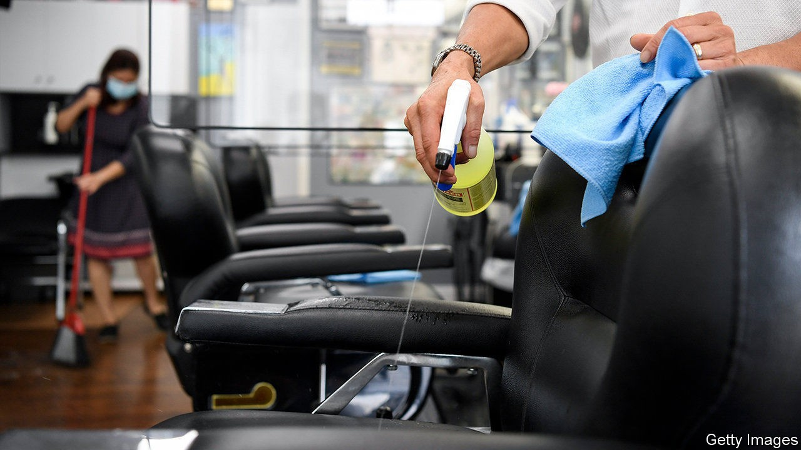
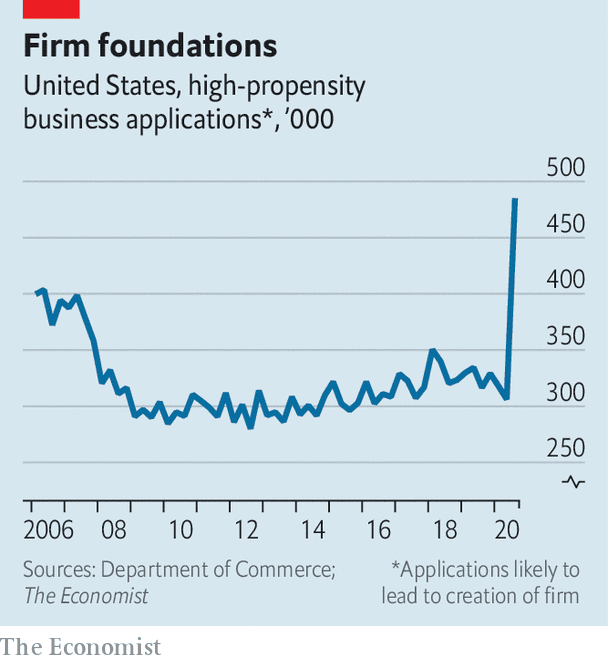

## Entrepreneurship

# The number of new businesses in America is booming

> No other rich-world country is experiencing the same rise in entrepreneurship

> Oct 10th 2020

THE PANDEMIC has had all sorts of unexpected consequences, from a boom in sourdough-bread baking to more people listening to nostalgic music on Spotify. Less noticed is a once-in-a-generation surge in startups. The government regularly releases figures on new-business formation, derived from applications for tax registrations. And “high-propensity” business applications—those displaying characteristics typically associated with firm-creation and the employment of staff—recently reached their highest quarterly level on record (see chart).

Some of these may represent people trying to claim stimulus funds, and a backlog of unprocessed applications had probably built up in March and April. Nonetheless they reflect a genuine rise in American entrepreneurship. Based on a different survey Goldman Sachs, a bank, finds that the share of respondents starting a new business in the past three months has also risen sharply. Other evidence shows that about as many Americans now work for themselves as before the pandemic, even as overall joblessness remains high.

All this has surprised economists. In the last recession the number of “high-propensity” business applications sharply declined. And over the past four decades the rate of new-business creation had been drifting downwards (researchers pointed to declining population growth as one cause, as well as the growing power of large firms, which may have dissuaded new ones from entering the market). The fact that America has suddenly recovered its entrepreneurial mojo is particularly intriguing, since nothing comparable seems to be happening elsewhere in the rich world.

The surge in startups cannot make up for all the damage wreaked by lockdowns and social distancing. The overall number of firms employing workers almost certainly remains lower than it was before the pandemic, since so many have gone bust, says John Haltiwanger of the University of Maryland. Many of America’s largest firms continue to shed staff (see [article](https://www.economist.com//united-states/2020/10/08/the-reasons-behind-americas-new-wave-of-lay-offs)). The jobs report for September showed the unemployment rate at a still-high 7.9%.

But the entrepreneurship boom bodes well for the future. A recovery with lots of startups tends to be more jobs-rich than one without, since young firms typically seek to expand, hiring new staff. Talk to the owners of new enterprises, and it is hard not to feel optimistic about America’s economic prospects. “People in general are tired of staying indoors, so if they feel safe at an establishment, they’re gonna come out,” says Matt, who with his wife Thao has just opened Smokin Beauty, a Vietnamese-inspired BBQ joint in Austin which boasts plenty of outdoor seating. Buzzer, a platform which allows people to see clips of sports events, proudly describes itself as “a company born during a global pandemic that has paused all live sports”.

Economists do not yet know what has provoked America’s entrepreneurship boom. But the economic-rescue package passed by Congress in March may play the biggest role. It did relatively little to preserve jobs, instead focusing on protecting people’s incomes with stimulus cheques worth up to $1,200 and bumped-up unemployment-insurance (UI) payments. This gave people both the need (losing their job) and the means (greater financial security) to take on the risk of founding a business.

Some evidence backs up that theory. Official data suggest that 90% of the net rise in the number of sole traders is being driven by people with a gross household income of less than $35,000, a group that was especially likely to lose their jobs when the pandemic struck, and who would have seen a particularly large income boost from the stimulus measures. America’s new crop of entrepreneurs is moving away from dying sectors and towards up-and-coming ones. In most industries the number of sole traders is in decline, yet in the past year the number working in the information sector, comprising jobs such as data-processing, web-search portals and publishing, has risen by 50%.

The more-generous UI benefits expired in July. More people may now prefer to look for a steady job rather than take a risk on a new business. Yet as the economy changes, new opportunities will continue to emerge. America’s startup boom may last for some time yet.■

Editor’s note: Some of our covid-19 coverage is free for readers of The Economist Today, our daily [newsletter](https://www.economist.com/https://my.economist.com/user#newsletter). For more stories and our pandemic tracker, see our [hub](https://www.economist.com//news/2020/03/11/the-economists-coverage-of-the-coronavirus)

## URL

https://www.economist.com/united-states/2020/10/10/the-number-of-new-businesses-in-america-is-booming
