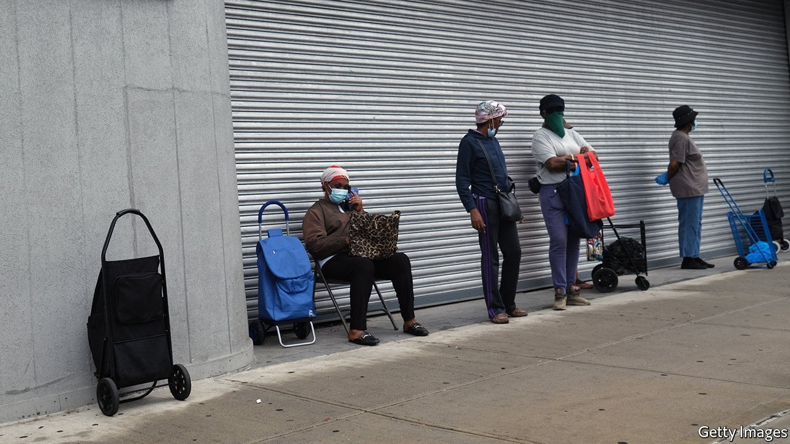
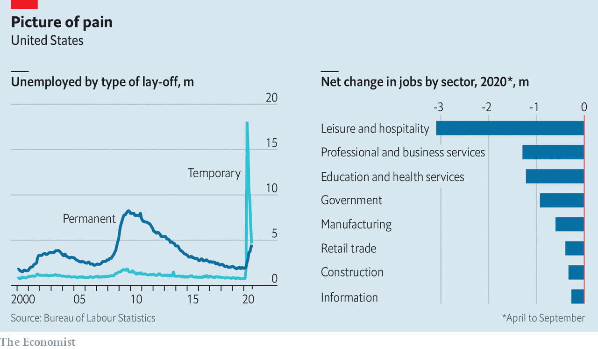

## Unemployment

# The reasons behind America’s new wave of lay-offs

> Now the pandemic, next automation and simplification

> Oct 8th 2020NEW YORK

ON OCTOBER 6TH Jerome Powell, the chairman of the Federal Reserve, made a plea for immediate extra stimulus, arguing that “too little support would lead to a weak recovery, creating unnecessary hardship for households and businesses”. Hours later President Donald Trump shocked USA Inc by declaring he wants no new stimulus until after the election in November (he later backtracked a bit). But do some company bosses see an opportunity in the prolonged pain of the pandemic?

The sudden shutdown of big parts of the economy in spring forced over 20m people out of their jobs. As the economy rebounded during the summer, many went back to work and the rate of new lay-offs slowed. Yet the nature of the sackings is evolving, with a sharp rise in permanent unemployment (see chart). Now a new wave of lay-offs suggests firms are getting ready to make deeper cuts. In recent days leading airlines have said they will cut over 30,000 workers. Disney, an entertainment giant, plans to shed 28,000. Regal Cinemas, the country’s second-biggest chain of theatres, is shutting all 500-plus venues in America (see [article](https://www.economist.com//business/2020/10/06/as-audiences-gingerly-return-cinemas-face-a-new-problem)). Even LinkedIn, a social network used by professionals to find work, plans to lose nearly 1,000 employees in America and beyond.

The disruption caused by the pandemic is one obvious explanation for deeper cuts in payroll. But David Garfield of AlixPartners, an advisory firm, reckons if companies must make do with only 70-90% of historical sales, as may happen with an anaemic recovery, they cannot survive without “major restructuring”. Mr Garfield believes firms must reduce complexity if they want to build resilience into supply and distribution networks. A recent study found that big grocery stores today offer 80% more varieties of products than the average store did three decades ago. Mondelez, a big consumer-products firm, plans to slash the number of stock-keeping units it offers by a quarter. Coca-Cola and Procter & Gamble have made similar noises.

Bain, another consultancy, sees American companies “retooling for the new normal” by ploughing $5trn-10trn over the next decade into automation. This may kill old-fashioned jobs in the short term, but create new, tech-savvy ones over time.

The jobs picture is likely to get worse before it gets better. The pandemic is the proximate cause, but the deeper driver is bosses preparing for a new economy. “This is your moment to strike as chief executive if you want a dramatic change in market share,” says Hernan Saenz of Bain. “Recessions are an amazing opportunity.” ■

## URL

https://www.economist.com/united-states/2020/10/08/the-reasons-behind-americas-new-wave-of-lay-offs
