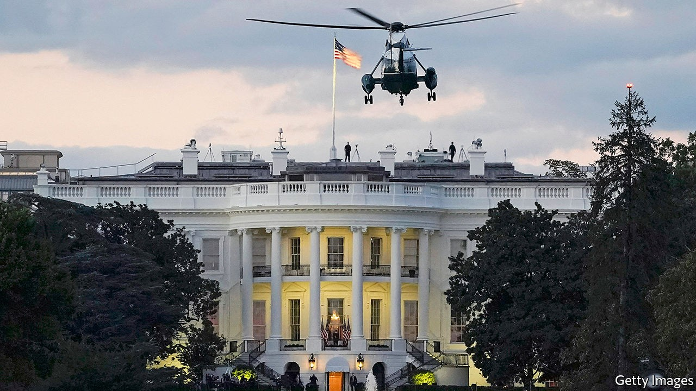
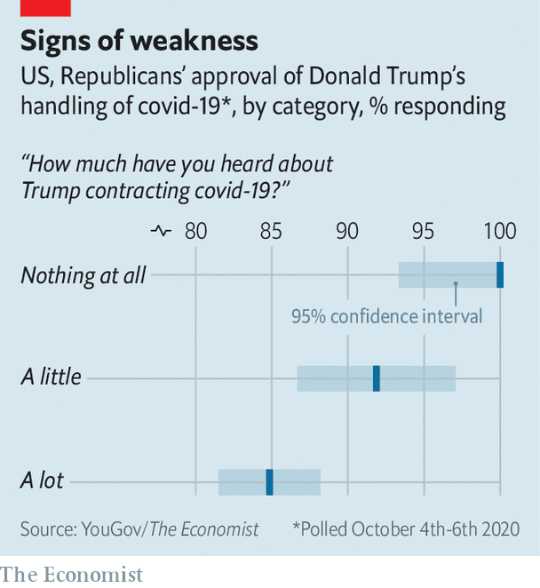

## Covid-19 in the White House

# The virus has hit President Donald Trump and his re-election hopes

> The president’s covid-defiance is putting off plenty of voters, including some Republicans

> Oct 10th 2020

PRESIDENTIAL HISTORY is replete with lies and evasions concerning the state of the commander-in-chief’s health. Grover Cleveland underwent secret cancer surgery, in the dead of night, aboard a yacht anchored in Long Island Sound. An ailing Franklin D. Roosevelt won the election in 1944 while claiming to be in the pink—and died three months into his new term. Rumours persist that Ronald Reagan began showing signs of dementia while in office. That the current administration has been less than straightforward about when Donald Trump contracted covid-19, what his subsequent movements were and how sick he remains might have been the most normal drama of his entire presidency.

Yet, as always, he writes his own script. Whereas Roosevelt sought to underplay his sickness, Mr Trump has gone overboard in claiming to have not merely survived the coronavirus, but vanquished it. After three nights in Walter Reed Medical Centre, following his tweeted announcement of a positive covid-19 test on October 2nd, Mr Trump declared that he had not felt better in 20 years, had “learned a lot” about the virus, then got himself discharged.

Back at the White House, he ascended to the Truman balcony, turned to face the cameras and slowly peeled off his face-mask. In subsequent video messages, he called on Americans not to let the virus “dominate your life” and suggested he might be immune to a virus that, according to his doctors, had caused his blood-oxygen level to plummet three days earlier.

The criticism of his actions has been immense—including from parts of the conservative media. More than 210,000 Americans have died of the virus, which Mr Trump downplayed long before he claimed to have conquered it. Five days before his first positive test he presided over a largely maskless gathering at the White House in honour of his latest Supreme Court nominee, Amy Coney Barrett. Two days before it he mocked Joe Biden, in the first presidential debate, for the Democrat’s punctilious mask-wearing. So many of the attendees at the White House event have since come down with the virus, in addition to Mr Trump and his wife Melania, that the media are calling it a superspreader event. And still Mr Trump is trying to find an angle in anti-facemaskism.

Stricken attendees at the White House gathering include Kellyanne Conway, a senior Trump adviser; Chris Christie, a former governor of New Jersey; and, in Mike Lee and Thom Tillis, two Republican senators whose votes will be required to vote Mrs Barrett onto the Supreme Court bench.

Inside the rabbit-hutch offices of the West Wing, the infection rate is higher. The president’s speechwriter, Stephen Miller, another senior aide, Hope Hicks, the press secretary, Kayleigh McEnany, and four of her colleagues are among the afflicted. So are two periodic White House visitors, Bill Stepien, the president’s campaign manager, and Ronna McDaniel, chair of the Republican National Committee. The minority of White House employees showing up to work, according to a memo leaked to the New York Times, have been told to wear surgical masks and gowns during any close encounter with the president. This might not seem like a good moment to trumpet masklessness.

Mr Trump was never likely to adopt the covid-contrite demeanour some conservative commentators have recommended. It is not in his nature. Squint hard, however, and there is a sort of rationale for his covid-defiance. Contrition, at this point, might look like an admission of responsibility for a public-health calamity that most Democrats and independents already blame him for. To stop that rot spreading to his own supporters, his defiance is in essence an effort to use his personal hold on them to try to change the subject.

There are two problems with this—the first of which represents the central flaw in Mr Trump’s political calculus from the moment he bagged the presidency. Having begun his term as the most unpopular incumbent on record, he needed to reach beyond his base to be sure of re-election. Instead he has revved up his supporters furiously, with hyper-partisan rhetoric and a diet of cultural grievance. His laughter-in-the-face-of-covid strategy is the latest example. This has had predictable results. Polls conducted in the wake of his boorish attack on Mr Biden in the debate suggest almost everyone outside MAGA world is mobilising against him.

A CNN survey puts Mr Biden 16 points ahead—the worst poll for an incumbent this close to an election—even though it showed Mr Trump’s support, at 41%, to be little changed. The average of polls shows a similar trend, though with a nine-point margin. Surveys of the battleground states, which have been consistently better for the president than his overall ratings, bring worse news. He is trailing Mr Biden in Pennsylvania, the state considered likeliest to give Mr Biden an electoral-college majority, by seven points.

The second problem is that Mr Trump’s covid messaging may be starting to turn off Republicans. YouGov polling for The Economist suggests that the more Republican voters hear of his illness, the more harshly they are liable to judge him on his management of the pandemic (see chart). One reason for this may be that the conservative media bubble, into which bad news about Mr Trump rarely percolates, has little choice but to propagate the fact that he and many in his White House have come down with covid.

Another, more intriguing, possibility is that this small slippage points to a nascent reconsideration of the president by his most tenuous supporters, a group of traditional pro-business conservatives, sometimes referred to as “reluctant Trumpers”. A late addition to the Trump train, members of this group, which represents perhaps 10% of the president’s base overall, are especially likely to prize the economy and competence. If Mr Trump lost them, he would be on track for an electoral wipeout.

It is too soon to predict that. Though weakened, he could still be only a lucky break or two from returning to serious contention. Yet, with time running out, he now faces three conspicuous obstacles in the way of that possible recovery.

One is his own health. Though Mr Trump is said to be showing no symptoms, obese 74-year-old men tend not to recover from covid-19 as rapidly as that would imply. A second is the health of his aides, fellow Republicans and the White House attendants who have also been laid low. They will be receiving less elaborate medical care than the president; Mr Christie is morbidly obese. Mr Trump needs them all to recover without major upset if he is to move the media’s attention elsewhere.

The third hurdle is the economy, which is both Mr Trump’s strongest issue, and spluttering. Labour-market figures for September point to a pronounced slowdown in job creation. That is why the mooted fresh dose of stimulus spending that Steve Mnuchin, the Treasury secretary, and House Democrats had been arduously negotiating also looked so important to Mr Trump’s re-election prospects. And yet on October 6th, in another show of strength-in-weakness, the president abruptly called off those negotiations. It was as unfathomable an action as holding an unmasked gathering during a pandemic.■

Dig deeper:Read the [best of our 2020 campaign coverage](https://www.economist.com//us-election-2020) and explore our [election forecasts](https://www.economist.com/https://projects.economist.com/us-2020-forecast/president), then sign up for Checks and Balance, our [weekly newsletter](https://www.economist.com//checksandbalance/) and [podcast](https://www.economist.com/https://play.acast.com/podcasts/2020/01/24/checks-and-balance-our-new-weekly-podcast-on-american-politics) on American politics.

## URL

https://www.economist.com/united-states/2020/10/10/the-virus-has-hit-president-donald-trump-and-his-re-election-hopes
