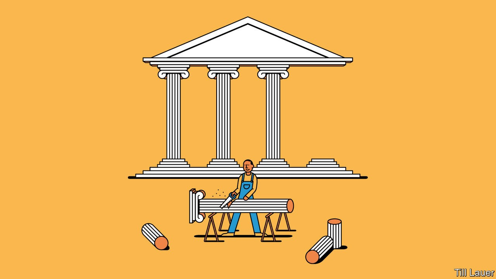

## Banyan

# How not to reform Indonesia

> President Joko Widodo is cutting red tape but also undermining institutions

> Oct 15th 2020

ONCE UPON a time, a slight, upstanding, mild-mannered person came to inhabit the presidential palace in Jakarta, carried there on the shoulders of millions of Indonesians who recognised in the former furniture-maker a man of the people. Today’s incumbent, by contrast, remains remote and aloof, surrounded by courtiers from the capital’s intertwined business and political elites. The previous president used to talk of using political capital to help ordinary folk. His informal blusukan walkabouts forged his famous connection with voters and allowed him to learn first-hand about their problems and how to fix them. The current one has just pared back protections for workers and, this week, sent the police out to crack the heads of those who took to the streets in protest.

The two men are, of course, one: President Joko Widodo, or Jokowi, who came to power in 2014 and was re-elected last year. On the face of things, the new “omnibus” law, which takes a saw to regulations around employment, among other things, is a sensible effort to make it easier to do business and thus promote investment. The economy is indeed tied up in red tape. Mandatory benefits for the few workers lucky enough to be in formal employment were definitely so lavish as to discourage firms from creating jobs. Yet to weaken them in the midst of the pandemic, which has prompted the steepest collapse in incomes in a generation, is tone-deaf, as a former senior official puts it. What is the government doing to help the unemployed to retrain, or to keep tiny businesses afloat?

That is not the law’s only flaw. It reduces the autonomy enjoyed by provincial, district and city governments across the vast archipelago (which, incidentally, enabled Jokowi’s own rise from mayor of a middling city to president). In the name of shredding paperwork, it reduces the say of affected communities in the issuing of environmental permits. It benefits the coal-mining interests close to Jokowi by doing away with royalties in favour of a lower value-added tax. And it makes it much easier for logging firms to plunder virgin forests.

Perhaps the clearest indication of the law’s deficiencies is the murky way in which it was drawn up. The government says unions were consulted; they deny it. The final text, passed by parliament on October 5th and now sitting on the president’s desk for his signature, has yet to be made public.

The saga caps a dispiriting year in which Jokowi and his people have stripped the anti-corruption commission of its independence, neutered the constitutional court, used the police to hound critics, expanded the army’s influence and pandered to Islamists at the expense of women, minorities and civil liberties. Now the central bank’s independence is at risk. The former senior official calls the past year “the biggest assault on independent institutions” since the days of Suharto, the strongman who ruled Indonesia from 1967 to 1998.

The question is what brought this turn in the presidency. One observer argues that Jokowi changed as he sought re-election. Needing money to campaign, he pivoted from the people to the oligarchs. The transformation was complete when, after a nasty presidential race, he co-opted his defeated opponent, Prabowo Subianto, a tycoon, ex-general and former son-in-law of Suharto who is the epitome of the old guard. Mr Prabowo is now defence minister. Jokowi’s coalition includes nearly three-quarters of MPs. With the opposition co-opted, the job of government is to spread patronage—or lose the oligarchs’ support.

Jokowi was probably never the transformational democrat his early fans imagined. Like Suharto, development was what mattered. Jokowi loves getting stuff built—toll roads, a metro system, power plants—and if a bit of corruption helps the process, fine. Now, as Ben Bland of the Lowy Institute in Sydney argues in an excellent book, “Man of Contradictions”, power has revealed his limitations. Building things falls “far short” of a “strategy to remake the economy”. Lurching from problem to problem, and with a low tolerance for boredom, power has “revealed a man with surprisingly little to say about the big questions” of Indonesia’s modern history, including the tension between democratisation and the elites’ concentrated power. As for Indonesia’s lurch back into authoritarianism: if it carries shades of Suharto, one man who wouldn’t mind the comparison with the old development-obsessed tyrant is the former furniture-maker himself.

## URL

https://www.economist.com/asia/2020/10/15/how-not-to-reform-indonesia
