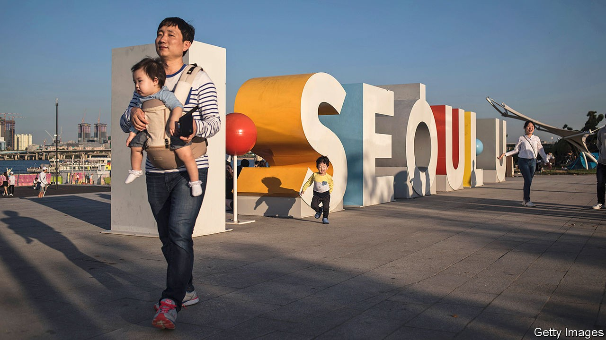
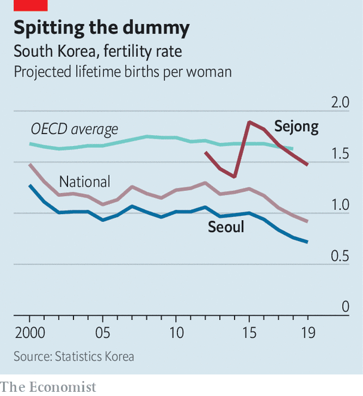

## Cradle to desk

# South Korea wants mothers to work, to bolster the labour force

> That might even make women more willing to have babies, which will also help

> Oct 17th 2020SEJONG

SHIN JOO-HEE learned to cook at the age of 39, while his wife was pregnant with their son. He says it started as a modest challenge to himself: “I wanted to do something nice for her at least once a week.” To his surprise, he found that he enjoyed it. These days the couple share child care and housework more or less equally, helped along by his flexible hours as a civil servant and her control over her schedule running a private art school. They hope that their son, now seven, will grow up without old-fashioned preconceptions about men’s and women’s work. “I truly believe those stereotypes will disappear in the next generation,” says Mr Shin.

That may be optimistic, but the family’s set-up, although still unusual for South Korea, is less exotic than it would have been just a few years ago, thanks in part to a gradual shift in the authorities’ response to the country’s demographic decline. For decades South Korean women have had too few children to keep the population steady in the long run. Last year deaths exceeded births for the first time. A series of campaigns and incentives to encourage women to have more children have not worked.

So the authorities have begun to focus on stopping the shrinking of the workforce, as opposed to the population. Making big changes to the retirement age or admitting lots of immigrants would be tricky politically, so officials are instead making it easier for women to join and remain in the labour market, where they are underrepresented. The resulting developments are a far cry from an egalitarian revolution, but both the work culture and relations between the sexes are beginning to change.

Sejong, where Mr Shin lives with his family, is a good place to observe the impact of those changes on families. It is a newly built administrative city south of Seoul, the capital, and it will probably struggle to achieve the government’s population target of half a million inhabitants by the middle of the decade. But it is popular with young families and couples planning to start one. At 37 the average Sejongite is nearly six years younger than the average Korean. Children make up nearly a quarter of the population, compared with 15% on the national level. The city consistently records the highest fertility rate in the country. Last year the average woman in Sejong could expect to have 1.5 children over her lifetime, fully double the rate in Seoul, though still below the average for rich countries (see chart).

Sejong is indeed child-friendly. The city centre is compact and provides little razzle-dazzle but plenty of green spaces, walking paths and nipper-nurturing infrastructure (half the coffee shop where Mr Shin and his family chose to be interviewed is taken up by an enormous sandbox). The government is pouring money into child care and family support, and regularly asks parents what they want the city to do for them. It helps that many locals work in the civil service, which has to offer flexible working hours like those enjoyed by Mr Shin, encouraging a more equal distribution of labour at home. “It’s extremely boring to live here if you don’t have kids, but for us it’s perfect,” says Park Hye-kyung, Mr Shin’s wife. Though many of her female friends are stuck at home with children, waiting up past midnight for husbands compelled to stay at the office, she says that lots of fathers want to be more involved—and more employers are letting them.

Even beyond Sejong, the number of men who choose to be involved in child care is inching upwards. In 2009 a mere 500 men outside the civil service took any paternity leave at all. In 2017 about 12,000 did. By last year the figure had reached 22,000—still barely a quarter of the 80,000 or so women who take maternity leave each year. The increase seems to be the result in part of the government’s belated realisation that women do not tend to have children on their own. “Making men participate in child care is important to allow women both to have children and to stay in the labour force,” says Kim Seung-tae, who runs the population policy division at the finance ministry. Consequently, the government has made it possible for parents to share what used to be maternity leave.

South Korea remains a tough place for working women, boasting the biggest pay gap between the sexes in the OECD and regularly taking last place in the “glass-ceiling index”, which ranks countries by the ease with which women can get ahead in their careers. (It is compiled by the Economist Intelligence Unit, a sister company of The Economist.) Mr Kim takes a somewhat defeatist view of the power of public policy to promote cultural change: “When it comes to people’s attitudes, all we can do is just highlight good examples and hope they will follow them.”

But one indication that the changes may stick and expand is that they are beginning to take hold among small and medium-size companies, which have tended to lag behind the government and large corporations when it comes to working conditions in general and opportunities for women in particular. Meere Company, a medium-size firm in Hwaseong, just south of Seoul, is typical. The company produces surgical robots and other high-tech equipment. The bulk of its 330 employees are engineers or salespeople; less than 10% are women. The first time any of its workers took paternity leave was three years ago. Since then seven more have done so. Kim Joon-koo, the CEO, expects the number to keep rising: “Of course there was resistance at first, but as we encourage more people to take leave it’s becoming more of a normal thing to do.” Mr Kim says that everyone taking leave can come back to the same job at the end of it—a legal requirement which companies in South Korea have tended to flout, in practice encouraging women to quit once they get pregnant. He says that the shift at the company has been accelerated by the example set by the government. “We’ve been moving in a more egalitarian direction ever since they have.”

The government’s intention in making businesses more friendly to families is to adapt to a shrinking population by increasing the proportion of women who work. What is more, the improving conditions may also help a little with the goal it had largely abandoned: getting women to have more children. The impact on South Korea’s demographic trajectory will be slight, acknowledges Mr Kim from the finance ministry: even in Sejong women have too few babies to stop the population from shrinking. But every current and future taxpayer is a plus. ■

## URL

https://www.economist.com/asia/2020/10/17/south-korea-wants-mothers-to-work-to-bolster-the-labour-force
