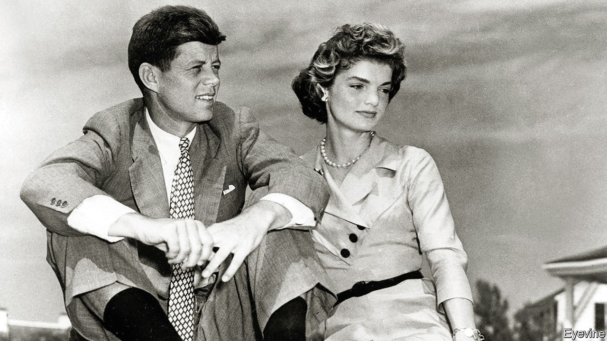

## The road to Camelot

# A masterful biography of JFK is a reminder of imperilled ideals

> Fredrik Logevall deftly unpicks the myths that surround his subject from the glamorous reality

> Oct 17th 2020

JFK: Coming of Age in the American Century, 1917-1956. By Fredrik Logevall. Random House; 816 pages; $40. Viking; £30.

JOHN FITZGERALD KENNEDY was just 43 when he became president—a whipper-snapper compared with Donald Trump, who was 70 when he was first elected, or with Joe Biden, who is 77. His administration exuded an air of youthful energy and glamour, but also a sense of high public purpose. JFK believed that lucky people like him had a duty to serve the public and lucky countries like the United States had a duty to serve the world.

Fredrik Logevall’s blockbuster of a book follows JFK’s life from his birth in 1917 to 1956, when he decided once and for all to run for the presidency (a second volume will tell the rest of the story). It is as good as anything that has been published about its subject, based on years toiling in the archives but written with a delightfully light touch. At times it reads more like a novel than a biography, so vivid is the prose and so extraordinary the material. It is also perfectly timed, with America in the doldrums, its politics polarised, its global reputation shot to pieces and its political class, particularly on the Republican side, discredited. “JFK” reminds readers of what America once was—and could be again.

Perhaps the greatest difficulty in writing a biography of Jack (as he was always known by friends, family and journalists) is that he is surrounded by legends. The Kennedys and their courtiers bear primary responsibility for this: Jack’s father, Joe, managed his image as a man of destiny from an early age and later his professional acolytes, particularly Arthur Schlesinger junior, turned instant history into hagiography. Nature lent a hand: Jack and Jackie Bouvier, whom he married in 1953, were a ridiculously good-looking couple and the Kennedy clan were a picturesque bunch.

Myths inevitably provoked counter-myths. Joe Kennedy, the founder of the family’s fortune and America’s ambassador to Britain in the late 1930s, is often presented as a right-wing monster who had his mentally ill daughter, Rosemary, lobotomised when she showed an interest in sex. Jack himself is often portrayed as a spoilt rich kid who went into politics only at his father’s bidding and treated women like trash.

Mr Logevall, a professor at Harvard University, deals with the legends deftly, defusing them as he goes along but never allowing them to dominate his narrative. He doesn’t sugar-coat “the Ambassador”, as the family patriarch was called: he was an isolationist reactionary who tried to keep America out of the second world war, had a soft spot for Joseph McCarthy and behaved appallingly to women. But he had his good points: “say what one will about Joseph P. Kennedy”, the author writes, “it’s not every multi-millionaire father who takes such broad interest in his children, who believes in them so fervently and who, together with his wife, instils in them, from a young age, a firm commitment to public service.” His nuanced picture of the young JFK presents him as a fully rounded human being rather than a hero or villain—a figure cursed by a sense of entitlement (particularly when it came to women), yet blessed with a profound desire to understand the world and improve it.

Jack was far from a passive vehicle of his family’s political ambitions. He struggled to free himself from his father’s prejudices: his first book, “Why England Slept” (1940), was a critique of appeasement of Hitler, and he matured into a leading supporter of liberal internationalism. He also broke from the populist political style that his family had adopted, presenting himself as a shy, cerebral figure rather than a back-slapping pol in the Irish-American mould that was his inheritance. “There was a basic dignity in Jack Kennedy,” a friend said, “a pride in his bearing that appealed to every Irishman who was beginning to feel a little embarrassed by the sentimental, corny style of the typical Irish politician.”

He was more than just a rich kid with a silver spoon in his mouth. Mr Logevall doesn’t hide the fact that his father’s money and connections helped: the Ambassador played a vital part in getting “Why England Slept”—an expanded undergraduate thesis—into print. But Jack was also his own man. He displayed genuine bravery commanding a boat in the Pacific during the war (though it was his family name that ensured his exploits were celebrated in the pages of the New Yorker). He also endured more than his share of tragedies. Two of his siblings—his elder brother, Joe junior, and his beloved sister, Kathleen, known as Kick—died before he was 40. He was the victim of a mysterious illness, later diagnosed as Addison’s disease, that put him in hospital for months and left him with almost permanent back pain.

In recounting Jack’s childhood, Mr Logevall also tells a story of ethnic ambition and cultural assimilation. The Kennedys had every reason to hate America’s WASP elite. Their ancestors fled from British-ruled Ireland during the famine and, on arriving in Boston, encountered a Brahmin class that hogged power and privilege. But the clan’s response was not to luxuriate in resentment but to get ahead. First they beat the WASPs at everything they held dear, from politics to money-making. JFK’s grandfather, P.J. Kennedy, transformed himself from saloon-owner to state senator; the Ambassador made a fortune in the traditionally WASP world of Wall Street before consolidating it in Hollywood.

Then they joined them. Jack attended a WASPy boarding school, Choate, and the Brahmins’ favourite university, Harvard, developing into a thorough Anglophile when his father became ambassador. That he admired Winston Churchill is hardly a surprise; but he also made a cult of Lord Melbourne, Queen Victoria’s first prime minister, on account of his charm, nonchalance, poise and female conquests. His sister Kick married a British aristocrat. The Kennedys’ set-up at Hyannis Port was very similar to the Bush family’s compound up the coast at Kennebunkport, down to the sports-packed daily schedule and rough-and-ready domestic arrangements. They were rightly called the first Irish Brahmins.

The most important thing they shared with the old WASP elite was a sense of public duty. At first this may have contained a soupçon of revenge: Joe undoubtedly liked the fact that he, a child of the Irish diaspora, was representing the world’s most powerful country at the Court of St James’s. But for Jack that matured into something broader and deeper. One of his favourite political aphorisms was a line from Rousseau: “As soon as any man says of the affairs of state, ‘What does it matter to me?’, the state may be given up as lost.”

His belief that America needed to take responsibility for policing the global system, first awakened by reading Churchill, was powerfully reinforced by his extensive travels, including visits to Hitler’s Germany, and his wartime experiences. His second book, “Profiles in Courage” (1956), reflected on the role of leadership in a democracy, particularly how statesmen should respond if their constituents and parties were bent on doing something dangerously foolish. The oft-quoted lines from his inaugural address, “Ask not what your country can do for you. Ask what you can do for your country”, may seem a bit overwrought today, but they expressed the essence of his political philosophy.

One of America’s great tests in the coming years will be whether the elite can recover the sense of public duty that animated JFK. Mr Logevall shows that political careers could take a heavy toll even when politics was less polarised and the press tamer. Jackie in particular blanched at the “crazy pace of politics” and her husband’s relentless work schedule. But recent American history is a testimony to what happens if the talented ignore politics for the quiet life and rich rewards of the private sector, and leave the public sphere to carnival barkers and clowns. ■

## URL

https://www.economist.com/books-and-arts/2020/10/17/a-masterful-biography-of-jfk-is-a-reminder-of-imperilled-ideals
