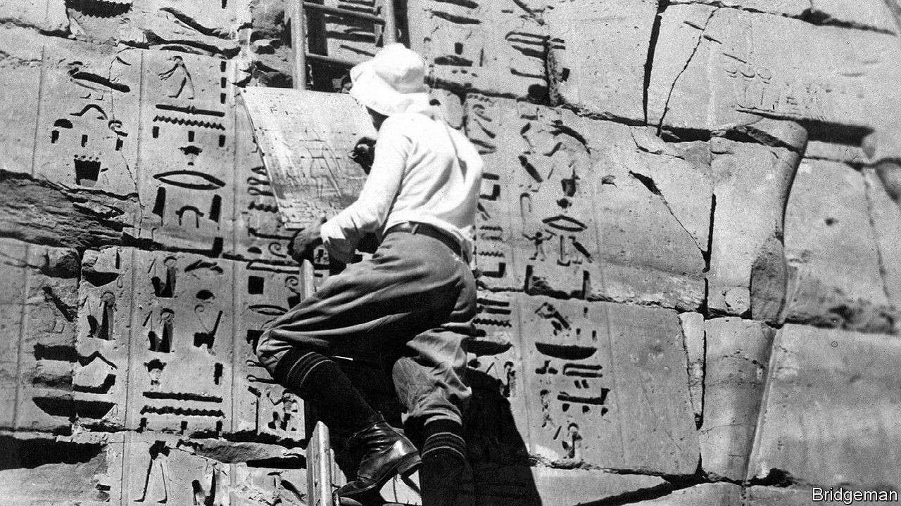

## Pyramid schemes

# Outsiders pillaged—and helped save—Egypt’s glories

> Toby Wilkinson chronicles their exploits in “A World Beneath the Sands”

> Oct 17th 2020

A World Beneath the Sands. By Toby Wilkinson.W.W. Norton; 528 pages; $30. Picador; £25.

AT THE BEGINNING of the 19th century, Egypt’s wondrous heritage was neglected. Ancient mud bricks were turned into fertiliser and temple stones repurposed in factories as the country’s industries developed. Within 100 years, all that had changed. Children learned about the pharaohs; politicians visited their tombs. “Our nation today does not exist independently from the nation of our past,” an Egyptian journalist wrote. “The nation is a single unbroken, unbreakable whole.”

As Toby Wilkinson makes clear in his fascinating new history, this transformation was riddled with ironies. For if Egyptians ultimately came to love their pharaonic past, they had often been coaxed to do so by outsiders. Finally abandoning occult myths and medieval stereotypes about Egypt, Western academics and adventurers had scrabbled for the truth. In 1822 Jean-François Champollion, a French scholar, deciphered hieroglyphics, at last letting the pharaohs speak in their own tongue. By the 1920s his successors were reading letters by Heqanakht, a farmer who lived 4,000 years ago.

An exquisite bust of Nefertiti showed that the ancient Egyptians could produce stunning sculpture. Vivid tomb paintings suggested a dynamic people. No wonder that the Westerners who came to Egypt often fell in love with it. “It is so difficult to tear myself away from this place,” exclaimed John Gardner Wilkinson, a British Egyptologist, in 1832—and he was not alone. Born into a comfortable family, Amelia Edwards was captivated by Egyptian landscapes; she wrote two books about the country and exhorted other Egyptologists to visit. Champollion adopted local dress and proudly drank Nile water, despite the risk of plague.

At the same time, some of the foreigners saw in Egypt and its treasures an occasion for imperialist chauvinism and an opportunity for pillage. As a popular Cairo saying put it: “The riches of Egypt are for the foreigners therein.” European explorers battled for access to the best sites, nursing nasty personal rivalries, ingratiating themselves with Egyptian rulers and smuggling booty away to museums at home (one enterprising Englishman extracted his treasure from a guarded storeroom by tunnel). Unable to carry the Great Pyramid of Giza back to Berlin, a group of Prussians did the next best thing, singing their royal hymn in the burial chamber and scrawling a hieroglyphic ode to their king. Archaeology was not a science, commented a later writer—it was a vendetta.

But “A World Beneath the Sands” is more than a saga of foreigners in the desert—it also follows Egypt on its rocky path to the 20th century. Mr Wilkinson vividly evokes the slave markets and Bedouin attacks of the early 1800s and, later, tourist hotels and the Suez Canal (opened in 1869). New nationalist ideas were sometimes advanced by the same outsiders who hoarded Egyptian artefacts. So desperate was a French Egyptologist to keep German and British influence out of the Egyptian Museum, for example, that he hired locals for senior jobs instead, incidentally championing their advancement.

By the 1920s Egyptian officials were cancelling foreign excavation permits. Especially after the nationalist revolution three decades later, archaeology in the country was controlled by the locals. That was just and probably inevitable—yet for all their flaws, the foreigners achieved a lot. They liberated ancient Egypt from legend, proving it “every bit as innovative and sophisticated” as Greece and Rome. ■

## URL

https://www.economist.com/books-and-arts/2020/10/17/outsiders-pillaged-and-helped-save-egypts-glories
