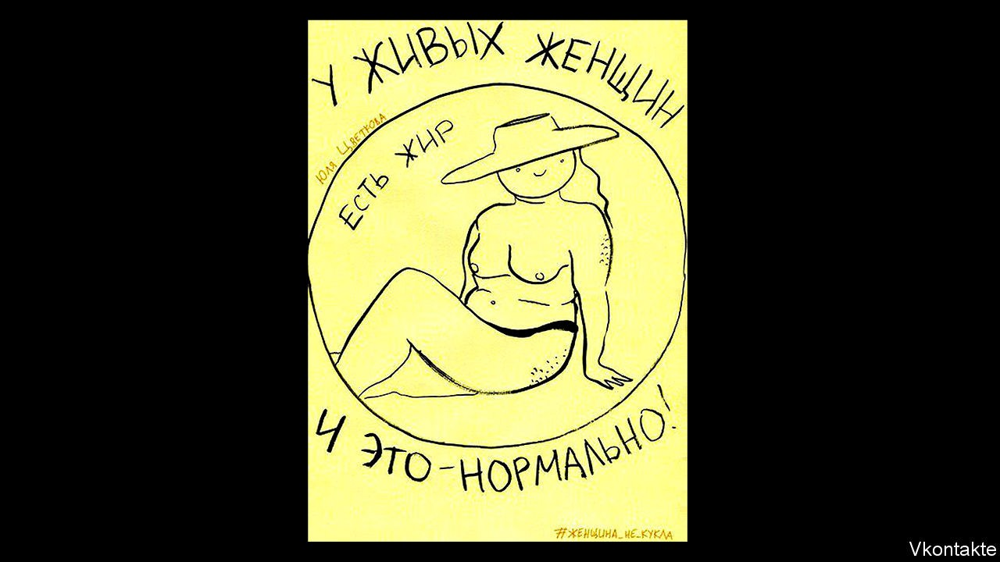

## Body and soul

# The persecution of a feminist Russian artist

> Yulia Tsvetkova faces up to six years in prison on ludicrous charges

> Oct 14th 2020MOSCOW

YULIA TSVETKOVA, an artist and activist in the far east of Russia, wanted to dispel the taboos that surround women’s bodies and sexuality. At 27, she had founded a community centre in her home city of Komsomolsk-on-Amur, where she hosted feminist and LGBT events. She produced plays for children that questioned gender stereotypes, ran a sex-education blog and celebrated same-sex relationships on social media (incurring a fine for disseminating gay “propaganda”). She also shared stylised drawings of female nudes in an online group named after the play “The Vagina Monologues”.

Among her sketches was a series called “A Woman is Not a Doll”. In one image, a woman sits with her legs apart, accompanied by the slogan, “Living women have body hair”. In another (see picture), a shapely figure in bikini bottoms and a sun hat perches among the words, “Living women have fat—and that’s normal!”

Supposedly on account of these and other pictures, police raided Ms Tsvetkova’s home last year and arrested her on charges of “distributing pornography”. When her case comes to trial (no date has yet been set), she faces up to six years in prison. In the meantime, the ludicrous accusations have galvanised protests against the country’s increasingly conservative authorities. Ms Tsvetkova’s queer, feminist art has become an emblem of embattled women’s and LGBT rights; artists and campaigners have taken to Russia’s streets, put on exhibitions and posted nude images of themselves in her support.

“These subjects have never been discussed by the whole country, among such a large number of people,” Ms Tsvetkova remarks from her home town some 3,700 miles east of Moscow, where she was under house arrest for several months this year (she is still unable to travel). Russian schools offer no sex education themselves, and public discussion of gay rights has in effect been illegal since 2013, because of a law that bans the “promotion of non-traditional sexual relations” to minors. The case against Ms Tsvetkova was launched after a prominent anti-gay campaigner reported her; she says she has received death threats from far-right groups. “How good it is that so many people care about this idea of women’s freedom,” she reflects. Those behind the supportive rallies “are very brave”.

Indeed they are: people speaking out on her behalf are being punished, too. Last month activists in Moscow organised a screening of “Vulva 3.0”, a German documentary that explores the history of female anatomy; the National Guard shut down the event and demanded a copy of the film. Courts have fined single-person pickets, who have held banners bearing slogans such as “My vagina is not pornography” and “We are all Tsvetkova”.

Artists have been persecuted before for challenging the regime’s conservative stance. The jailing of members of the punk collective Pussy Riot in 2012 heralded a harder line on dissent; this summer Kirill Serebrennikov, a controversial director, received a suspended three-year sentence for fraud. Rappers, film-makers and performance artists have been targeted. But Ms Tsvetkova’s plight has drawn an especially broad response. Galina Rymbu, who has written poetry in solidarity, says the protests are part of a pushback against regressive laws, in particular the decriminalisation of most domestic violence in 2017.

“If the state wants to kill us, it has the opposite effect. We will save ourselves and come together,” insists Ms Rymbu, some of whose work is published in Britain this month as part of a translated anthology by the feminist collective F-Letter. Feminist ideas have spread in Russia even though the cause has sometimes seemed “hopeless”, Ms Rymbu says, amid government efforts to portray the feminist and LGBT movements as insidious Western imports.

Ms Tsvetkova is under no illusions about her chances in a legal system in which more than 99% of trials result in convictions. “I’m researching the law and violations of rights in Russia,” she says. But she is also “looking into the prison system and rehabilitation of prisoners. And I’m still doing some drawing.” ■

## URL

https://www.economist.com/books-and-arts/2020/10/14/the-persecution-of-a-feminist-russian-artist
