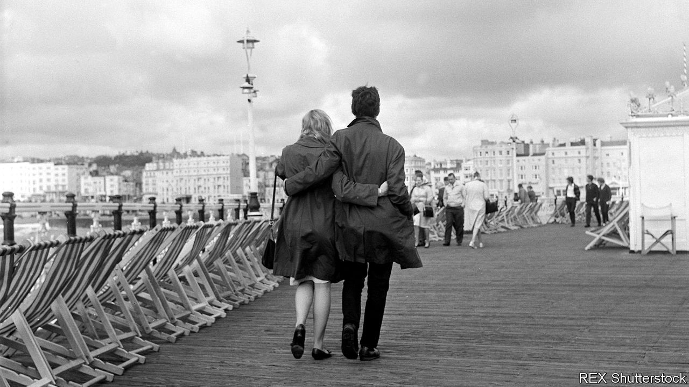

## Secrets and lies

# William Boyd’s new novel is set amid the upheavals of 1968

> “Trio” follows three tormented characters involved in a film production in Brighton

> Oct 17th 2020

Trio. By William Boyd.Viking; 320 pages; £18.99. Published in America by Knopf in January 2021; $27.95.

OVER A CAREER spanning almost four decades William Boyd has written many kinds of bestselling novels, from black comedies to literary thrillers. His finest books, such as “Any Human Heart” (2002), trace a protagonist’s life against a backdrop of 20th-century upheavals. “I always think a life without complications isn’t really a life,” remarks a character in “Love is Blind” (2018), which swashbuckled across fin-de-siècle Europe. Those wrinkles and nuances render the people he sketches convincing and compelling.

“Trio”, his 16th novel, is no cradle-to-grave epic. It unfolds over a single summer, shadowing (as the title suggests) not one character but three—a film producer, an actor and a writer. If it lacks the breadth of Mr Boyd’s immersive life stories, there are ample complications to engage readers in the threesome’s struggles.

It is 1968 and filming is under way in Brighton of a Swinging Sixties movie, “Emily Bracegirdle’s Extremely Useful Ladder to the Moon”. For Talbot Kydd, the producer, every day brings a new fiasco. His problems come to a head when he discovers that someone is stealing film stock and his business partner is defrauding him. Anny Viklund, an American starlet, is enjoying an illicit affair with the leading man until her ex-husband, now an escaped convict, shows up out of the blue. Elsewhere Elfrida Wing, the long-suffering wife of the film’s director, tries to overcome ten years of writer’s block, only to be thwarted and steadily broken by alcoholism and her philandering husband’s latest betrayal.

In time, each is forced to delve deep into their “private self” and decide who they really are and what they really want. Talbot is living a lie and yearns to open up his “undeveloped heart” and obey his true desires. Anny becomes a fugitive who must weigh up her means of escape. And in the book’s darkest sections, Elfrida moves from drowning her sorrows to thinking about drowning herself.

This is an absorbing novel about lives spiralling out of control and the drastic measures required to right them. Rotating between perspectives, the story is made up of a series of dramas that can be read as separate if intertwined tales or as components in a satisfying whole. In “Trio”, in other words, three is never a crowd. ■

## URL

https://www.economist.com/books-and-arts/2020/10/17/william-boyds-new-novel-is-set-amid-the-upheavals-of-1968
