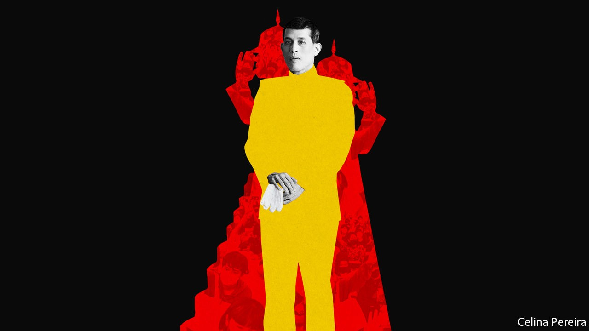
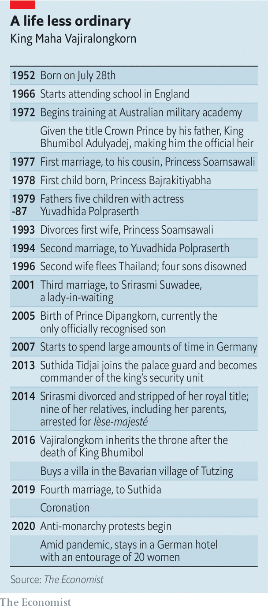
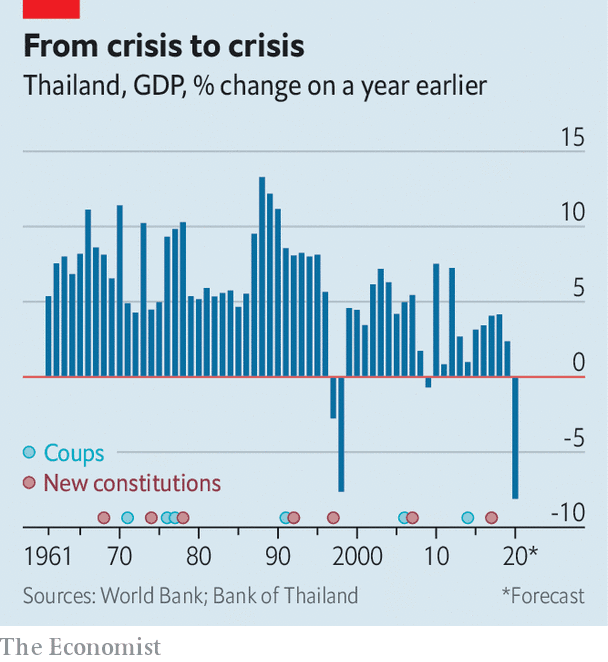
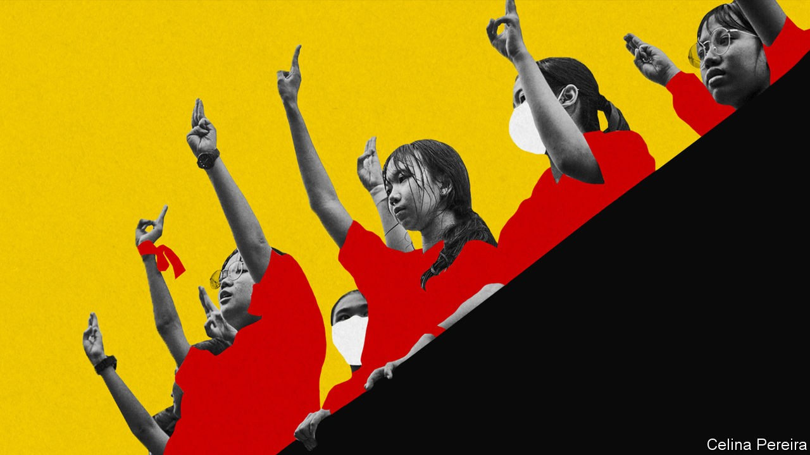

## Battle royal

# Thailand’s king seeks to bring back absolute monarchy

> Maha Vajiralongkorn has provoked something new in Thailand: open criticism of a king

> Oct 14th 2020

THE MONUMENTS disappear in the dark. In April 2017 it was a small bronze plaque from Bangkok’s Royal Plaza. It marked the spot where, in 1932, revolutionaries proclaimed the end of Thailand’s absolute monarchy. In December 2018 a statue was hauled away. It commemorated the defeat of rebels who attempted a coup against those same revolutionaries. Last month activists installed a plaque in the heart of Bangkok’s royal district to protest against the missing monuments. “The people have expressed the intention that this country belongs to the people, and not the king”, it stated. Within a day it was gone.

The world knows Thailand’s King Maha Vajiralongkorn as a playboy who has churned through four wives, lives among lots of women in a German hotel and relishes skimpy crop tops that reveal elaborate temporary tattoos. For Thais, his four-year-old reign has been more sinister.

The king makes elderly advisers crawl before him, shaves the heads of courtiers who displease him and has disowned several of his children. Worse, he has steadily amassed power, taking personal control of “crown property”, assuming direct command of troops and ordering changes to the constitution. He makes no secret of his hankering for the days of absolute monarchy (hence the disappearing monuments). But Thais began to protest in July. Can they prevent the removal not just of plaques, but of constitutional constraints?

On October 14th thousands of protesters marched through central Bangkok to camp outside Government House, where ministers’ offices are located. They also formed human chains to carry away potted plants that blocked the way to the country’s Democracy Monument. Not far away King Vajiralongkorn himself, in the country on a fleeting visit, passed by in a motorcade. Clusters of royalists gathered wearing yellow shirts to show their loyalty to him.

That night a spooked government issued an emergency decree banning gatherings of more than four people and prohibiting reporting on topics that could “harm national security” or “cause panic”. The government warned that protesters who insulted the monarchy would be prosecuted. Several prominent leaders of the protest were arrested the following morning. Yet tensions increased as protests continued in defiance of the decree.

Thailand defines itself as a democracy with the king as head of state. The monarchy is revered. Photographs of royals adorn public buildings and private homes. Father’s Day is celebrated on the previous king’s birthday. Thais hear a royal anthem before films start at the cinema.

Technically King Vajiralongkorn rules as a constitutional monarch. But ancient structures have never entirely disappeared. The king used to sit at the apex of society in a semidivine role. Defenders of the vestiges of this order have long clashed with those claiming to represent an alternative source of authority: the Thai people.

The conflict helps explain why Thailand has endured 12 coups and 20 constitutions since 1932. Since the 1950s a symbiotic relationship between the army and the palace has bolstered the legitimacy of military regimes. For the past two decades the greatest foe of such elites has been Thaksin Shinawatra, a populist prime minister ousted by the army in 2006. His supporters, known as red shirts, battled their yellow-shirted foes in the streets on several occasions in the years after he lost power.

The generals engineered a coup in 2014. The commander who led it, Prayuth Chan-ocha, remains prime minister. An army-friendly constitution disadvantaged large parties, such as Mr Thaksin’s flagship one, Pheu Thai, in an election last year.

One supposed reason why the army seized power six years ago was to ensure a steady succession between the ninth and tenth monarchs of the Chakri dynasty. King Vajiralongkorn’s path to the throne was not simple. Thailand’s elites took against him while his popular father still lived. King Bhumibol Adulyadej was considered the richest monarch in the world, his wealth outstripping that of oil-endowed Middle Eastern rulers and Europe’s royals with their castles and palaces.

Aristocratic types fretted because the crown prince, as Vajiralongkorn was previously known, caused so many scandals. Even his mother likened him to Don Juan. After leaving his first wife, a princess in her own right, he disowned four of his five children with his second wife, an actress, who eventually fled Thailand. When the relationship ended with his third wife—once filmed almost naked and crouching before her husband with birthday cake—several of her family members went to prison. The prince spent lavishly and indulged in eccentricity, elevating his beloved poodle, Foo Foo, to the rank of “air chief marshal”.

Still, King Vajiralongkorn took over unimpeded after his father’s death. Whereas the father was publicly loved, the son is privately loathed. His coronation last year attracted tiny crowds compared with those at the late king’s funeral rites. Despite his co-operation with army regimes, millions of Thais felt King Bhumibol displayed the virtues expected of a Buddhist monarch.

King Vajiralongkorn does not even live in Thailand. He rules a country of 70m people from more than 5,000 miles away in Germany. One insider bluntly appraises his activities there: “Bike, fuck, eat. He does only those three things.” The German government finds his presence awkward. “We have made it clear that politics concerning Thailand should not be conducted from German soil,” the foreign minister, Heiko Maas, told the Bundestag on October 7th.

The king’s militaristic harem inspires embarrassing headlines around the world. Just months after his fourth marriage to a former air stewardess last year, he elevated one concubine, a former nurse, to the status of “royal noble consort”. She is the first woman to hold this title since Thailand became a constitutional monarchy.

Sineenat Wongvajirapakdi fell from grace soon after her elevation. She disappeared from view. Then, in September, she was reinstated and declared “untainted”. Chinese netizens have likened Ms Sineenat to a crafty concubine from a popular television series, “Empresses in the Palace”.

In March 2012 permission from the Justice Department was published in the Royal Gazette for a temporary prison. A spartan map appears to show its location as possibly within the grounds of a palace owned by Vajiralongkorn. His bad books are a miserable place to be. Pictures allegedly of Srirasmi Suwadee, once his third wife, appeared in a German newspaper last year. Head shaved and tearful, she was reported as being under house arrest.

Airing such dirty linen in public in Thailand, however, is perilous. The country’s lèse-majesté law allows between three and 15 years in prison for insulting “the King, the Queen, the Heir-apparent or the Regent”. King Vajiralongkorn has instructed the government not to use the law. But this hardly reflects newfound tolerance. Critics instead risk charges for sedition or computer crime, among others. In July one man was sent to a psychiatric hospital for wearing a T-shirt that stated: “I have lost all faith in the institution of monarchy”.

Playboy antics distract from the more sinister feats of the monarch since he came to power. In political, financial and military matters King Vajiralongkorn has gained powers never possessed by his father. His interventions appear part of a larger strategy to push Thailand closer to absolute monarchy once more.

Take his finances. In 2017 he gained full control of the Crown Property Bureau (CPB), which manages royal investments (it was previously run by the ministry of finance). Its holdings are estimated to be worth $40bn. In 2018 the CPB declared that its assets would be considered the king’s personal property. As a result the monarch has stakes in some of Thailand’s corporate titans. He is the largest shareholder in Siam Cement Group, a conglomerate with revenues of almost $14bn in 2019, with a third of its shares. The head of the CPB, long a stalwart in the king’s circles, is a director of Siam Cement Group and of the 113-year-old Siam Commercial Bank, one of Thailand’s biggest, in which the king also has a stake.

In addition to the king’s private means, the Thai state showers the royal family with funds. For the 2021 fiscal year government agencies have drawn up budgets which allocate more than 37bn baht—over $1.1bn—to the monarchy. The Royal Office will receive 9bn baht of that directly. Much of the rest goes to government agencies, the police and the defence ministry for security and for development projects. By comparison, Britain’s Queen Elizabeth cost her taxpayers the equivalent of $87m last year. Precise details on where the money goes are elusive. Huge sums go to pay for royal transport alone (there are many planes and helicopters to maintain).

King Vajiralongkorn’s political interventions are another demonstration of his growing authority. In theory the monarch sits above parties, parliament and politics. But after a referendum in 2016, in which campaigners were banned from opposing the constitution put forward for approval, the monarch demanded changes to the charter. He altered it specifically to make ruling from afar easier.

He meddled even more audaciously ahead of last year’s parliamentary election. Mr Thaksin persuaded the king’s older sister to run as a putative prime ministerial candidate for a party with links to him. But the crown in effect came to the rescue of Mr Thaksin’s military foes. The monarch declared his sister’s ambitions “unconstitutional”. He also stated that royals should stay out of politics—yet the night before the election, he urged Thais to vote for “good people”, which was taken as an endorsement of Mr Prayuth and his allies.

This is just one example of how the palace and the barracks have continued to support each other since King Vajiralongkorn came to the throne. The king has a deep interest in military matters. Trained in an Australian academy, he holds the titles of admiral, field-marshal and air-marshal. The queen is a general and Ms Sineenat a major-general. The king has drawn military forces to his direct command. The Royal Command Guard has been created with some 5,000 soldiers. They are stationed in Bangkok, while other important army units, including an infantry regiment and a cavalry battalion which have facilitated past coups, have been moved out of the city. Overthrowing any government without advance co-ordination with royal troops would prove extremely difficult.

Why has the army permitted such manoeuvres? Defence of the monarchy is one of its central reasons for existing. Both the powerful army commander who retired in September, and his replacement, are deeply loyal to the king. They also rose through the ranks of the King’s Guard, in which Vajiralongkorn himself once served. Mr Prayuth and his closest allies, by contrast, emerged from the Queen’s Guard within the Second Infantry Division.

The prime minister can hardly counter the monarch’s power grabs. He depends on the king’s support for a semblance of legitimacy. Whereas the middle and upper classes of many countries contain democratic champions, those of Thailand “have never needed mass support to advance or protect their interests”, explains James Wise, a former Australian ambassador to Thailand, in his book “Thailand: History, Politics and the Rule of Law”. These conservatives would not stand for an army-linked prime minister rebuffing the royal institution.

Mr Prayuth is also weak: he wrestles even with his allies in the ruling coalition and lacks personal popularity. That hinders his ability to tackle the difficulties Thailand faces. Growth was slowing even before the coronavirus pandemic struck (see chart). Now the central bank expects the economy to contract by more than 8% this year—worse than the crash in the Asian financial crisis in 1997.

A very few opposition politicians have resisted King Vajiralongkorn’s growing control. In October most MPs from the liberal Future Forward Party, founded in 2018, opposed an executive decree in the lower house of parliament. The decree, which passed anyway, facilitated the partial transfer of army units and related budgetary allocations to the Royal Command Guard. Even so, it was the first time that lawmakers had ever opposed a legal procedure linked to the monarchy.

Future Forward no longer exists. Its platform in favour of democratic freedoms and army reform, as well as the popularity of its charismatic leader, Thanathorn Juangroongruangkit, made it a threat to the establishment. The outfit grew from nothing to become the country’s third-largest party in parliament in little more than a year. Legal cases against the institution and its leadership started to mount. In November Mr Thanathorn was stripped of his status as an MP. In February the party was dissolved by the constitutional court and its executives banned from politics for a decade. The judges decided that a loan Mr Thanathorn gave the party was an illegal breach of individual-donation limits.

Flash mobs mounted protests, though social-distancing measures soon put an end to them. The lull was temporary. Social media have provided an outlet for audacious criticisms. So widespread was moaning over the traffic jams caused by royal motorcades, for example, that in January the king instructed police not to close entire roads for travelling royals.

Other grumbles could not so easily be sorted. In August, after legal threats from the Thai government, Facebook blocked access from Thailand to a 1m-member group criticising the monarchy. “Requests like this are severe, contravene international-human rights law, and have a chilling effect on people’s ability to express themselves,” the firm stated. It is preparing to mount a legal challenge.

Popular anger has moved from screens to streets. Since July protesters have gathered to call for the dissolution of the government, reform of the constitution and an end to the harassment of opposition activists. Students’ demonstrations inspired a wider swathe of Thais to march, too. Their efforts mark an evolution from the feud between red shirts and yellow shirts. New battle lines are over democratic freedoms.

The boldest protesters have called openly for reform of the monarchy. They object to the king’s financial set-up and his consolidation of military power. Mr Thanathorn has also called for transparency about how state funds are spent on the monarchy.

The situation grew more serious as the protests swelled in size. The great fear is that the bloody treatment of student protesters in the 1970s will be repeated. In 1976 police, army and vigilante groups attacked students after they staged a mock hanging in protest against the killing of two pro-democracy activists. A story spread among royalists that the figure hanged resembled Crown Prince Vajiralongkorn. According to official figures, 46 students died and more than 3,000 were arrested.

So far the authorities have arrested a few dozen protest leaders. The government had claimed it wanted to talk to students about their grievances. “Having a peaceful and civil dialogue where we exchange our views is the best approach for moving forward,” said the education minister. However, this week the establishment ran out of patience. If the prime minister cannot bring calm he may be replaced. Any drastic intervention is unlikely, however, without the monarch’s foreknowledge.

But King Vajiralongkorn’s clout has come at a price: open criticism of the monarchy. “The ghost is out of the bottle and you won’t get it back again,” reckons one diplomat in Bangkok. The more brazen the king’s moves towards a more absolute form of rule, the more forceful the criticism. “We are trying to bring the king and monarchy under the constitution,” explains one teenage protester. “We aren’t trying to bring them down.” King Vajiralongkorn’s actions could determine whether Thailand continues to revere royalty, or starts to revile it. ■

Editor's note: this piece has been updated to include the Thai government's announcing a state of emergency

## URL

https://www.economist.com/briefing/2020/10/14/thailands-king-seeks-to-bring-back-absolute-monarchy
