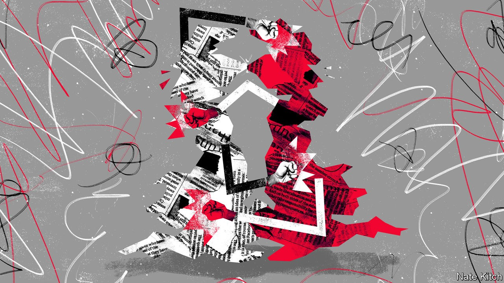

## Bagehot

# Britain’s political and social fabric is under unusual strain

> The country is becoming mad, bad and dangerous

> Oct 17th 2020

THE BRITISH like to think that they have a genius for defusing conflicts. France’s road to democracy lay through the Revolution and the Terror; Britain’s through the Great Reform Act. Germany and Italy had Hitler and Mussolini. Britain had Oswald Mosley, who signed his political death warrant as soon as he donned a black shirt and took to walking oddly. In China and Russia Communism resulted in the loss of millions of lives. In Britain it caused a few misguided souls to waste their lives flogging copies of the Morning Star.

Yet this illusion is born of a short-sighted view of history and geography. On the island of Ireland British citizens have only just stopped murdering each other for sectarian reasons. Peace is a recent phenomenon on the British mainland, too. In the 17th century the Civil War claimed the lives of a higher proportion of men than did the first world war. The 18th century saw an epidemic of riots and public drunkenness. Boyd Hilton’s volume of the Oxford History of England covering the years from 1783 to 1846 is entitled “A Mad, Bad and Dangerous People?”.

Britain has enjoyed a stable couple of centuries not because the British people are a naturally pacific lot but because of a uniquely successful political settlement that prioritised compromise over conflict and assimilation over exclusion. The traditional ruling class had a genius for co-opting new social forces. Thomas Macaulay, the great historian of Britain’s peaceable settlement, proclaimed that the country’s aristocracy was the most democratic and its democracy the most aristocratic in the world. Its institutions have a genius for co-opting and civilising political divisions. The weekly Punch and Judy show that is prime minister’s question time may be tedious, but it beats fighting in the streets.

Yet this settlement is beginning to fray. One of the stablest countries in Europe has become one of the most unpredictable. The box of surprises that produced Brexit may well lead to Scottish independence before the decade is out. France used to be the nation of street protests, but during the height of the Brexit frenzy Parliament Square was permanently occupied and the forces of Remain put 600,000 people on the streets. The British now hate their political elites with continental fervour. A ComRes poll in 2018 revealed that 81% of the respondents, and 91% of Leave voters, felt most politicians didn’t take into account the view of ordinary people. The country’s disparate parts are also growing sick of each other, as the Scottish independence movement produces an aggressive English counter-reaction.

There is no shortage of explanations for these growing tensions. Left-wingers blame de-industrialisation for creating a dangerously unbalanced country one corner of which is much richer than the rest. Traditional conservatives blame popular capitalism: the masses want instant gratification and the elites can’t be bothered to uphold cultural standards. (George Walden’s recently republished “New Elites: A Career in the Masses” expounds this case brilliantly.) But two developments have contributed most.

The first is the rise of identity politics. “Brexitland”, a new book by Maria Sobolewska and Robert Ford, argues that British politics, which used to be organised around class, has since the 1960s reordered itself around identity. “Identity liberals” are university graduates who pride themselves on their “open-minded” attitudes to immigration and ethnic minorities. “Identity conservatives” are older voters (who grew up when only 3% of people went to university) and people who left school with few qualifications; their economic interests do not always coincide, but they share a pride in Britain’s traditional culture, they bristle at attempts to marginalise it and they set the tone of Boris Johnson’s Conservative Party.

Identity politics, which seeks to drive a wedge between “us” and “them”, is far more explosive than class politics: you can compromise over the division of the economic pie but not over the core of your being. Brexit demonstrated this painfully. Enlightened liberals, even less tolerant than cultural conservatives, behaved like middle-class passengers forced to sit next to a working-class hen party on an overcrowded Ryanair flight. And neither side could resist the temptation to taunt the other. David Lammy, a Labour MP, likened the Eurosceptic European Reform Group to the “Nazis” before correcting himself and saying that the comparison was not strong enough. Plenty of issues, from Scottish independence to historical monuments, are susceptible to that sort of treatment.

The second disruptive force, closely related to the first, is the rise of the meritocracy. In his prophetic book of that name Michael Young argued that meritocrats believe that they owe their positions to nothing but their own merit, while the unsuccessful either lash out against the system or turn in on themselves in despair. The six-fold expansion of the universities has deepened the divide. Britain’s education system is now a giant sieve that selects the university-bound half of the population, depositing them in big cities, and lets the rest fall where they may, feeling unrepresented in Parliament or the media. White school-leavers are a particularly marginalised and volatile group, whose ranks are swelled by a new problem that Young didn’t anticipate. Many of those who get a university education feel cheated by it, for rather than offering admission to the cognitive elite, it may lead only to a pile of debt and a future labouring in the “precariat”. History suggests that the overeducated and underemployed are political tinder, as both the Bolsheviks and the Nazis demonstrated.

This might sound overexcited: the British system survived the 1930s not only intact but enhanced. The Conservative Party has done a good job of absorbing the raw energies of populism. The Labour Party is moving back to the centre after Jeremy Corbyn’s insurgency. But Brexit and the pandemic are further discrediting the political class while shrinking the economy. The numbers of “mad, bad and dangerous” people are growing. The country’s rulers need to think more seriously about how to civilise them. ■

## URL

https://www.economist.com/britain/2020/10/17/britains-political-and-social-fabric-is-under-unusual-strain
