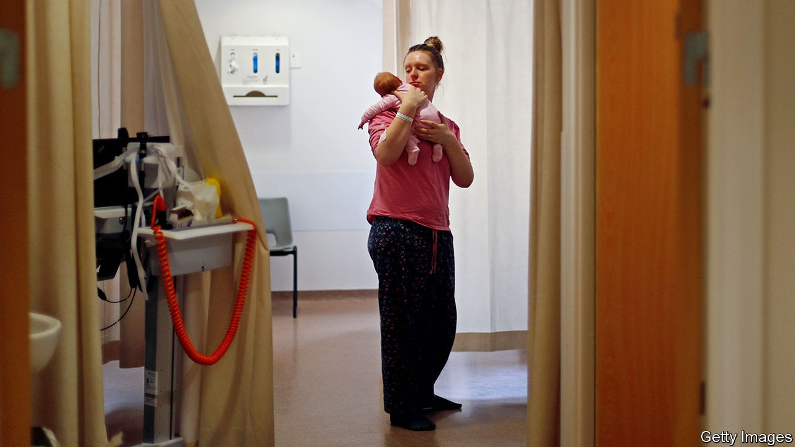

## Maternity services and the pandemic

# Covid-19 is limiting access to maternity services for British fathers

> That’s bad for their partners and their babies, as well as for them

> Oct 17th 2020

WHEN JAMES returned from the hospital after the birth of his son, he was surprised to find a bottle of whisky and some cans of lager on his doorstep. The mystery was soon solved. Under covid-19 rules, James was allowed into the hospital where his partner Annie was due to give birth only once active labour had begun. Thirty-six hours after being admitted for an induction, Annie found herself on a delivery ward in the early hours of the morning desperately trying to rouse her sleeping husband by phone. When that failed, she resorted to ordering a delivery from a local off-licence in the hope that the doorbell would prove more effective. In the event, he woke before the booze arrived.

James made it to the hospital on time and all went well. Others have not been so lucky. “I’ve heard real horror stories of what women have had to face alone, whether it’s awful news at a scan or going through a difficult birth without your partner there,” says Joeli Brearley of Pregnant Then Screwed, a campaign group. As Britain locked down in March, hospitals limited the number of visitors allowed on their premises. Pregnant women had to attend 12- and 20-week scans, and go through much of the process of labour, alone. Non-essential retail reopened in June, followed by pubs and restaurants in July, but tight restrictions have remained in place limiting access to maternity services and post-birth visits by new fathers. A petition calling for the rules to be loosened across Britain has received over 440,000 signatures and the backing of 60 MPs.

The Royal College of Midwives, a trade union and professional body, acknowledges that “the support of a partner during scans and labour is important”, but argues that restricting access to some services means that “maternity teams can continue to deliver good-quality, safe care, protecting pregnant women and the midwives who care for them.” Others are less convinced. “It’s important to remember that the vast majority of birth partners live with the woman giving birth,” says Jeremy Davies of the Fatherhood Institute, a think-tank. “We haven’t had a sudden spike in virgin conceptions.” Evidence suggests the presence of partners leads to better medical outcomes, partly because it reduces stress and anxiety during birth.

In response to rising discontent the NHS issued new guidance for maternity services on September 8th. But campaigners say that interpretations of the guidelines vary widely across the country and most services remain closed to partners. The concept of “active labour” is especially slippery. “It’s not like this stuff runs on a timetable,” says a midwife. As of late September, fewer than one in four hospital trusts were allowing partners to be present for the whole of labour and half were still banning women from being accompanied to their 12-week scan. As Ms Brearley says, “No one should have to find out they have miscarried alone.” ■

Editor’s note: Some of our covid-19 coverage is free for readers of The Economist Today, our daily [newsletter](https://www.economist.com/https://my.economist.com/user#newsletter). For more stories and our pandemic tracker, see our [hub](https://www.economist.com//news/2020/03/11/the-economists-coverage-of-the-coronavirus)

## URL

https://www.economist.com/britain/2020/10/17/covid-19-is-limiting-access-to-maternity-services-for-british-fathers
