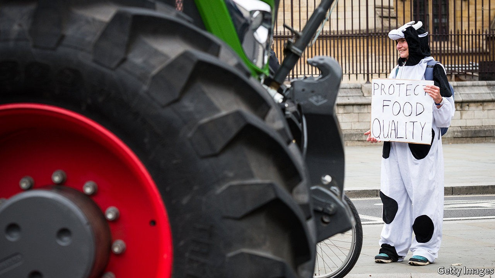

## Trade policy

# Farmers, greens and animal-lovers make doing trade deals difficult

> Campaigners want imported food to meet Britain’s domestic standards

> Oct 15th 2020

IF THE 14 Tory MPs who rebelled against the government in a vote on the agriculture bill on October 12th are given a hard time by party whips, they will get plenty of support elsewhere. Along with them, Jamie Oliver, a celebrity chef, and the National Farmers Union have teamed up with environmentalists and animal-welfare lobbyists to oppose the government.

The government won this vote, on an amendment that would have required food imports to meet British standards, but the fight is not over. Since the deal that the government has touted most—one with America—depends on opening trade in agricultural products, the vote is a measure of the difficulty the government will face in getting this done.

The pitch from Brexiteers was that, unshackled from the sovereignty-sapping EU, Britain’s swashbuckling negotiators would zip around the world to agree new deals, so restoring a champion of free trade to its former glory. It has not proved so easy. There are trade deals to be done, of course. But the most urgent of these are supposed to stop old alliances from lapsing. In 2019 43% of Britain’s exports went to the EU, and 14% to countries with which the EU has a trade deal. So far the Department for International Trade (DIT) has secured continuity deals with countries representing 10% of Britain’s exports; Canada, Singapore and Mexico are among those still left to go.

The scramble to sustain the status quo is hardly in keeping with Britain’s global branding. So the DIT has started negotiations with Australia, New Zealand and America, and plans eventually to bring Britain into the Comprehensive and Progressive Trans-Pacific Partnership, a deal with 11 countries around the Pacific Rim.

Britain’s strategy for securing new deals has echoes of its past. When Joseph Chamberlain, a Conservative bigwig, argued for a tariff wall in 1903, he did so partly so that holes could be knocked through it, and “imperial preferences” given to Britain’s colonial trading partners. Now, instead of slashing its tariffs unilaterally, Britain mostly modified or kept those of the EU. That leaves British negotiators with leverage in trade talks, as they can offer reductions in tariffs on, say, citrus fruit in exchange for market access elsewhere.

Imperial preferences allowed in cheap imports of Australian dairy and Canadian wheat. Joining the European project meant ditching them; leaving it could allow British consumers to enjoy the delights of cheaper food, not just from those countries but also from America. And a deal that facilitated those imports could also ease the path for British exports.

That prospect does not fill the British public with joy. American negotiators see a trade deal with Britain as an opportunity to unpick the EU’s precautionary principle, which assumes risky things are dangerous until proven otherwise, and either overturn “unscientific” restrictions on imports of hormone-treated beef and chlorinated chicken or prevent future ones from emerging. Along with Mr Oliver, the farmers and the greens, more than 1m Britons have lent their signatures to a campaign demanding that imports meet Britain’s domestic standards on food safety, animal welfare and the environment. “The US is asking the UK to import beef that’s been puffed up with hormones, meat that’s been washed with chemicals and crops that have been grown using vast quantities of pesticides,” says Sam Lowe of the Centre for European Reform. “None of that is very appealing on paper.”

Some deals can probably be done without much difficulty. Australia and New Zealand are unlikely to hold out for the concessions that the United States is demanding. But domestic politics could well scupper an American deal. Although glowing headlines and a handshake with America’s president would be nice, the government may find the price too high.■

## URL

https://www.economist.com/britain/2020/10/15/farmers-greens-and-animal-lovers-make-doing-trade-deals-difficult
