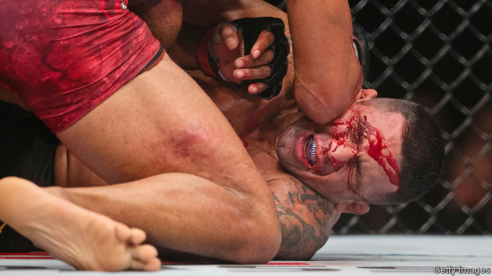

## Class conflict

# Mixed martial arts is on the rise in Britain, and on the right

> But the sport attracts interest from both ends of the political spectrum

> Oct 15th 2020

MANSFIELD, A FORMER mining town in the Midlands, tends to be ahead of the curve. In 2017, after 94 years under Labour control, it fell to the Conservative Party, foreshadowing the collapse of the “red wall” of northern Labour seats in 2019. It is also in the forefront of a sporting revolution sweeping former industrial towns, particularly in the north and the Midlands: the rise of mixed martial arts.

MMA fighters are locked in a cage and employ violent tactics to subdue their opponents. The sport has spread to Britain from America, home to the Ultimate Fighting Championship (UFC), the world’s largest MMA promotion company. In 2007 the British Medical Association advised that the sport be banned on the grounds that it was too violent, but it has continued to grow, and now boasts the same participation among 18-34-year-old men as cricket and rugby, according to Harris Interactive, a market researcher. In November 2019 the UFC opened a gym in Nottingham, the first of its kind in Europe, and earlier this month the BBC broadcast an MMA fight for the first time.

A focus on discipline, often combined with teetotalism, has won the sport a reputation for keeping young men in deprived areas on the straight and narrow. “It’s discipline and respect, little things like that, that aren’t much about nowadays,” says Christian Smith, a former professional fighter who now runs Tap or Snap, one of Mansfield’s 14 MMA gyms. Jimmy Hey, an MMA trainer who runs the Apex Gym in Great Harwood, Lancashire, says he would often drive around the area and spot his students acting up. “I’d catch them with an eight-pack of beer, getting ready to go home at 12 o’clock in the afternoon and just sit there and get drunk… So I used to drag them off the street and that. But they responded really well.”

Brutality in the ring can turn cage fighters into celebrities with international reputations. Michael Bisping, from Clitheroe, Lancashire, worked in factories before moving to America where he became a world champion. “A lot of lads see it as a way out,” says Mr Hey. Fans reject the idea that fighters are mere thugs. “It can look like mindless violence in a cage,” admits one. “But I’ve heard it compared to high-speed chess, which I agree with.”

On both sides of the Atlantic, the sport has political overtones. In America, Dana White, president of the UFC, and Colby Covington, a welterweight champion, are outspoken supporters of Donald Trump. Darren Till, a Liverpudlian fighter who has relocated to Brazil, is a cheer-leader for Jair Bolsonaro. In America and Germany, some MMA gyms are associated with the far right. The sport is a natural fit for extremists who want to co-opt it, says Alex Channon, a senior lecturer of sport at the University of Brighton. “The struggle for physical domination between men is pretty much central to fascist ideology.”

Britain First, a fascist group, had an MMA instructor at a training camp in Erith, south-east London; that came to light—and to an end—when Paul Golding, the group’s leader, was handed a suspended prison sentence in 2017 after headbutting the instructor in a nightclub. Mr Hey was questioned by anti-terror police after Hope Not Hate, an advocacy group, claimed he was training members of National Action, a banned group. He admits to having trained National Action members but says he did not realise they belonged to the group. A subgroup of MMA embraces cultural nationalism, claiming that martial arts were invented not by East Asians, but by ancient Celts. The majority of MMA enthusiasts regard them as eccentric.

The left is challenging right-wing domination of the sport, through so-called “red gyms”. Some offer training to activists to fight fascists at protests; others, like Solstar in London, teach lefties about healthy living. Paula Lamont, a co-founder of Solstar, says she felt there needed to be a left-wing presence in MMA, though the club does its best to keep politics out of the cage. “We don’t have political debate within the club,” says Ms Lamont. “Otherwise everyone would just argue.” ■

## URL

https://www.economist.com/britain/2020/10/15/mixed-martial-arts-is-on-the-rise-in-britain-and-on-the-right
