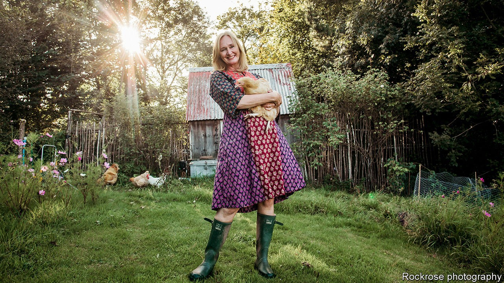

## Publishing

# Political biographies are dislodging celebrity books

> Dysfunctional politics, it turns out, is rather entertaining

> Oct 15th 2020

JAMES DAUNT used to grimace when another dreary politician’s memoirs hit the shelves. “You would unpack the worthy brick that came from the publishers and then three months later you would put them all back in a box to go back whence they came,” says the boss of Waterstones, a bookstore chain. The minutiae of long-ago cabinet meetings left the nation strangely unmoved. “Norman Fowler’s memoirs didn’t race out the door.”

What the punters wanted were celebrity tell-alls. They devoured books by or about boy bands, athletes and people such as Katie Price, a model famous for being famous. A writer of “bucketloads” of these books says he twice bashed them out in 20 days.

Though the biggest celebrity biographies still outsell other non-fiction, the genre is on the wane. At their peak, in 2008, celebrity titles made up 55% of the biography and memoirs market, according to Nielsen, a research outfit, bringing in £77m ($144m). That dwindled to £43m in 2019, or slightly more than a third of the market. Over the same period, biographies of politicians and historical figures climbed from less than a tenth of the market to nearly a sixth, making about £19m last year.

By the time the latest title, a life of Boris Johnson by the serial biographer Tom Bower, was published on October 15th, it was already climbing up Amazon’s pre-order charts. “Diary of an MP’s Wife”, a gobsmackingly indiscreet behind-the-scenes account of David Cameron’s government by Sasha Swire, is in high demand, too. “Jeepers,” exclaims Mr Daunt. “We’re ordering more and more and more.”

Three factors explain the celebrity recession. First, thanks to social media the world already knows all about many putative subjects. Second, publications which once fought for first dibs on a book’s gossip are poorer than they were. Newspapers that once paid £150,000 might now pay £50,000. A celebrity magazine that would have shelled out £30,000 would now offer £1,000 or so. Third, retailers are fewer and pickier than they once were. The record shops that once flogged thousands of pop biographies have closed down, and bookshops are run differently. Mr Daunt gives managers the power to stock their branches, rather than stuffing them with centrally chosen biographies. “The days are gone that you could give a celebrity £1m to have a book ghost-written that you knew would be piled up from one end of the land to the other,” he says.

As for the boom in political books, it is less that Britons have grown more cerebral than that politics has become more entertaining. Mr Johnson and Jeremy Corbyn, the former Labour leader, are unusual characters. Britons are gripped by Donald Trump and the reaction against him. Books by Mary Trump, the president’s niece, John Bolton, his former national security adviser, and James Comey, an ex-head of the FBI, have all sold well. Michelle Obama’s autobiography kept the tills busy and her husband’s latest book, published next month, is tipped to be a Christmas bestseller. Dysfunctional politics may make for an unhappy world, but publishers, at least, have smiles on their faces.■

## URL

https://www.economist.com/britain/2020/10/15/political-biographies-are-dislodging-celebrity-books
