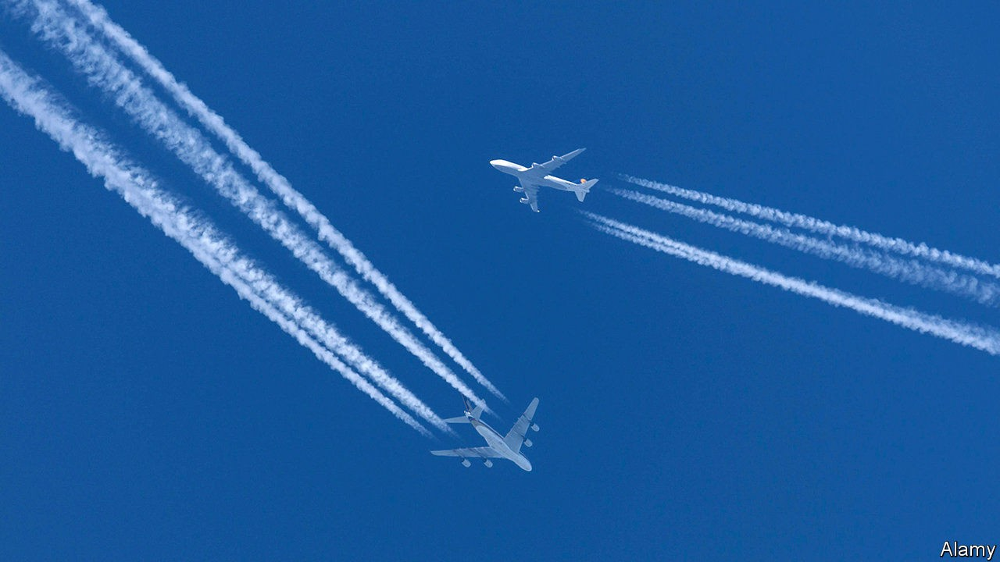

## Not boxing clever

# A subsidies scrap between Boeing and Airbus comes to an end (maybe)

> Both aerospace heavyweights emerge battered from the 16-year bout

> Oct 13th 2020

A 16-YEAR FIGHT at the World Trade Organisation (WTO) between Boeing, an American planemaker, and Airbus, a European one, over illegal subsidies resembles a heavyweight boxing bout in which both sides raise their gloves to claim the round. And so it was on October 13th, when the WTO ruled that the EU can impose tariffs on $4bn-worth of American goods annually. The award is lower than last year’s decision that America is allowed to slap duties on $7.5bn in European goods. But it was much higher than the Americans once braced for. More important, both aerospace titans look knocked about.

The counterpunching at the WTO began in 2004. After Airbus first overtook it in aircraft deliveries, Boeing complained that its rival was boosted by government support eventually amounting to $22bn in repayable “launch aid”. Airbus soon parried with its own claim that Boeing had benefited from $24bn in favourable tax breaks, as well as research-and-development support from NASA and the Pentagon.

The WTO eventually determined that both firms had received illegal subsidies. America used last year’s win to slap tariffs on everything from French cheese to Scotch. Airbus now faces levies of 15%. The EU will be permitted to impose its new duties after October 27th.

The latest ruling will not put paid to the bickering. Boeing says that the contentious tax break from Washington state has been repealed, so the looming EU tariffs are unjustified. Airbus says it is now in full compliance with the rules, and grumbles that the WTO appellate body that decides such matters is in limbo. America’s long-standing claims of unfair treatment at the hands of the body have led it to veto new appointments, leaving the arbiter inquorate.

With no knockout blow on either side, the spat may end in a negotiated settlement. America has been more reluctant to talk. But it may reconsider, given the size of the EU’s permitted retaliation—and Boeing’s precarious position. The aerospace giant has more to fear from the devastating effect of the pandemic on the world’s air travel. The continued grounding of the 737 MAX, its cash cow, after two fatal crashes means that battered carriers are cancelling orders without penalty.

Airbus has not escaped unscathed. Last month it said it would cut more jobs on top of the 15,000, out of a global workforce of 130,000, announced in June. It has shaved output to 40% of capacity. Like Boeing, it has lost around half its market value since the start of the year.

The European firm nevertheless looks in a bouncier mood. It is said to be planning to ramp up production of its A320 single-aisle aircraft as early as next year, perhaps hoping to win 737 MAX customers. Airbus also has a broader range of planes and a factory in Alabama, which lets it escape tariffs on jets sold to American customers (though not on imported parts), whereas Boeing assembles all its planes at home. Airbus has just unveiled plans to bring a hydrogen-powered net-zero-emissions aircraft to the skies by 2035. Boeing, already weighed down by the MAX debacle, may do best to put yesterday’s fight behind it and prepare for the next bout.■

## URL

https://www.economist.com/business/2020/10/13/a-subsidies-scrap-between-boeing-and-airbus-comes-to-an-end-maybe
