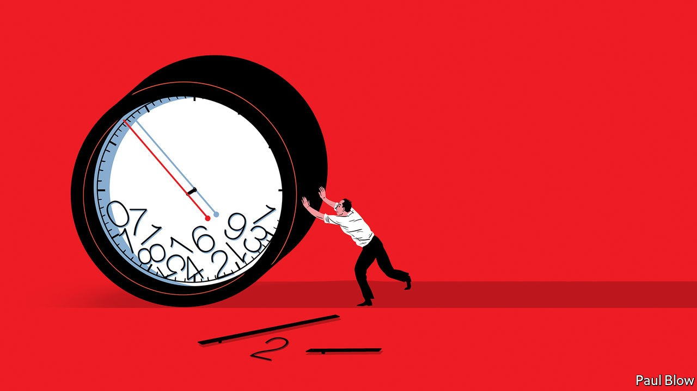

## Bartleby

# Countering the tyranny of the clock

> How flexible working is changing workers’ relationship with time

> Oct 17th 2020

TWO HUNDRED years ago, a device began to dominate the world of work. No, not the steam engine—the gadget was the clock. With the arrival of the factory, people were paid on the basis of how many hours they worked, rather than their material output.

In the “putting out” system that prevailed before the factory era, merchants would deliver cloth to be woven, spun, stitched or cut to a worker’s home. Each worker would then be paid for the items they produced. That gave the weavers and spinners freedom to work when it was convenient. At the factory, in contrast, workers were required by the owner to turn up for a set shift.

The tyranny of time was marked by a number of innovations. As few workers owned watches or clocks in the 19th century, people known as “knocker-uppers” would roam the streets rapping on doors and windows to wake workers at the right time. Later, factories would use hooters and whistles to signal the start and end of shifts, and employees would punch in and out using a time clock. Eventually, as workers moved farther away from their place of employment, the power of the clock led to daily rush hours, as millions headed to and from work. Often they paid a penalty in terms of time wasted in traffic jams or awaiting delayed trains.

The clock’s authoritarian rule may at last be weakening. Flexible working existed well before the pandemic. But it only offered employees the ability to choose when in the day they worked their allotted hours. Remote working has brought a greater degree of freedom. A survey of 4,700 home-workers across six countries commissioned by Slack, a corporate-messaging firm, found that flexible working was viewed very positively, improving both people’s work-life balance and productivity. Flexible workers even scored more highly on a sense of “belonging” to their organisation than those on a nine-to-five schedule.

It is hardly surprising that workers prefer flexibility. Working a rigid eight-hour schedule is incredibly restricting. Those are also the hours when most shops are open, when doctors and dentists will take appointments, and when repairmen are willing to visit. Parents on a conventional routine may be able to take their children to school in the morning but are unlikely to be able to pick them up in the afternoon. Many families find themselves constantly juggling schedules and giving up precious holiday time to deal with domestic emergencies.

On reflection, it is also not too shocking that home-workers feel they are more productive. After all, few people have the ability to concentrate solidly for eight hours at a stretch. There are points in the day where people are tempted to stare out of the window or go for a walk; these may be moments when they find inspiration or recharge themselves for the next task. When they do this in an office, they risk the boss’s disapproval; at home, they can work when they are most motivated.

Remote working is not possible for everyone, of course. There is a long list of industries, from emergency services to hospitality and retail, where people need to turn up to their place of work. But for many office workers, remote working is perfectly sensible. They may maintain some fixed points in the week (staff meetings, for example) but perform many of their tasks at any time of the day—or night. Office workers can now be paid for the tasks they complete rather than the time they spend (which firms would have to monitor by spying on people at home).

What is striking about Slack’s study is the widespread nature of support for home-working. Overall, just 12% of the workers surveyed wanted to return to a normal office schedule. In America black, Asian and Hispanic employees were even more enthusiastic than their white colleagues. Women with children were generally keen, reporting an improvement in their work-life balance—though a gap exists between discontented American women and those in other countries, who are much happier (the availability of state-subsidised child care helps explain the difference).

Of course, the new schedule carries dangers: people may lose all separation between work and home life, and succumb to stress. To inject some human contact, companies may embrace a hybrid model in which workers go into the office for part of the week. But overall office-workers’ freedom from time’s yoke is to be welcomed. The clock was a cruel master and many people will be happy to escape its dominion.

## URL

https://www.economist.com/business/2020/10/17/countering-the-tyranny-of-the-clock
