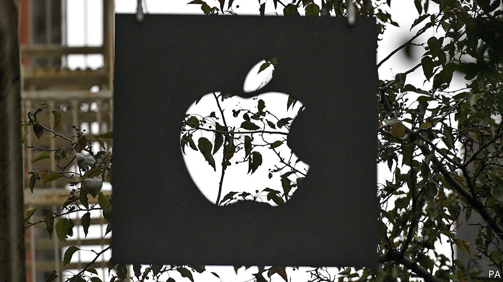
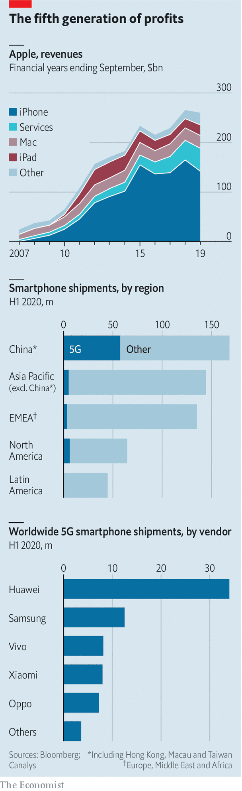

## The iPhone gets up to snuff

# Rather later than rivals, Apple unveils a first 5G-enabled phone

> Oct 17th 2020

HAVING more or less invented the smartphone in 2007, Apple has lately lagged behind other gadget-makers. On October 13th it caught up, unveiling its first 5G-enabled iPhones. Expect sales to pick up as users who have put off purchases finally upgrade. Whether they can find a zippy 5G network is another matter. Opensignal, a research firm, finds that most 5G handsets are connected to one less than a quarter of the time.■

## URL

https://www.economist.com/business/2020/10/17/rather-later-than-rivals-apple-unveils-a-first-5g-enabled-phone
