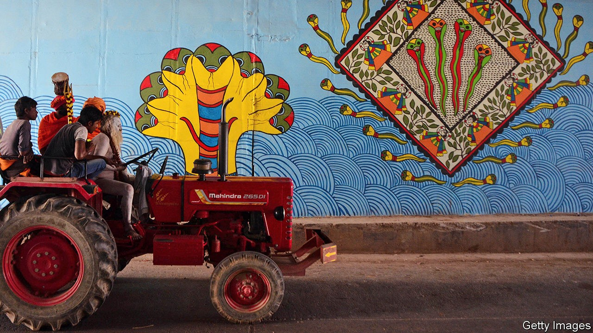

## Fertile ground

# The pull of India’s tractor-makers

> Demand for farm equipment has soared amid the pandemic

> Oct 15th 2020

WERE ANY more evidence needed to reflect how surprising 2020 has been, consider tractor sales. In April Hemant Sikka, president of Mahindra & Mahindra’s farm-equipment business—which makes around 300,000 of the things a year, more than any other company anywhere—sat in his Mumbai flat near his shuttered main factory wondering if he still had a business. India’s nationwide lockdown that began a couple of weeks earlier led analysts to foretell doom for all manner of vehicle sales. Instead, Mr Sikka’s main challenge has turned out to be meeting unprecedented demand, both at home and abroad.

The Indian conglomerate’s tractor sales have broken records since May; production is operating at 100% of capacity. At its American factories the company has added a second shift. Regional managers around the globe are clamouring for tractors to replenish sparse dealer lots.

After collapsing in March, the share price of Mahindra & Mahindra has doubled, pulled along by the booming tractor division. So have the share prices of Deere and AGCO, two American manufacturers of farm equipment, suggesting that investors are eyeing bountiful profits from the industry as a whole.

Mahindra’s particular niche—durable, low-horsepower machines—has been especially sought-after. In America that is the fastest growing segment, with sales up by 18% in the first nine months of the year, compared with 2019, according to the Association of Equipment Manufacturers. By contrast, sales of the largest tractors have declined by 2%. The smaller tractors are used on properties of less than 100 acres (40 hectares). That makes them ideal for organic farms, which, because they eschew pesticides, cannot be large. They are also handy for tasks such as mowing lawns or hauling things around the rural properties where many city-slickers have fled from covid-infested urban areas.

In India other factors are at play. Stories about Indian farmers have long focused on suicides and misery. This year there is good news. The summer harvest was 6% bigger than last year. Prices for farm produce were up by an average of 12%. This has boosted farm incomes (even though it has concerning implications for inflation). The winter crop looks equally promising, thanks to favourable monsoon rains, which have been 9% heavier than usual and, critically, well-distributed over India’s northern agricultural belt. Reservoirs are at their highest level in a decade, which bodes well for harvests to come.

The extra cash, combined with lower interest rates and cheaper credit, has enabled farmers to modernise. Some are upgrading to slightly larger machines, capable not just of pulling a plough but also of hauling heftier kit like harvesters. The draconian national lockdown, which for weeks prevented migrant workers from returning to their villages from cities, added another incentive to accelerate mechanisation. Farmers in India often regard buying a Mahindra tractor as akin to having a child: both become part of their lives and livelihoods for decades to come. With brighter prospects than in years past, many may wish to add more little Mahindras to the fold. ■

## URL

https://www.economist.com/business/2020/10/15/the-pull-of-indias-tractor-makers
