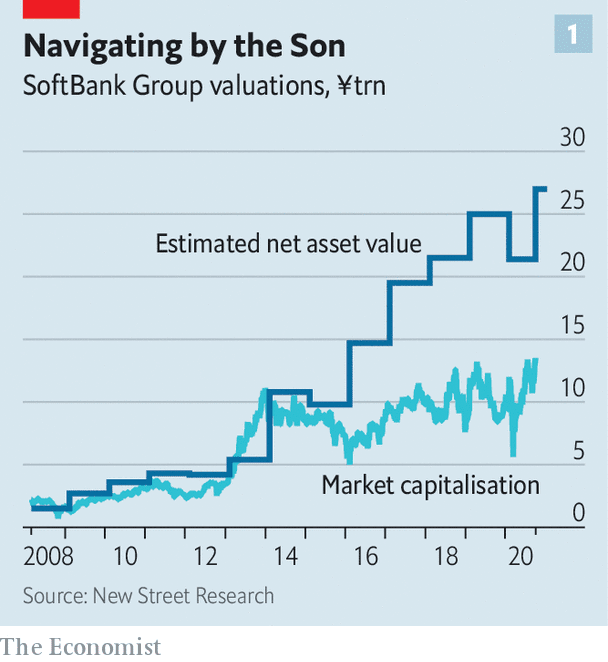
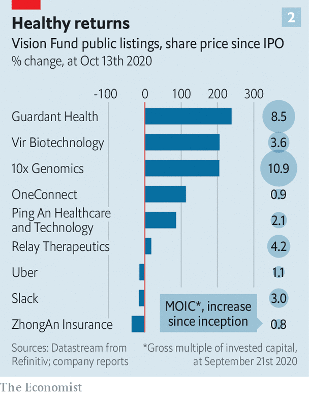

## The future of SoftBank

# What SoftBank’s Masa does next

> Can the coronavirus-induced digital revolution restore Son Masayoshi’s reputation for investing brilliance?

> Oct 15th 2020

EARLIER THIS year the covid-19 pandemic brought SoftBank Group to its knees. As bondholders fled heavily indebted firms, the junk-rated Japanese tech conglomerate looked shaky. In March its flamboyant boss, Son Masayoshi, announced a $41bn sale of assets to return to stability.

Mr Son has since regained his footing—or at least his chutzpah—enumerating the upsides of coronavirus lockdowns for his firm. The “new normal”, in which meetings, food delivery, education, medical care, shopping and entertainment are mediated online, he said in September, is a boon to SoftBank. He has long invested around a grand vision of a digital transformation and ubiquitous artificial intelligence (AI). Covid-19 means it is coming to pass much more rapidly than expected. Having mostly dumped its telecoms activities outside Japan, SoftBank is wholly devoted to Mr Son’s technophilic passions.

The digital surge is helping the group’s underperforming Vision Fund, a $99bn tech-investing vehicle. The fund started deploying capital in 2017 in a cloud of hype and optimism but lost its way as a result of a few spectacular failures, most notably the implosion of WeWork, an office-subleasing firm masquerading as a tech platform.

Even though SoftBank contributed only $28bn of the Vision Fund’s capital (equal to around 12% of the Japanese firm’s assets at the time), the mishaps hurt its share price and Mr Son’s reputation as a brilliant investor. That reputation was acquired after his purchase, starting in 2000, of a 34% stake in a Chinese e-commerce startup called Alibaba, now China’s most valuable listed company. The pandemic has hurt valuations of some Vision Fund firms in industries such as hospitality and transport. Mr Son has struggled to raise outside money for a sequel, Vision Fund 2, which was aiming for $108bn in capital but now makes do with small sums from SoftBank.

Unsurprisingly, then, these days the Japanese firm steers attention away from the Vision Fund. This leaves a mystery over where Mr Son will direct his energy and cash next. His selling spree did not end with the asset sales announced in March. This year SoftBank has completed an unprecedented number of disposals.

The firm has offloaded most of its mobile-telecoms assets, including another slice of its Japanese mobile business, SoftBank Corp, and the whole of Sprint, America’s fourth-largest mobile operator, and of Brightstar, a distributor of wireless gear. In September Mr Son announced the sale of Arm, a Britain-based chip-designer, for $40bn to Nvidia, a big American chipmaker. Arm was the lynchpin of Mr Son’s envisioned ecosystem of huge web- and AI-powered startups. Even some of his top executives were confounded to see it go.

Excluding the sale of Arm, which will take months to complete, SoftBank has amassed $52bn from the divestments. Investors do not expect the hyperactive Mr Son to sit on it for long. Three different paths appear open to him. One scenario is to activate long-discussed plans to take SoftBank private. Second, he may be preparing to take a large stake in one or more publicly listed technology giants. In September SoftBank pulled off another surprise when it emerged as the mystery “Nasdaq whale” that had snapped up billions of dollars’ worth of options in publicly listed stocks such as Amazon, Microsoft and other technology stars. A new asset-management arm had already bought nearly $4bn of shares in various tech giants. Third, he could double down on the Vision Fund model by putting more cash into the second vehicle and subsequent funds.

The rationale for a management buyout, which would be one of the largest in history, is the steep discount between SoftBank’s market value and the value of its underlying listed assets (see chart 1). That has narrowed thanks to a big run-up in SoftBank’s share price this year (owing in part to a large share buyback).

A buy-out would be feasible, says a big SoftBank investor, if it were structured as a bridge loan financed by selling more of the firm’s stake in Alibaba and other assets. But it would shrink SoftBank, enriching its billionaire boss but reducing his ability to invest in new growth areas, notes Oliver Matthew of CLSA, a broker. As such, says Mr Matthew, it looks fairly unlikely.

Investing in publicly listed tech giants could be more attractive. These firms are raking in big profits from the digital surge. Unlisted tech darlings, by contrast, are often still honing their business models or fighting for market share. Mr Son’s view, according to a person close to him, is that “size begets size, and the big companies are the ones to succeed in this environment”. New opportunities in private markets are less plentiful—partly because the Vision Fund has already bankrolled most of them.

The third way is less crazy than the first fund’s blow-ups suggest. Its results are looking better than a few months ago. So far it has deployed $82.6bn of capital in 92 firms. By the end of June it had risen in value by $3.5bn. By the end of September, say people close to it, it had gained another $4.5bn. This adds up to a 10% return, hardly stratospheric: the NASDAQ tech index has returned ten times as much in the past three years. But it continues a turnaround from early 2020, when the fund pulled its parent into a record $8.8bn annual loss. The fund has nine more years to run. In the spring it slashed valuations to conservative levels and now expects markups.

A hot market for technology initial public offerings (IPOs) will help. Since the fund’s inception nine of its firms have gone public. Prominent bets like Uber have disappointed. But all told, returns from the listings have been decent (see chart 2). And more IPOs are in the offing. DoorDash, a food-delivery firm, expects to list in November at a valuation of around $25bn. That would quintuple the value of Vision Fund’s $600m investment.

Its 37% stake in Coupang, South Korea’s Amazon, could prove similarly juicy if it went public at the level at which some have been trying to invest. According to investors in Asia, Coupang has received offers at a valuation as high as $30bn. And SoftBank’s portfolio contains holdings in some of China’s choicest private tech stars, including ByteDance, the biggest (which owns TikTok, a short-video app beloved of teenagers the world over), and Beike, a residential-property platform which has recently quadrupled in value.

Another reason for optimism is that the lessons from the Vision Fund’s error-filled first three years appear to have sunk in. The second fund is not trying to stuff too much money into young companies. Whereas Mr Son’s monster first fund refused to get out of bed for any investing opportunity under $100m, eight of its successor’s 13 investments are less than that. One is a piddling $20m. It looks far less risky.

What has not changed is Mr Son’s clout and unpredictability. Under pressure from Elliott, an activist hedge fund, he has made governance tweaks, adding a woman to the board. But Glass Lewis, a proxy firm, opposed another appointment. Allies with the stature to challenge him, such as Jack Ma, Alibaba’s co-founder, have stepped down. Whatever Mr Son’s next act, he will serve chiefly his own impulses.■

## URL

https://www.economist.com/business/2020/10/15/what-softbanks-masa-does-next
