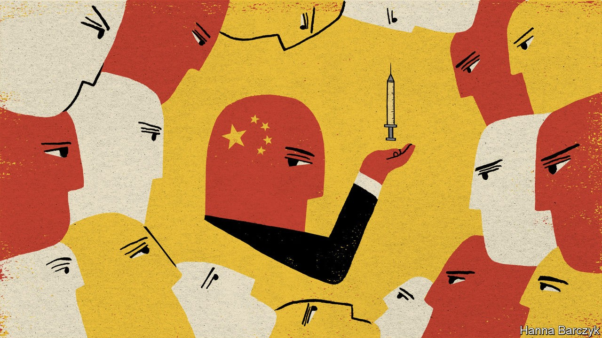

## Chaguan

# China calls its “heroic” handling of covid-19 proof of its wisdom

> A lopsided global recovery amid Chinese bragging could sharpen divisions between China and the West

> Oct 17th 2020

A  SERIES OF failures made 2020 a rough year for China’s relations with the world. First, Chinese officials—following the logic of their unaccountable, secretive one-party system—failed to report an unknown virus in the central city of Wuhan for several critical weeks, giving covid-19 time to take hold. More failures followed. As one foreign government after another botched its own response, China’s rulers refused to take any blame for the pandemic, instead slapping economic sanctions on such countries as Australia that called for inquiries into the outbreak’s origins. The costs are plain to see: a recent survey of rich countries by the Pew Research Centre found soaring distrust of China (with negative views in Australia jumping 24 percentage points since last year).

That political gulf between China and the world is set to widen. This time, the cause will be asymmetric success. China has effectively controlled covid-19 and its economy is returning to life. Meanwhile, governments in America, Europe and beyond face second waves of infections and business bankruptcies and exploding public deficits. Several elected incumbents will lose office.

Amid that global misery, China’s leaders call their country’s recovery proof that Communist Party rule offers a uniquely effective blend of organisational prowess, respect for science, and traditional Chinese morality. They are about to discover how provocative that boasting will sound to many in the rest of the world. Foreign anger will in turn prompt resentment within China. Ordinary Chinese remember the collective sacrifices made by hundreds of millions of citizens who stopped transmission by staying indoors for weeks, often without pay. Glib lines from Western politicians about admiring China’s people and opposing the Communist Party will not help. People are complicated. It is possible for Chinese citizens to remember their leaders’ early mistakes, to resent officials for thuggishly enforcing lockdowns, and at the same time to agree that the country’s pandemic response is a source of national pride. Modern China’s story is not one of oppressed masses all yearning to be free. Party bosses stake their claim to rule on making people’s lives better. Their China is a majoritarian project that enjoys broad, if unknowable, public support. The headache for foreign governments is how to respond when the party crushes minorities that get in the way, whether ethnic, religious or political.

Covid-19 has given a fresh edge to arguments about which political system is best. It is hard to overstate how bad the West’s handling of the virus looks to ordinary Chinese. It is heartbreaking to hear Western-educated liberals wonder whether democracy is being exposed as selfish and disorderly. Longtime admirers of America watch President Donald Trump blaming their country for unleashing a “China virus” on the world, and hear a horrifying incitement to racial hatred. Chinese nationalists feel vindicated.

Diplomats in Beijing compare covid-19 to the global financial crisis of 2008, another event that convinced many Chinese leaders that the West is in long-term decline. Arguably, this pandemic is a more perilous moment. For one thing, in 2008 the credit crunch was a crisis discussed between Chinese and Western elites. Few American or European voters either knew or cared that global growth was being sustained by massive Chinese investments in domestic infrastructure. For another, China was not on the defensive. Elites in Beijing were tut-tutting observers of a crisis created in the West. As one Chinese leader told Americans in 2008: “You were our teacher, and the teacher doesn’t look very smart.”

This time, on both sides, elites and regular folk have strong views about covid-19. In Beijing, Western diplomats recall this pandemic year with real bitterness. They remember the dark days of January and February as their home governments cancelled scheduled flights to and from China, and pleaded for permission to evacuate citizens from Wuhan, only to be summoned for hours-long meetings at the Chinese foreign ministry, where officials angrily accused them of sowing panic and insulting China. With unblushing hypocrisy, China then turned round and sealed its borders still more tightly a few weeks later, after foreign infection rates climbed. Early on, foreign countries were asked to send medical aid to China without any publicity, and complied. Later, when they sought to buy Chinese ventilators for their own patients, they were told that the price included public praise for China.

Far from the embassies in Beijing, foreign views of China have soured dramatically, too. In the Pew survey of public opinion in advanced economies, a median of 61% of respondents deplored China’s handling of covid-19. Chinese officials blame such criticism on scapegoating by anti-China hawks in America. That is self-serving tosh. Thirteen of the 14 countries polled were even harsher about America’s covid blunders. The survey is a record of public displeasure over mistakes made, not a festival of China-bashing.

Foreign scepticism about China’s record is not entirely fair. Some in the West speculate that China is hiding mass infections. That is improbable: despite strict censorship, news of another Wuhan-like catastrophe would leak. Instead, after early cover-ups, China’s response has been simple but effective. Since late March it has closed its borders to most foreigners, built high-tech systems to monitor domestic travel and attacked even small flare-ups with lockdowns and mass testing. After announcing a dozen cases on October 11th, the coastal city of Qingdao began testing 9m people.

Yet a core claim made by the party is also false—that its crushing of covid-19 proves the unique advantages of autocracy. Off China’s coast, the democratic island of Taiwan has handled the virus brilliantly, recording just seven deaths in a population of 23m.

The arguments will not stop even if vaccines are found to beat the virus back. Shared suffering did not bring the world together in 2020. Alas, a lopsided global recovery, especially if accompanied by Chinese bragging, risks creating still sharper divisions. ■

Editor’s note: Some of our covid-19 coverage is free for readers of The Economist Today, our daily [newsletter](https://www.economist.com/https://my.economist.com/user#newsletter). For more stories and our pandemic tracker, see our [hub](https://www.economist.com//news/2020/03/11/the-economists-coverage-of-the-coronavirus)

## URL

https://www.economist.com/china/2020/10/17/china-calls-its-heroic-handling-of-covid-19-proof-of-its-wisdom
