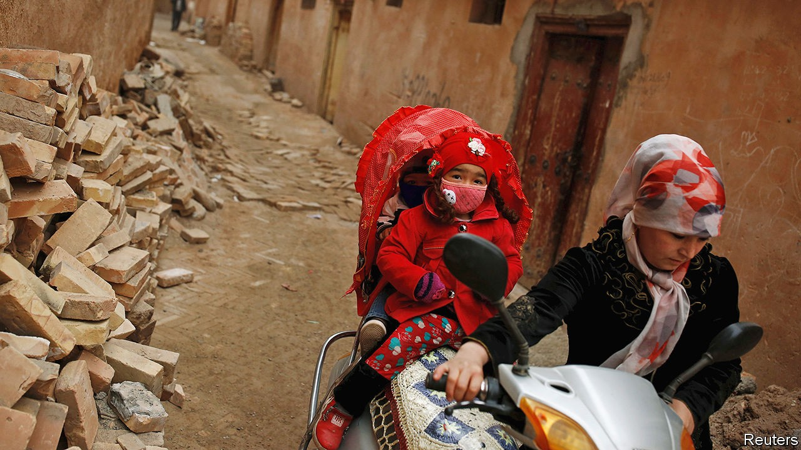
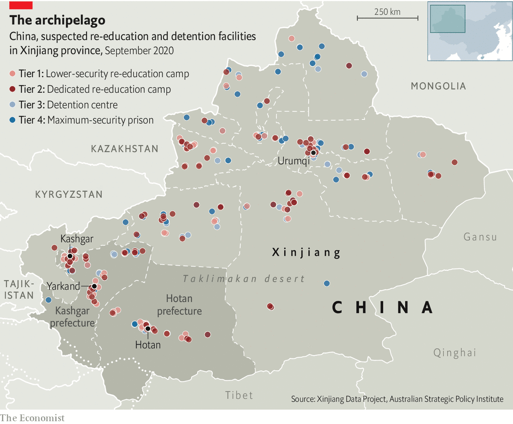

## Orphaned by the state

# How Xinjiang’s gulag tears families apart

> So many parents have been locked up that officials struggle to cope with the left-behind children

> Oct 17th 2020

FOR ZUMRAT DAWUT’s three children, Fridays were terrifying. That was the day when officials would question students at their schools in Urumqi, the regional capital of Xinjiang in China’s far west. The interrogators were looking for clues about their lives at home. They wanted to know whether parents prayed or used Islamic greetings at home, or talked to the children about the prophet Muhammad. The information they gleaned could result in a family member being sent to a “vocational training centre”, the government’s euphemism for a camp in Xinjiang’s new gulag.

As Ms Dawut describes it, ethnic Uyghurs like her were under constant watch. Her children suffered the effects as much as their parents. Every Monday they were not in school she had to take them to the courtyard of her block of flats to watch the raising of China’s flag, whether in freezing winter temperatures or in blazing summer heat. Participants were careful to look cheerful. Not only were the officials watching for signs of dissatisfaction; every family had to keep an eye on ten neighbouring families, and report anything suspicious by putting notes in a box at each ceremony.

Ms Dawut says that before she and her children fled to America last year (they are seeking asylum there), she spent two months in one of the new camps where more than 1m people, mostly Uyghurs, have been sent without trial since 2017. Her offences: receiving calls from Pakistan where her husband is from; visiting Pakistan years earlier; accepting money from a foreigner (a family friend who lived in China); and securing an American visa. She was put in a cell so packed that inmates had to take turns sleeping. Her children feared that if they misspoke during their Friday interrogations, she would be sent back.

It is impossible to verify individual accounts of the horrors that have been unfolding over the past three years in Xinjiang as a result of these incarcerations, or what the government calls job training and “deradicalisation”. Foreign journalists who visit the region are kept under intense surveillance, which makes interviews potentially perilous for those they try to talk to. Yet government documents and the accounts of witnesses provide damning evidence that the stories of people like Ms Dawut are not only credible, but typical. They show how the attempt to erase Uyghurs’ distinctive cultural identity and crush their Islamic faith has not only caused immense suffering for the more than one-in-ten Uyghurs who have been sent to the camps, but has also blighted the lives of their hundreds of thousands of children.

This report draws on records compiled by officials in rural communities in southern Xinjiang where many of the Uyghurs live (see map). They were given to The Economist by Adrian Zenz, a German scholar whose research, using satellite imagery and government documents, has been instrumental in confirming the proliferation and purpose of the camps. The files were downloaded (without hacking) from online networks used by local-government work groups in their fight against poverty. Uyghur exiles interviewed for this story asked that their names not be used, and that other details which could be used to identify them be withheld. Many of those who have escaped China fear that speaking out will endanger family and friends in China.

The work groups’ records use a chilling official terminology to refer to children whose parents are being held by the state. They are called dankun (“single-hardship”) or shuangkun (“double-hardship”), depending on whether one or both parents have been sent away to a vocational-training camp in the new gulag, a regular prison or another kind of detention facility.

Yarkand, a county in Kashgar prefecture on the southern rim of the Taklimakan desert, has about 900,000 residents. Of them, roughly 100,000 are children in grades one to six (ie, aged between about seven and 12). In 2018 more than 9,500 of these students were recorded at one point as being single-hardship or double-hardship (822 were of the double kind). All of those children were Uyghurs, apart from 11 who were of Kazakh or Tajik ethnicity—two mostly Muslim groups whose members account for less than 1% of the population of Yarkand. Not a single Han child had a parent in custody. These data, if extrapolated across Xinjiang, imply that around 250,000 of the region’s nearly 3m Uyghurs under the age of 15 have had one or both parents interned. As Mr Zenz notes in a [paper](https://www.economist.com/https://medium.com/@adrianzenz/story-45d07b25bcad) published as The Economist went to press, 880,500 children had been placed in boarding facilities by the end of 2019, an increase of nearly 383,000 since 2017.

The tearing apart of Uyghur families has been so rapid that local governments have struggled to accommodate the surge in the number of children who have lost parents to internment. Indeed, the documents show that some double-hardship children have been placed in institutions meant for children whose parents have died or left them. Governments are rapidly expanding and transforming primary schools into boarding facilities, many of them with high-security fences. Even pre-kindergartens are being adapted for boarding. Infants only a few months old have been placed in them. In Xinjiang, the floor-space of student dormitories in boarding schools grew by more than 30% in 2019 compared with less than 5% in China as a whole (see chart).

In Kashgar and other mainly Uyghur regions the authorities plan to send all hardship students above third grade to such schools. Schools are under orders to observe such children closely. In 2018 the government of Kashgar city, the capital of the prefecture of that name, said they should receive “psychological counselling”. It said teachers must “resolutely put an end to negligence in monitoring students in distress” and told them to “eliminate the negative impact on personality development” caused by separation from parents.

Students are even encouraged to write letters and send short videos to their parents in camps and prisons. Near the end of her time as an inmate, Ms Dawut says those detainees who were deemed well-behaved were allowed to have live video chats with their families. They would be provided with ordinary clothes and told to speak positively about their experience.

But such tightly controlled communications are no remedy for the pain. The trauma experienced by many children was conveyed in an online article last year by an ethnic-Han teacher at a school in Kashgar. She wrote of an impoverished girl, her father interned and her mother in a far-off city, often hungry and inadequately clothed, being beaten by her stepmother. She said that when sirens blared outside the school—a frequent occurrence—students would rush to the window, wondering, the teacher believed, whether one of their parents was about to be taken away.

Assaults on family life continue after children have left school. When Uyghur girls grow old enough to wed (the legal age for which is 20 in China), they can expect to be cajoled by officials into marrying Han men. Nowadays refusal can incur retribution for the woman’s family. Even as the government eases its limits on family size elsewhere in China, in Xinjiang it is tightening such controls, imposing fines and other sanctions on Uyghur couples who have more than two children, or three if they live in the countryside. Uyghur women are being fitted with intrauterine devices at a rate far higher than in China as a whole, according a report in June by the Associated Press, citing findings by Mr Zenz.

Women with three children are at greatest risk of being forcibly sterilised. Ms Dawut says she was subjected to such treatment in 2018. After she recounted her ordeal at an American-government panel last year on the sidelines of the UN, media in China released a video of Ms Dawut’s brother. In it he said she had not been to one of the camps and had not been sterilised. She says she is willing to be examined medically to prove the latter. But the statistics are telling enough: birth rates among Uyghurs in Xinjiang have plummeted, official figures show. In Kashgar and the neighbouring prefecture of Hotan, they fell by more than 60% between 2015 and 2018.

Officials try to deflect criticism of the harm they are inflicting on families. They suggest they are protecting children from the “three evils” of terrorism, separatism and religious extremism—and taking better care of them. In 2018 Xinjiang Daily, a state newspaper, described a visit by Zhu Hailun, the deputy party chief of Xinjiang and an architect of the gulag scheme, to a “Kindness Pre-school” at a camp in Hotan. He was told that the children, some aged less than a year, all had parents who could not take care of them “for various reasons”. The report said the children were being given necessities free of charge. They were gaining weight, growing taller and quickly learning Mandarin, it crowed.

As elsewhere in China, Xinjiang has been stepping up efforts to banish ethnic-minority languages from schools—a policy that has recently triggered protests by parents in Inner Mongolia, a northern region. One purported aim is to give non-Han children a better chance of success in their careers, given the importance of Mandarin in many jobs. But it is also about diluting minority identity. The authorities in Xinjiang are very keen to achieve that. The Uyghur language is Turkic and the customs and religion of Uyghurs appear more foreign to most Han Chinese than do those of Tibetans or ethnic Mongols. As the authorities see it (even if they are careful not to declare it so), fighting separatism in Xinjiang also involves a cultural war.

Until early this century, schools in Uyghur-dominated regions mostly employed ethnic Uyghurs who taught in the local language. A former educator in Xinjiang, who fled China in 2017 to escape persecution, says it became obvious before he left that schools were trying to recruit more ethnic-Han teachers. Job ads called for a proficiency in Mandarin attained by few Uyghurs, and no longer required that applicants have a local residency permit. By the time he left China, he says, the only local-language course left in the curriculum was Uyghur literature. Many Uyghur teachers had been pushed out of their jobs. Some had been sent to the camps (one simple method for disqualifying Uyghur teachers was a “political investigation” to determine whether anyone in their home had been in trouble with the authorities).

In 2017 a primary school in the Kashgar township of Tokzake issued a plan for creating a “completely Chinese-speaking school environment”. The document, obtained by Mr Zenz, said any use of Uyghur by teachers or students should be treated as a “serious teaching incident”. An article on the website of People’s Daily, the party’s main mouthpiece, called the school the “epitome of rural education in Kashgar”.

At the boarding schools where hardship children are sent, the plunge into a Mandarin environment is likely to exacerbate the pain of separation from their families. But having to grapple with a strange language is only part of the remoulding they face. Some Han teachers in Xinjiang have posted videos on social media to show how “interethnic unity” is promoted in schools, with Uyghur students sometimes required to wear traditional Han costumes and sing patriotic songs. Teachers who are Han wield considerable power on account of their ethnicity. The one whose student had been beaten by her stepmother wrote that she had warned the guardian that if she beat the child again, she would report her and possibly get her sent to a camp.

The government’s policy of sending hundreds of thousands of Han officials and civilians to stay in Uyghurs’ homes is another disturbing example of how Xinjiang’s Han-dominated government (under Communist rule, the region’s leader has always been Han) is chiselling away at Uyghur family life. Officials call it “becoming kin”. Han “relatives” stay as often as every month with Uyghur families for ten days at a time (the stays often impose costly burdens on the Uyghurs, even though the “relatives” are supposed to help with provisions). Hosts have to show enthusiasm, or face repercussions. Ms Dawut’s then ten-year-old daughter was assigned a 20-year-old man as kin. She shows a photo of the official drinking tea in her home, smiling, seated next to her child. She weeps as she describes how uncomfortable this relationship between the young man and her daughter made her feel.

The government insists that its measures are working. It points to the absence of any terrorist incident in Xinjiang since 2017, when the camp-building programme began. Last month, in a white paper on Xinjiang, it said residents’ “sense of gain, happiness and security” had “significantly increased” thanks to employment-boosting measures such as the provision of vocational training. It said Xinjiang had given such coaching to nearly 1.3m people a year between 2014 and 2019, but did not specify how it was administered. Last year officials claimed everyone had “graduated” from the camps, but the Australian Strategic Policy Institute, a think-tank, has identified dozens of new detention centres being built in the past two years. It says some inmates are being moved from vocational-training camps to higher-security facilities such as the one pictured near Kashgar.

Ms Dawut says she is still haunted by her experience in a camp. Every day she would gather in a classroom with women from several other cells, where they would have to study “Xi Jinping Thought”. As they left, guards would ask them, “Is there a God?” A “yes” would earn a beating. Then they would ask if there was a Xi Jinping, Ms Dawut recalls, in tears. “They said, ‘Your God cannot get you out of here, but Xi Jinping has done so much for you.’” ■

Dig deeper[The persecution of the Uyghurs is a crime against humanity](https://www.economist.com//leaders/2020/10/17/the-persecution-of-the-uyghurs-is-a-crime-against-humanity)From 1843 magazine: [“If I speak out, they will torture my family”: voices of Uyghurs in exile](https://www.economist.com//1843/2020/10/15/if-i-speak-out-they-will-torture-my-family-voices-of-uyghurs-in-exile)[The pandemic has eroded democracy and respect for human rights](https://www.economist.com//international/2020/10/17/the-pandemic-has-eroded-democracy-and-respect-for-human-rights)

## URL

https://www.economist.com/china/2020/10/17/how-xinjiangs-gulag-tears-families-apart
