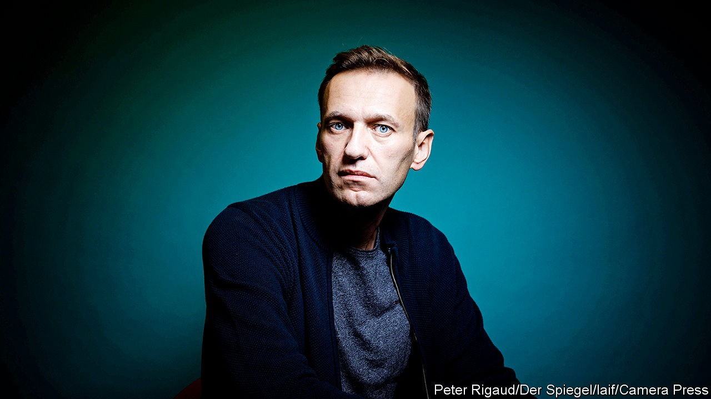

## The man who lived

# An interview with Alexei Navalny, assassination survivor

> Russia’s opposition leader has emerged stronger than ever

> Oct 17th 2020BERLIN

ALEXEI NAVALNY, Russia’s charismatic opposition leader, has always had something of the Hollywood hero about him, and he likes to illustrate his speeches with references to popular movies. Reflecting on the journey he has made from Siberia, where he was poisoned with Novichok, a nerve agent, to a Berlin hospital, where he awoke after a three-week coma, he is conscious of the cinematic quality of the plot so far: a people’s hero challenges an evil dictator who tries to kill him with a mysterious poison. But his loyal friends and his devoted wife bring him back to life. “It starts like a political thriller, then turns into a romantic comedy,” he tells The Economist during an interview in Berlin.

The intubation scars on his neck, his gaunt look, the tremor in his hands and the insomnia are a little too real for a Hollywood movie, though. And the biggest changes are less visible. “Paradoxically, I have become more humane, maybe even sentimental,” he says. Watching the recent satellite footage of military drones hitting targets in the Azerbaijan-Armenia conflict, he surprised himself thinking: “Hang on a second, this black dot is a person who just probably lost his legs and is now staring into the sky…It is good for a politician to look into the face of death,” he says.

Mr Navalny (pictured above, for Der Spiegel), who almost died on August 20th on board a flight from Siberia to Moscow, certainly did that. The heavy police presence outside the house in Berlin where he is recovering confirms he is still in danger from the man widely believed to have ordered or sanctioned his poisoning. Mr Navalny speaks his name loud and clear: Vladimir Putin, the president of Russia.

Start with the weapon. The toxin was identified by Germany as a new version of Novichok, a class of military-grade nerve agents. “There is no black market for Novichok,” says Mr Navalny. “And the fact that this is a new variety means that Russia has an active programme in prohibited chemical weapons that could only be accessed by special services with Putin’s approval.”

The Kremlin’s refusal to investigate the poisoning, and its willingness to shatter relations with Germany and the EU in order to cover it up, confirm Mr Putin’s involvement, he argues. So does Mr Putin’s explanation, in a conversation with Emmanuel Macron, the French president, that Mr Navalny poisoned himself to discredit the Kremlin. It was a line so insultingly absurd that Mr Macron leaked it to the media. “It shows that Putin cannot transfer responsibility for this,” argues Mr Navalny.

His poisoning marks the transformation of the Russian regime “like that moment in ‘Alien’, when an egg shell breaks and a monster springs out…there are no more red lines,” he says. A mysterious death from an invisible poison was intended to strike terror both at home and abroad. “Putin clearly revels in this idea of his mystique and deadly powers.” The fact that Mr Navalny survived, largely thanks to the pilots who carried out an emergency landing in Omsk, does not change that message.

Mr Navalny is also clear about the motives, which he says are linked to his venturing beyond Moscow and into the regions, the bastion of the regime’s power. He was in Siberia, mobilising voters against Mr Putin’s ruling United Russia party, when he was poisoned. Having long lost the support of middle-class Moscow and St Petersburg, the Kremlin tolerated Mr Navalny’s activism in those cities. Moving into the heartland spelled danger.

“The regime is held together by the perception of its solid support among the ‘salt of the earth’ people in the regions. Our main task was to destroy that myth,” Mr Navalny says. To do it, he has built an extensive regional network. He has also orchestrated “smart voting”: directing those who are fed up with the regime to the best-placed alternative party in order to consolidate protest votes and deprive United Russia of its majority. “Whatever control the Kremlin has over courts and security services, its party is the most basic instrument of its power,” he notes.

Over the past two years the Kremlin has tried but failed to eradicate Mr Navalny’s network by conventional means, including harassment, the arrest of activists on fabricated charges and the freezing of bank accounts. But when mass protests broke out almost simultaneously in far-eastern Khabarovsk and in Belarus on the western flank of the former Soviet empire, the perception of threat among Mr Putin’s security men changed—and so did their tactics.

“They could not have told Putin that the protest in Khabarovsk was the result of broad discontent triggered by the arrest of a popular governor,” says Mr Navalny. But they could and probably did tell him that this was part of a Western plan operating through Mr Navalny, with more to come. So permission for “special measures” was requested and granted, he reckons.

Yet if they hoped to neutralise Mr Navalny, they have achieved the opposite. He has gained the moral high ground and sympathy among those who did not previously support him. A hospital visit from Angela Merkel, the German chancellor, has greatly boosted his international standing.

The Kremlin seems desperate to stop him from coming back, alleging he has ties to the CIA and threatening treason charges. Mr Navalny is determined to return to Russia, challenging Mr Putin’s legitimacy. “For all their mighty powers and their control over everything, they know that there is a broad historic process that is moving against them,” he says. Mr Navalny knows the risks, but he has chosen a leading role in the drama, whether it ends as tragedy or with a Hollywood-style triumph. ■

After this article went to press on October 15th, the EU approved sanctions, including a travel ban and asset freezes, against six Russians it believes are connected to the assasination attempt on Mr Navalny. Among the six are the head of the intelligence service (the FSB) and two close Kremlin aides to President Vladimir Putin.

## URL

https://www.economist.com/europe/2020/10/17/an-interview-with-alexei-navalny-assassination-survivor
