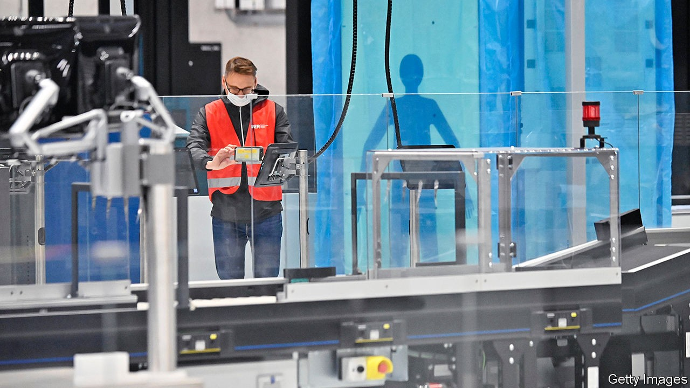

## Will it really take off?

# Berlin’s long-delayed airport is finally opening

> Just as air travel collapses

> Oct 17th 2020BERLIN

CHECK-IN FOR a flight to Antalya was going smoothly until airport staff saw The Economist’s gun. This correspondent, a volunteer on a recent trial run for Berlin’s new airport, had been handed a fake hunting-rifle to test the mettle of security staff. The police summoned to check told him he had “forgotten a crucial bit of documentation”. After a fake ticking-off, permission to board was grudgingly granted.

It was a relatively mild slip in the long history of Germany’s best-known infrastructure disaster. Ground was broken on Berlin Brandenburg Airport (BER) in 2006. It was supposed to take five years to build. After a second failed opening, in June 2012, a head-spinning catalogue of errors was revealed: fire-doors didn’t open; miles of cables were mislaid; and “the Monster”, a vast smoke-extraction system, was ineffective.

BER became a standing rebuke to Germany’s reputation for get-it-done efficiency. Wags quipped that it would have been cheaper to demolish Berlin and rebuild it next to a functioning airport. Angela Merkel despaired. The failure had many fathers, including hubristic dreams of creating an aviation hub to rival Frankfurt, a complex ownership structure split between the federal government and two states, and politicians who thought they could manage projects better and more cheaply than the private sector.

Now, after six missed openings, countless lawsuits, a handful of corruption scandals and two parliamentary inquiries (one of them still going), and at a cost of around €7bn ($8.2bn), BER will mark its official opening on October 31st with incoming flights on Lufthansa and easyJet. It will incorporate a nearby airport as a low-cost terminal. Tegel, an eccentric airport in north-west Berlin, will close—much to the regret of locals who enjoyed the brisk 70-step journey from kerbside to security.

A year ago the fear was that surging passenger numbers would mean BER would be too small the moment it opened. Its owners had drawn up a “master plan” to expand capacity to 58m passengers by 2040. The pandemic put paid to that; overall numbers for Berlin may fall to 10m this year from 36m in 2019, and it is anyone’s guess when—or if—they might approach their previous heights. But by solving (or at least postponing) one problem, covid-19 has created another. FBB, the company which runs Berlin’s airports, is in dire financial straits. Its state backers have promised €300m this year, and may be on the hook for more than half a billion in loans in 2021.

Yet some suspect the heavily indebted FBB is using covid as a smokescreen for deeper financial woes. One report found that a further €1.8bn may be needed by 2023 to avert insolvency. But subsidies must be approved by the EU, which will apply stringent state-aid tests. Private investors are said to be sniffing around, though politicians are wary of selling a stake too cheaply. Sceptics like Christoph Meyer, a Berlin MP, fear a “never-ending story” of taxpayers’ money pouring into FBB. BER’s opening will finally spare Berliners’ blushes. But the headaches it will cause are far from over. ■

## URL

https://www.economist.com/europe/2020/10/17/berlins-long-delayed-airport-is-finally-opening
