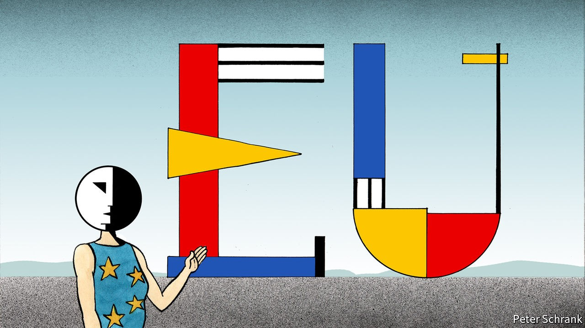

## Charlemagne

# Can the European Union learn to love a common culture?

> No one swoons over the single market

> Oct 17th 2020

BAUHAUS AND Brussels are an uneasy mix. Walter Gropius, the founder of the Bauhaus art school, which shaped design in the 20th century, declared that a building “must be true to itself, logically transparent, and virginal of lies or trivialities”. A short stroll around the EU quarter in Brussels reveals buildings that happily violate all these rules. Post-modern monstrosities butt against merely ridiculous buildings with nicknames such as the Space Egg. Inside, things are often little better, with lurid colour schemes providing an absurd backdrop for serious discussion and layouts straight out of Maurits Escher’s paintings of “impossible constructions”. Bauhaus principles led to the iPhone, a triumph of simple design. EU design principles led to a building with floor numbers that go: 02, 01, 00, 10, 20, 35, 50, 60, 70, 80.

Ursula von der Leyen, the president of the European Commission, believes a bit of Bauhaus spirit is exactly what the EU needs. As part of the bloc’s flagship “green deal” reforms, the EU will found a European Bauhaus movement to ape the influential design school that ran from 1919 to 1933 in Germany. “It needs to be a new cultural project for Europe,” said Mrs von der Leyen, speaking last month in the European Parliament, which is nicknamed Le Caprice des Dieux due to its resemblance to a cheese of that name. Although it was still nebulous, Mrs von der Leyen spelled out a vision of architects, artists and engineers combining as they did a century ago in Weimar Germany, except this time to help stave off climate change as well as designing natty buildings. “We need to give our systemic change its own distinct aesthetic,” she declared.

Such forays into the world of culture had become relatively rare for EU leaders. When European federalism was in its pomp, Jacques Delors, the commission president who oversaw the creation of the single market and the introduction of the Maastricht treaty in the 1980s and 1990s, warned that economic integration was not enough. “You cannot fall in love with the single market,” he put it, repeatedly. But a decade of crisis then led to leaders trying to avoid divorce rather than increase romance. Until Mrs von der Leyen’s speech, calls for a common culture were unusual. Officials in Brussels hide under the desk when someone mentions the C-word. Within the EU institutions, culture is often a punchbag. In “The Capital”, a satire by Robert Menasse set in the Brussels bubble, the main characters are frustrated officials in the commission’s culture department. The EU’s cultural efforts are easy to lampoon and the new Bauhaus is no exception. It can trigger a cartoonish image of fashionable men in expensive spectacles designing ecologically sound window frames in exchange for tax-free salaries.

For others, cultural projects are the missing part of an at-times-bloodless project. The EU was set up in part to stop proud European nations murdering each other. It did so via technocratic, economic and, frankly, rather dull means. When it comes to culture, there is a feeling of caution bordering on cowardice among European officials. For an example, pull out a wedge of euro notes. Rather than founding fathers or recognisable monuments that may inflame national jealousies, citizens are left with pictures of windows and bridges that do not exist (or did not until one enterprising town in the Netherlands recreated each bridge over a canal as a tourist attraction). It is better to have a row about who goes on bank notes than a pallid, purely economic relationship with an increasingly powerful institution, argues Giuliano da Empoli, director of Volta, a think-tank.

Worrying about the appearance of bank notes rather than their value can appear divorced from reality. Yet the EU’s critics have few qualms about fighting a culture war. In relative terms, the country that spends most on culture is not France, with its world-class museums and general fetish for intellectualism, but Hungary. Viktor Orban, the prime minister, rails against art that is pro-gay or anti-ruling party. His government spends a colossal 3% of annual GDP on “recreation, culture and religion”, often on things such as the swanky football stadium next door to Mr Orban’s country estate. For eurocrats to bang on about culture from an ugly building in Brussels during a pandemic may seem like a parody of disconnection. But if they avoid the topic, the EU’s enemies will happily fill the gaps, argues Mr da Empoli. “A realist in Europe knows that it is not rationality that wins elections,” he adds. “A realist is someone who knows that symbols are what carry the day.”

An emphasis on culture can come with a dark side. Hungary and other small countries, such as Estonia, which ranks second in the spending stakes on culture, invest so much because they worry about disappearing. Strip out language and culture and there is little left of small nations, points out one diplomat. They are no longer alone in this petrified world-view, which is found at the EU’s highest levels. Eurocrats veer between hoping that the EU will be a global superpower and worrying that it will become an irrelevant peninsula. “This civilisation—Europe is a civilisation—could be clearly threatened by this geopolitical evolution,” warned Josep Borrell, the bloc’s foreign-policy chief, in a recent speech. It is a sentiment with which Mr Orban would agree. And that should make leaders pause. After all, a paranoid bloc is not a wise one.

If the EU is determined to embroil itself in a clash of civilisations, its leaders must ponder some simple but fundamental questions. What exactly is European culture? How, exactly, can transnational politics shape it? And what, exactly, is the point? After six decades of integration, the EU has created a relatively homogenous economic bloc. But creating a shared European culture is a completely different kind of challenge. Brussels can tinker, setting standards for buildings, shovelling money into theatres and helping small countries preserve their languages. But culture is a living thing, that evolves from the bottom up. It is beyond the capacity of any superstate to control. ■

## URL

https://www.economist.com/europe/2020/10/17/can-the-european-union-learn-to-love-a-common-culture
