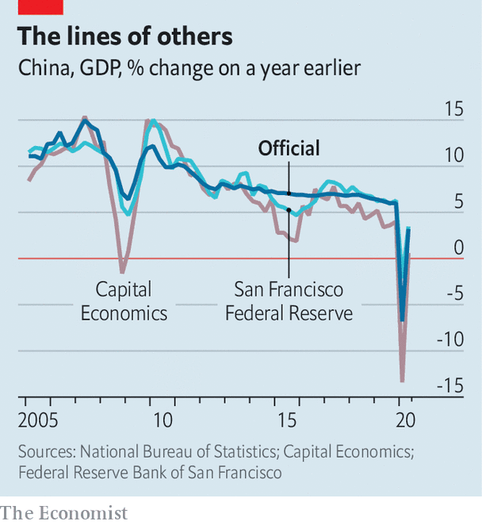

## The real deal

# Can China’s reported growth be trusted?

> Economists have constructed alternative gauges, some less flattering than others

> Oct 15th 2020SHANGHAI

NO SOPHISTICATED ANALYSIS is needed to show that China is in better economic shape than most other countries these days. Just look at its bustling shopping malls, its jammed roads in rush hour and its mobbed tourist sites during holidays. But if the crowd scenes suffice to affirm that China is doing well, a little more work is needed to address the question: exactly how well? As is often the case with Chinese data, the answer is controversial.

The national statistics bureau will report third-quarter GDP on October 19th. Analysts expect growth of about 5% compared with a year earlier, a strong recovery from the depths of the coronavirus slowdown, and all the more stunning when much of the world is mired in recession. Yet some believe the official growth data have been too rosy this year, not least because China’s pandemic lockdown in the first quarter was among the world’s most restrictive.

Thankfully, the mysteries are not unfathomable. Research published in recent weeks sheds some light on what is really going on. Doubts about China’s data are not new: it is probably fair to say that few serious economists trust its exact growth figures. Instead, there are two broad camps. One thinks that official data are overly smooth, but that the general picture is not all that misleading, because the government sometimes exaggerates GDP and at other times lowballs it. The second camp sees one-sided manipulation, with China’s boffins consistently inflating the size of the economy. The new research comes from both camps.

Start with the more sceptical of the two, best demonstrated in a note in September by Capital Economics, a consultancy. Julian Evans-Pritchard and Mark Williams, its analysts, argued that Chinese data have looked particularly fishy since 2012. Before that, growth regularly exceeded targets by a wide margin. Since then, reported GDP has been smack in line with targets set early in the year. And statisticians have stopped making big revisions to their initial estimates. It all seems a little too perfect.

Other data look more credible. Whereas real growth (ie, adjusted for inflation) has been improbably smooth, nominal growth has been volatile. Moreover, certain elements of the real-growth calculations appear to have been lifted upwards. For years the construction component of GDP moved in tandem with cement production. But from 2014 until 2018 a big gap opened up as construction raced ahead. In the first quarter of this year, when China was in partial lockdown, the transportation component of GDP was resilient—despite a collapse in freight and passenger traffic.

So Capital Economics has developed a “China activity proxy” to gauge growth. There is a long tradition of analysts using alternative sources to measure the Chinese economy. No less an authority than Li Keqiang, now prime minister, famously did so when he ran a north-eastern province. In their latest proxy Messrs Evans-Pritchard and Williams include eight indicators, from property sales to seaport cargo. The results are stark. Whereas official GDP grew by 48% in cumulative terms from 2014 to 2019, they put the true expansion at 33%.

China’s boffins can to turn to an unlikely corner for a partial defence: America’s Federal Reserve. John Fernald, Eric Hsu and Mark Spiegel, economists at the Fed’s San Francisco arm, have also constructed a proxy for Chinese growth, laid out in a forthcoming paper, using indicators such as consumer expectations and fixed-asset investment. They, too, conclude that official growth has been implausibly smooth since 2013. But they find that true growth was faster about half the time and slower the other half (see chart).

The crucial test for these proxies is whether they offer insights about China’s trajectory that are missing in the official GDP data. Both pass the test. The ups and downs of their measures better explain China’s periodic shifts in fiscal and monetary policies than the uncannily steady path of official real GDP does. The Fed economists subject their proxy to another test, constructing it to be in line with Chinese imports, as measured by the reported exports of trading partners—in other words, a data source entirely free from potential Chinese fiddling. In countries with reliable statistics, import growth typically moves closely with that of GDP. That is the case for their proxy—but not for official GDP.

Does this mean that Chinese data are, put bluntly, garbage? No. The Fed economists find that Chinese statistics, with the notable exception of real GDP, have become more reliable over time. The analysts with Capital Economics conclude that the main problem occurs in the transformation of nominal figures into real ones; statisticians appear to use excessively low inflation rates when calculating real growth so that the government can hit its targets. Nominal measurements are more trustworthy, and that matters when trying to assess, say, China’s debt burden or the size of its economy relative to America’s.

The proxies, alas, offer slightly different narratives about China’s economy this year. Capital believes that the slowdown in the first quarter was much sharper than reported, whereas the Fed’s calculations suggest that it was milder. Both, however, agree on the most salient point: the rebound since then has been big. The crowded streets and buzzing shops do not lie. ■

## URL

https://www.economist.com/finance-and-economics/2020/10/15/can-chinas-reported-growth-be-trusted
