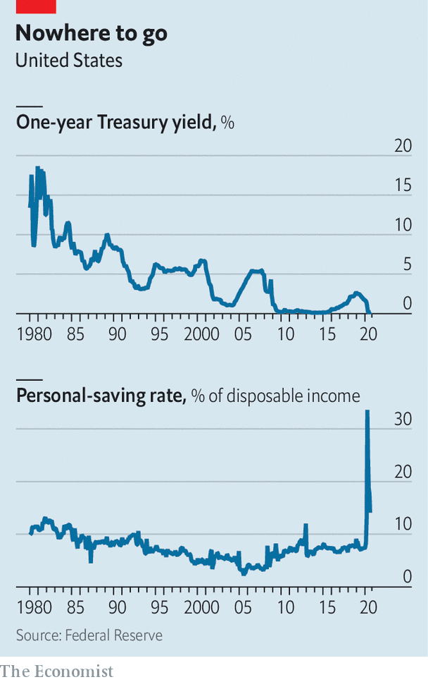

## The saver’s dilemma

# Low interest rates leave savers with few good options

> The covid-19 pandemic has only sharpened the dilemma

> Oct 17th 2020

IN THE 1980S comedy, “Trading Places”, Jamie Lee Curtis plays a prostitute who has been saving for her future; she has $42,000 “in T-bills, earning interest”. If she followed the same strategy today, she would be disappointed with the return. The one-year Treasury bill yields 0.13%, so her annual interest income would be just $55. If she reinvested the income, it would take more than 530 years for her money to double.

Savers around the world face the same problem. Bank accounts, money-market mutual funds and other short-term instruments used to offer a decent return. Not any more (see chart). Rates are lower in nominal terms than they were 30 years ago because of a long-term decline in inflation, but they are also lower in real terms. The pandemic has made the dilemma acute. This year American, British and German nominal ten-year bond yields have all touched their lowest levels in history.

Savers are likely to respond to this situation in one of three ways. They can save less, and spend more of their incomes. Another approach is to set aside more money, to make up for lower returns. A third option would be to put more savings into risky assets, such as equities, which should deliver a higher return over the long run.

So what will savers actually do? Unfortunately, history is not a particularly helpful guide. You might think that central banks had looked into the question, given their low policy rates are intended to boost consumption (and thus the economy) and reduce how much people stash under their mattresses. But the Federal Reserve and the Bank of England have done surprisingly little research into the subject.

More work has been done in Germany, where low interest rates are a hotter political issue. But this suggests that the impact of rates on savers’ behaviour is murky, at best. The Bundesbank has found that the level of returns has become less important over time as a determinant of savers’ behaviour. A study by Allianz, an insurer, also finds that other factors play a bigger role. The more money governments devote to social spending, for instance, the less people save, because they expect the state to help them in tough times. Demography also affects the saving rate: people tend to save more as they near retirement. But once retired, most live off their savings, so an increase in the number of retirees could cause the aggregate saving rate to fall. Research by Charles Yuji Horioka of Kobe University suggests that this has been the main cause of the long-term decline in Japan’s household-saving rate.

To the extent one can tell, the historical relationship between rates and the level of savings seems to be weak. The Allianz study finds that, across Europe as a whole, for every one-percentage-point drop in interest rates, saving rates increased by 0.2 percentage points. Even then cause and effect is hard to disentangle. Central banks cut rates in response to bad economic news, and such news, rather than lower rates, may be the main reason that savers become more cautious. America’s saving rate fell from more than 10% before 1985 to less than 5% in the mid-2000s. That could have been related to the downward trend in rates. But shorter-term fluctuations seem to have been driven by recessions.

If history is an unreliable guide to what savers will do now, what signals can be gleaned from their behaviour so far this year? Anxiety about the pandemic helped push the saving rate in America to a record high earlier in the year; in August it was still relatively elevated, at 14.1%. The Investment Company Institute (ICI), a lobby group for American fund managers, reports that $115bn flowed into money-market (ie, short-term deposit) funds in March this year. “Fear came into discussions with clients,” says Andy Sieg, president of Merrill Lynch Wealth Management. “Their concern was safety of principal.” If you are worried about losing your job, then the return on your savings is a minor concern. The main thing is to have some.

Yet as the panic subsided some savers turned to another strategy, of piling on risk. The American stockmarket rallied, due in part to central-bank action. Many retail investors rushed in, buying shares through platforms such as Robinhood. With returns on bonds and cash so low, stocks seemed attractive, particularly as some offer a dividend yield that exceeds the return savers get in the bank. For investors who turned to shares in March, this wealth effect easily compensated them for the lower returns on other savings. This greater risk-taking is part of a longer-term trend. Mr Sieg says that, ten to 15 years ago, rich American retirees may have parked a lot of their savings in municipal bonds. Now they have a more diverse portfolio including equities and corporate debt.

The approach of taking more risk to compensate for lower interest rates has not always paid off, though. America’s frothy stockmarket has been an outlier. Savers elsewhere have been less well compensated for risk. Britain’s FTSE 100 index is below its level in 1999. In Germany a boom in the 1990s did cause equities to rise from 20% to 30% of household assets. But when the bubble burst, retail investors’ enthusiasm waned. By 2015 shares were 19% of household assets. Japan’s stockmarket is still below its high in 1989. Around half of total household financial assets is still in cash and bank deposits, says Sayuri Shirai of Keio University.

Moreover, not all savers are the same. Even in America, stockmarket gains have mainly accrued to the rich. The wealthiest 1% owns 56% of the stockmarket, up from 46% in 1990; the top 10% own 88% of the market. One way of thinking about this is that most people set aside cash for emergencies. Poorer people may be unable to save any more than that; rich ones can afford to venture into equities.

Even if they don’t punt on stocks, ordinary workers in rich countries still have exposure to riskier assets through their pension schemes. But these tend to be quite small. The median balance in an American 401(k) plan for those aged 55 to 64 was only $61,738 in 2019. A pension of 4-5% of that pot amounts to just $2,500-3,100 a year. In Britain, where auto-enrolment has brought many low-income employees into the pension system, the median defined-contribution pot in 2019 was just £9,600 ($12,200). And the solvency of final-salary pension schemes has deteriorated as a result of the shifts in markets. When they calculate the cost of meeting their pension promises, funds have to discount the cost of their liabilities using bond yields; as yields have fallen sharply, these costs have risen. The average public-sector pension plan in America was 72.2% funded in 2019, down from 78.4% in 2009, according to the Centre for Retirement Research (CRR), despite the long bull market in shares.

The danger is that individual savers faced with bewildering movements in markets and rickety pension schemes may choose to keep their savings in deposits. Many may lack access to financial advice, and are unaware of the scope for higher returns or indeed of the scale of savings they need to set aside to prepare for their old age. A worrying signal can be gleaned from Britain, where rules were changed in 2015 to allow people to withdraw money from their pension pots without using the proceeds to buy an annuity (which offers a guaranteed income). Annuity returns on bond yields were stingy, making them an unpopular choice.

With their savings stuck in cash elderly people around the world risk running out of money before they die. This is already happening in Japan. “The decline in interest rates to virtually zero has sharply reduced the interest income that the retired were counting on, requiring them to draw down their savings more than they had been planning to,” says Mr Horioka. Governments have long urged people to make provision for retirement, but low rates have made that harder to achieve. With society yet to square the circle, and rates going nowhere anytime soon, savers’ lives are set to get even more difficult. ■

## URL

https://www.economist.com/finance-and-economics/2020/10/17/low-interest-rates-leave-savers-with-few-good-options
