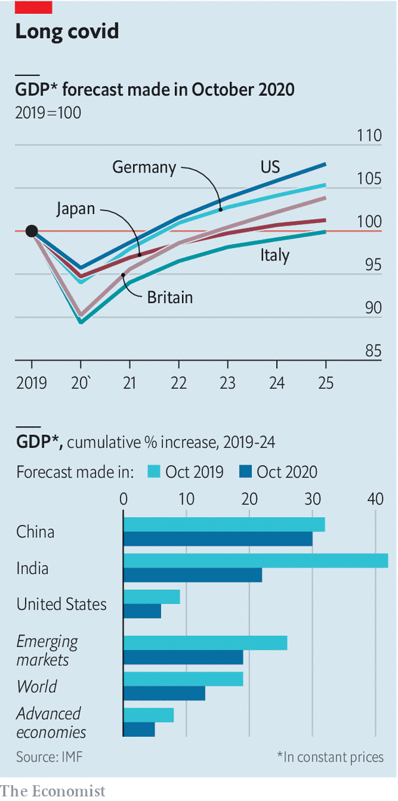

## From acute to chronic

# The IMF predicts that the world economy will suffer from “long covid”

> Some lost growth will not be recovered

> Oct 17th 2020

THE IMF’S latest forecasts, released on October 13th, spell out just how long the economic harm from covid-19 will last. America’s gdp will return to its 2019 level only in 2022; Italy’s, in 2025. The fund reckons that in many places output will stay well below its pre-pandemic trend, as labour and capital are only slowly reallocated from shrinking industries towards thriving ones. Last October the fund expected India’s economy to grow by more than 40% by 2024; now it expects half that.

Editor’s note: Some of our covid-19 coverage is free for readers of The Economist Today, our daily [newsletter](https://www.economist.com/https://my.economist.com/user#newsletter). For more stories and our pandemic tracker, see our [hub](https://www.economist.com//news/2020/03/11/the-economists-coverage-of-the-coronavirus)

## URL

https://www.economist.com/finance-and-economics/2020/10/17/the-imf-predicts-that-the-world-economy-will-suffer-from-long-covid
