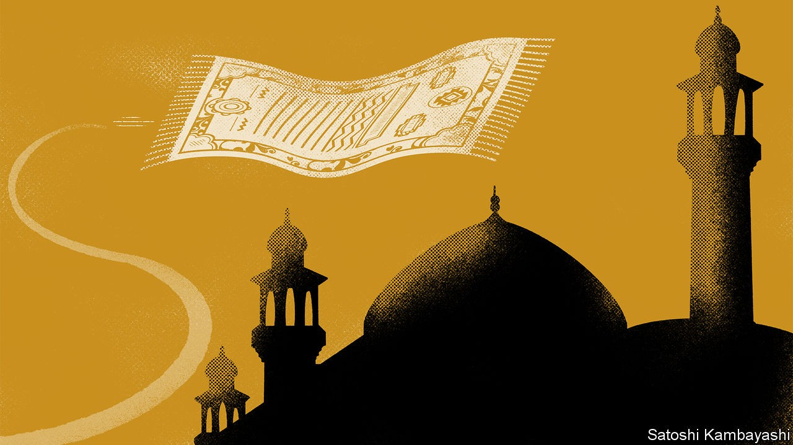
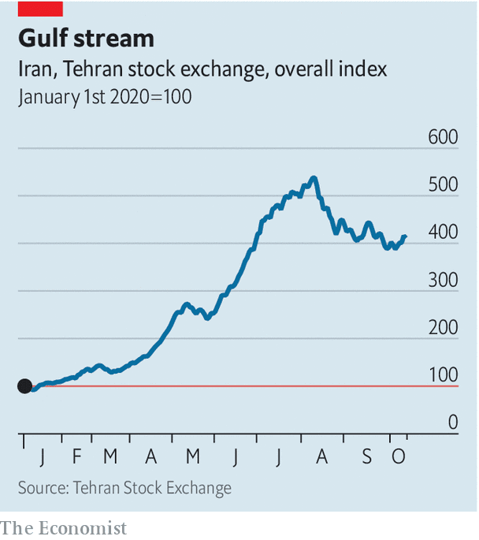

## Buttonwood

# The tale of Iran’s stockmarket bubble is familiar—but also strange

> There is more to it than savings having nowhere else to go

> Oct 17th 2020

AROUND FIVE years ago emerging-market investors were greatly excited by the prospects for Iran’s stockmarket. The lifting of sanctions in exchange for limits on its nuclear programme was in sight. Exports of oil, Iran’s main source of foreign currency, would increase, boosting the economy. And there was the hope that Iran might soon be included in equity indices tracked by global investors. A surge of buying by foreigners would surely follow.

Things turned out rather differently. Sanctions were lifted in 2016, only to be reimposed by America in 2018. Oil exports have dwindled. Iran did have a stockmarket boom, but it came much later than anyone had expected and foreigners played almost no part in it. And it was more bubble than boom. In a few short months this year, share prices rocketed (see chart).

The bubble has since popped. Share prices have fallen by around a quarter since early August and by a lot more in hard-currency terms. One rationale for the frantic stock-buying was Iranians’ desire to hedge against the lost purchasing power of the rial; sanctions make holding dollars offshore rather tricky. It is tempting to conclude that bad things happen when savings have nowhere else to go but the stockmarket. But Iran’s story is more complicated than that.

Start with the economy. The collapse of oil production that followed the reimposition of sanctions caused GDP to shrink by around 6% last year. A lack of oil revenue has hurt government finances and undermined the rial. But there is more to Iran’s economy than oil, says Maciej Wojtal of Amtelon Capital, a Europe-based fund that invests in Iran. It has a domestic market of 83m, mostly young people, roughly the same as Turkey. A range of industries, from white goods and cars to personal care and processed food, serve that market. Sanctions have not entirely suffocated trade. Iran’s neighbours—notably Iraq and Afghanistan—lack its industrial base, and so import a lot from it. Its neighbourhood includes Pakistan, Turkey and the UAE. A steadily weaker rial has over time boosted non-oil export industries, such as petrochemicals, metals, engineering services—and even chocolate and pastries, says Ramin Rabii of Turquoise Partners, a financial-services group.

The stockmarket reflects this industrial diversity. There are hundreds of stocks in a variety of sectors. And because crude is a state-owned business, it better reflects the non-oil economy. The market had a good run last year thanks in large part to improving export earnings. People took notice. Here was an asset class that acted as a hedge against the rial’s diminishing value. The scene was set for this year’s melt-up in share prices.

The trigger was the coronavirus pandemic, which hit Iran particularly hard. Industry stopped. Hard currency became even scarcer. Since January the rial has lost more than half its value against the dollar, according to Bonbast, which tracks the unofficial currency market. Iran’s central bank flooded the banking system with liquidity to try and limit the economic damage. Inflation picked up to almost 35%. Money soon found its way into asset prices, including shares. Iran’s government even raised a chunk of revenue through a big IPO in April. As in America, retail investors flooded in. The number of people active in the stockmarket went from 700,000 to 5m in a matter of months, says Mr Rabii.

There are shades of China in 2015 here: a fear of devaluation; a weak economy; and trapped capital feeding a stockmarket frenzy, cheered on by the government. That ended badly. But stocks were far from the only hedge in town in Iran. Property prices in Tehran have surged since American sanctions were reimposed, says Mr Rabii. Just about any hedge against a weaker rial has multiplied in value, from gold coins to second-hand cars. Others have noted a hint of bubble dynamics in hard currencies in Iran. The more they go up, the greater the temptation to keep hoarding them. Scarcity begets scarcity.

For Iran’s government, a stockmarket boom was the least worst way to absorb excess liquidity, says Esfandyar Batmanghelidj, of Bourse & Bazaar, a London-based think-tank that focuses on Iran’s economy. True, people who piled in at its peak are now nursing hefty losses. But a stockmarket bubble beats one in hard currencies, second-hand cars or property, all of which add to the cost of living. Optimists will point out that China survived its frenzy; the value of its stockmarkets has just hit a new high.

## URL

https://www.economist.com/finance-and-economics/2020/10/17/the-tale-of-irans-stockmarket-bubble-is-familiar-but-also-strange
