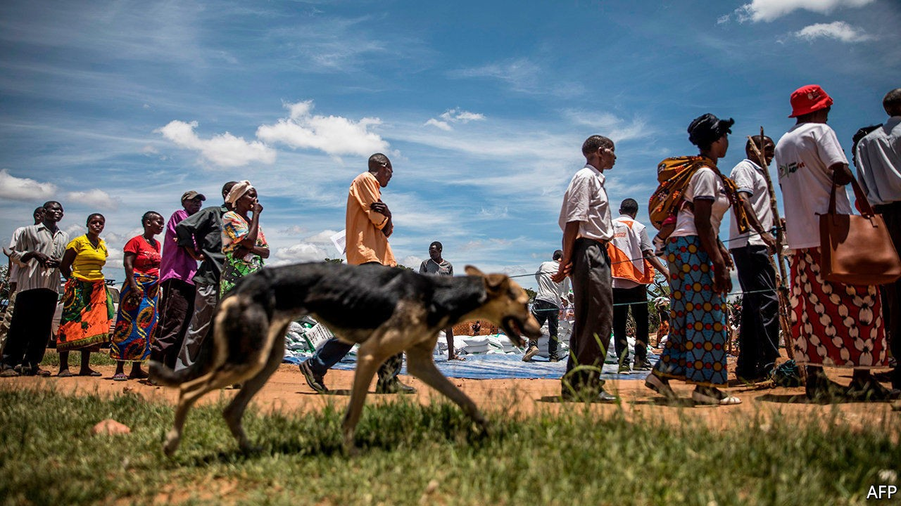
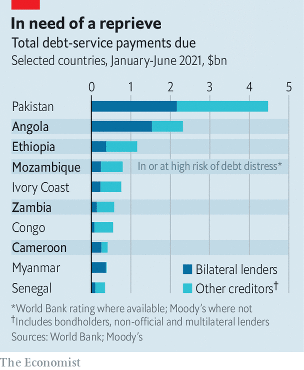

## Relief efforts

# Why securing debt forgiveness for poor countries is so hard

> For debt relief to be meaningful, private creditors and China must be on board

> Oct 17th 2020WASHINGTON, DC

GOVERNMENTS IN MANY poor countries have faced a sickening choice this year, between spending to support their populations through the covid-19 crisis and paying creditors. On October 14th finance ministers of the G20 group of countries offered a temporary salve for 73 of the world’s neediest countries, by saying they would extend their Debt Service Suspension Initiative (DSSI) to halt debt-service payments until July 2021. That should free up funds to fight the pandemic (see chart). But a lasting solution will take more dramatic action.

Public debt in poor countries rose from 29% of GDP in 2012 to 43% in 2019, according to the IMF, and is expected to jump to 49% this year. Collapsing tax revenues and swollen deficits make it harder to pay the bills and give foreign investors the jitters. According to data from the World Bank and the three largest credit-rating agencies, at least 33 of the DSSI-eligible countries were either close to or in debt distress—ie, struggling to meet their repayment obligations. The 73 countries eligible for the DSSI were due to spend over $31bn servicing debt between May and December. About half of this was owed by the 33 countries under most fiscal strain, which include Ethiopia, Mozambique and Zambia.

If a wave of sovereign defaults has been avoided, it is because central banks have lowered interest rates and international financial institutions have doled out emergency funds. But neither these nor the DSSI, which only suspends debt-service payments, can fix longer-term solvency problems. Where these exist the best solution is probably a quick debt restructuring in order to avoid disorderly defaults. The underwhelming experience of the DSSI helps illustrate why speedy restructuring could be devilishly difficult to achieve. So far only around $5bn of debt-service payments between May and December this year have been suspended.

One difficulty was that struggling borrowers were wary of signing up, in case they worsened their financial position. The G20 encouraged private creditors, which were owed another $5bn between May and December, to participate, but found that poor countries worried that rating downgrades might ensue. Some fretted that approaching even official creditors would be taken badly by rating agencies. “We would certainly ask why they needed to avail themselves of that option,” says Tony Stringer of Fitch, a rating agency.

Then there was the matter of getting other lenders on board. The “Paris Club” of mostly rich-country governments was once important enough to call the shots in any restructuring. But by the end of 2019, the strained 33 owed around a quarter of their public debt to China, which is not in the club. And although China signed up to the DSSI on paper, and has been one of the biggest providers of relief, in practice it has wriggled out of offering the same terms as other countries. Quibbles have included whether the payments should be halted from the date at which the request for suspension was made or when its terms were finalised, and whether countries already in arrears should get relief. China also insisted that the China Development Bank, which makes development loans, was not an official lender, and should therefore be excluded from the scheme.

https://www.youtube.com/embed/AaS3ywvuuTQ

Definitions of private and official creditors are “manipulable, manipulated, and totally beside the point”, says Anna Gelpern of Georgetown University. What matters is that creditors are treated equally, so that they can agree on restructuring quickly without suspecting that their own sacrifice may be lining other creditors’ pockets. If the process is slowed down by Chinese lending agencies squeezing the most from their debtors, then the indebted country could end up with too little relief, and default later anyway.

The extension to the DSSI might suggest that lenders are trying to put off difficult questions around restructuring. Encouragingly, though, the G20 also said that it had agreed in principle on a “common framework” for debt restructuring, which could ensure that G20 creditors and the private sector are treated alike. The details are yet to be hammered out before a summit in November. But if it prods the Chinese authorities to co-ordinate across their various lending agencies, it could lead to some real relief. ■

## URL

https://www.economist.com/finance-and-economics/2020/10/17/why-securing-debt-forgiveness-for-poor-countries-is-so-hard
