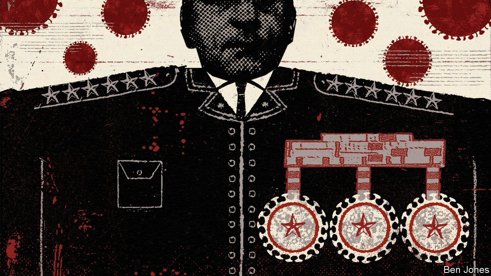
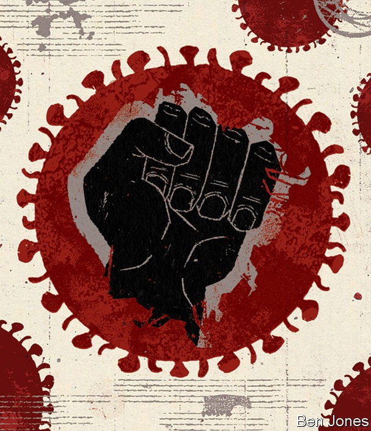

## No vaccine for cruelty

# The pandemic has eroded democracy and respect for human rights

> Strongmen have taken advantage of covid-19 in numerous ways

> Oct 17th 2020ALMATY, ISTANBUL, KAMPALA, MEXICO CITY AND SÃO PAULO

PEOPLE WERE hungry during lockdown. So Francis Zaake, a Ugandan member of parliament, bought some rice and sugar and had it delivered to his neediest constituents. For this charitable act, he was arrested. Mr Zaake is a member of the opposition, and Uganda’s President Yoweri Museveni has ordered that only the government may hand out food aid. Anyone else who does so can be charged with murder, Mr Museveni has threatened, since they might do it in a disorderly way, attract crowds and thereby spread the coronavirus.

Mr Zaake had been careful not to put his constituents at risk. Rather than having crowds converge on one place to pick up the food parcels, he had them delivered to people’s doors by motorbike-taxi. Nonetheless, the next day police and soldiers jumped over his fence while he was showering and broke into his house. They dragged him into a van and threw him in a cell. He says they beat, kicked and cut him, crushed his testicles, sprayed a blinding chemical into his eyes, called him a dog and told him to quit politics. He claims that one sneered: “We can do whatever we want to you or even kill you...No one will demonstrate for you because they are under lockdown.” The police say he inflicted the injuries on himself and is fishing for sympathy with foreign donors.

The charges against him were eventually dropped, but the message was clear. “The president doesn’t want the opposition to give out food,” says Mr Zaake, who walks with crutches and wears sunglasses to protect his eyes. “He knows that people will like us [if we do].”

The pandemic has been terrible not only for the human body but also for the body politic. Freedom House, a think-tank in Washington, counts 80 countries where the quality of democracy and respect for human rights have deteriorated since the pandemic began. The list includes both dictatorships that have grown nastier and democracies where standards have slipped. Only one country, Malawi, has improved (see map). Covid-19 “has fuelled a crisis for democracy around the world,” argue Sarah Repucci and Amy Slipowitz of Freedom House. Global freedom has been declining since just before the financial crisis of 2007-08, by their reckoning. Covid-19 has accelerated this pre-existing trend in several ways.

The disease poses a grave and fast-moving threat to every nation. Governments have, quite reasonably, assumed emergency powers to counter it. But such powers can be abused. Governments have selectively banned protests on the grounds that they might spread the virus, silenced critics and scapegoated minorities. They have used emergency measures to harass dissidents. And they have taken advantage of a general atmosphere of alarm. With everyone’s attention on covid-19, autocrats and would-be autocrats in many countries can do all sorts of bad things, safe in the knowledge that the rest of the world will barely notice, let alone object.

Measuring the pandemic’s effect on democracy and human rights is hard. Without covid-19, would China’s rulers still have inflicted such horrors on Muslim Uyghurs this year? Would Thailand’s king have grabbed nearly absolute powers? Would Egypt have executed 15 political prisoners in a single weekend this month? Perhaps. But these outrages would surely have faced stronger opposition, both at home and abroad. Granted, the current American administration makes less fuss about human rights than previous ones have and covid-19 has not changed that. But the voice from the White House is not the only one that counts.

Last year was a year of mass protests, which swept six continents, brought down five governments (Algeria, Bolivia, Iraq, Lebanon and Sudan) and forced others to rethink unpopular policies, as in Chile, France and Hong Kong. This year, by contrast, governments have banned mass gatherings to enforce social distancing. For many, this is wonderfully convenient.

For example, in India, the world’s largest democracy, the biggest campaign of civil resistance for decades erupted shortly before the pandemic. For 100 days protesters raged against proposed changes to citizenship laws that would discriminate against Muslims and potentially render millions of them stateless. These protests petered out after a curfew was imposed in response to covid-19, since it was no longer possible to occupy the streets.

Later, when Prime Minister Narendra Modi’s Hindu-nationalist government began imposing strict local lockdowns, it singled out neighbourhoods which had held protests, many of which were Muslim. Heavy police barricades locked in residents for weeks.

In early September the government declared that in the upcoming parliamentary session there would be no Question Hour for the opposition and no private members’ bills—long-standing institutions that allow opposition MPs to query the government directly. The excuse: the health risks of covid-19, along with assertions that in a crisis, legislative time was too precious to waste on noisy debate. The opposition walked out, allowing Mr Modi to ram through 25 bills in three days. He then suspended the session eight days early, having apparently forgotten the earlier excuse that time was short.

At the outset of the crisis Mr Modi, who has a knack for the theatrics of power, called on citizens to bang on pots, and later to light sacred lamps, in a show of solidarity to fight the pandemic. These displays, taken up by his supporters with glee, were not spontaneous expressions of support for doctors and nurses, like similar displays in Italy, Spain or Britain. Rather, they were a demonstration of Mr Modi’s power.

H.L. Mencken, an American journalist, once wrote that “the whole aim of practical politics is to keep the populace alarmed (and hence clamorous to be led to safety) by an endless series of hobgoblins, most of them imaginary.” He could have added that when people have real cause for alarm, they are even keener to be led to safety. Some put their trust in the sober calculations of evidence-driven experts. Others put their faith in strongmen.

Mr Modi has racked up colossal approval ratings this year, even as he presides over a double catastrophe of mass death and economic slump. So has Rodrigo Duterte in the Philippines, despite the largest reported caseload in South-East Asia. Mr Duterte’s poll numbers may be coloured by fear; he has had thousands of people, supposedly criminal suspects, killed without trial, a campaign that appears to have intensified during the pandemic. But many Filipinos admire his grim style—extending a “state of calamity” for another year last month, temporarily banning many nurses from going to work overseas and vowing to try the first covid-19 vaccine himself to show it is safe.

Admiration for Jair Bolsonaro, Brazil’s militaristic president, is as high as ever, despite over 5m covid-19 cases and more than 150,000 deaths. This is partly because he has handed out emergency aid to 67m hard-up Brazilians, but his macho posturing also appeals to many voters. He caught covid-19 and recovered, crediting his background as an athlete. He declared: “We have to face [the virus] like a man, damn it, not like a little boy.” He blames state governors for being so scared of the disease that they wreck people’s livelihoods unnecessarily.

That strikes a chord with some. When São Paulo’s lockdown was at its tightest, a clothing shop was illegally letting customers in through a tiny metal shutter door. “The governors shut things down to hurt the economy and make Bolsonaro look bad,” grumbled the owner, who shared his president’s dismissive attitude towards covid-19. “The death numbers are a lie,” he said: “I’m only wearing this mask out of respect for our clients. I don’t need it.”

Strongmen find it easier to impress the masses when they control the news. In April Reporters Without Borders, a watchdog, counted 38 countries using the coronavirus as an excuse to harass critical media. That number has now more than doubled, to 91, says Freedom House.

Many governments have criminalised “fake news” about the pandemic. Often, this means commentary that displeases the ruling party. Nicaragua’s regime plans to ban news that “causes alarm, fear or anxiety”. El Salvador has relaunched a state television outlet, having purged 70 journalists since President Nayib Bukele came to power last year. “I am watching a very balanced newscast,” grinned Mr Bukele. “I don’t know what the opposition will see.”

Anyone in Zimbabwe who publishes or disseminates “false” information about an official, or that impedes the response to the pandemic, faces up to 20 years in prison. Two journalists were arrested when they tried to visit in hospital three opposition activists, including an MP, who had been abducted, tortured and forced to drink urine by ruling-party thugs.

All around the world, ordinary people are being gagged, too. Some 116 citizen journalists are currently imprisoned, says Reporters Without Borders. In Uzbekistan people entering quarantine facilities have had to hand over their phones, supposedly to prevent the devices from spreading the virus but actually so they cannot take photos of the woeful conditions inside.

Medics, who see covid-19 fiascos close up, face extra pressure to shut up. China’s rulers silenced the doctors in Wuhan who first sounded the alarm about the new virus. Censorship can be lethal. Had China listened to doctors and acted faster to curb the disease, it would not have spread so fast around the world.

Still, other regimes have copied China’s example. In September the Turkish Medical Association accused Turkey’s government of downplaying the outbreak. A ruling-party ally called for the group to be shut down and its leaders investigated for stoking “panic”. Yet the doctors were right. The health ministry later admitted that its daily figures did not include asymptomatic patients. An opposition lawmaker shared a document suggesting that the true number of cases in a single day in September was 19 times the official tally.

Egypt’s government says it is coping admirably with the pandemic. A dozen doctors have been arrested for suggesting otherwise, as have several journalists. One, Mohamed Monir, died of covid-19 contracted during detention.

Of the 24 countries that had national elections scheduled between January and August, nine were disrupted by the pandemic. Some delays were justified. But as South Korea showed, a ballot can be held safely if suitable precautions are taken. Some other governments were in no hurry. Sri Lanka’s President Gotabaya Rajapaksa dissolved the opposition-controlled parliament in March and did not allow fresh elections until August. In the meantime, he ran the country without lawmakers to check him.

In Hong Kong pro-democracy candidates were expected to do well in elections in September. Citing the risk of covid-19, the territory’s pro-communist leaders delayed them for a year.

Burundi’s election in May was probably never going to be clean, but the virus supplied the perfect excuse to exclude pesky foreign observers. Twelve days before the election they were told that they would have to quarantine on arrival in the country for 14 days, thus missing the vote.

In Russia Vladimir Putin has turned the virus to his advantage. He shifted responsibility for a strict lockdown to regional governors, but then took credit for easing it. In the summer he held a constitutional pseudo-referendum to allow himself to stay in office until 2036. Citing public health, he extended the vote to a week and allowed people to vote at home, in courtyards, in playgrounds and on tree stumps. The vote was impossible to observe or verify. Mr Putin declared a resounding victory. Parliament voted to change the voting procedure permanently.

In countries with too few checks and balances, rules to curb the virus can be used for other ends. On a dark road in Senegal, a policeman recently stopped a taxi and detained the driver for wearing his anti-covid mask on his chin. After 45 minutes, shaking with fury, the driver returned to his vehicle. The cop had threatened him with dire punishments unless he handed over some cash, he explained to his passenger, a reporter for The Economist. He drove off as fast as he could, cursing.

While petty officials abuse the rules to pad their wages, strongmen typically abuse them to crush dissent. Police assaulted civilians in 59 countries and detained them in 66 for reasons linked to the pandemic. Violence was most common in countries Freedom House classifies as “partly free”, where people are not yet too scared to protest, but their rulers would like them to be.

In Zimbabwe, for example, many of the 34 new regulations passed during a national lockdown are still in place, and have been used as a pretext for myriad abuses. In September the Zimbabwe Human Rights NGO Forum, an umbrella group, released a report listing 920 cases of torture, extrajudicial killings, unlawful arrests and assaults on citizens by the security services in the first 180 days of lockdown. One man was forced to roll around in raw sewage. Many had dogs set on them. Dozens of opposition activists have been arrested or beaten, including a former finance minister. There were too many everyday cases of intimidation and harassment to count.

Many strongmen are also chipping away at pre-pandemic checks on their power. Nicaragua has borrowed an idea from Mr Putin: a law will require NGOs that receive foreign funding to register as “foreign agents”. India used similar rules to shut down the local arm of Amnesty International, which closed in September after its bank accounts were frozen.

In Kazakhstan trials are taking place on Zoom, leading some defendants in politically charged cases to complain that this makes it easy for judges to have selective hearing. Alnur Ilyashev, a pro-democracy campaigner who was sentenced to three years of restricted movement for “disseminating false information”, said he could not always hear his own trial.

Panic about a contagious disease makes people irrational and xenophobic. A study in 2015 by Huggy Rao of Stanford University and Sunasir Dutta of the University of Minnesota found that people were less likely to favour legalising irregular immigrants if told about a new strain of flu. Many autocrats, even if they have not read the academic literature, grasp that blaming out-groups is a good way to win support.

Mr Modi’s government tars Muslims as superspreaders. Bulgaria imposed harsher lockdowns on Romany neighbourhoods than on others. Turkey’s religious authorities blame gay people. Malaysian officials blame migrant workers, some of whom have been caned and deported.

Minorities have had an especially grim time in Myanmar. Aung San Suu Kyi, the country’s de facto president, threatened severe penalties for residents who re-enter the country illegally. People understood this to refer to the Rohingyas, a persecuted Muslim group, roughly 1m of whom have fled into neighbouring countries. The rumour that Rohingyas were infecting the nation spread rapidly. A cartoon circulating online showed a Rohingya man, labelled as an “illegal interloper”, crossing the border, carrying covid-19.

Meanwhile, a UN rapporteur warns that the pandemic has “emboldened” Myanmar’s army, which has stepped up its war on secessionists. The Arakan Army, a rebel group, offered ceasefires in April, June and September; all were rebuffed. In May and June the army bombed civilians, razed villages and tortured non-combatants, says Amnesty International. Some 200,000 have fled to camps for displaced people, according to a local NGO, the Rakhine Ethnics Congress. Since covid-19 struck, donations have declined and supplies of food to the camps have dwindled.

Abusers and autocrats have not had it all their own way this year. The pandemic has drained their treasuries. Their finances will still be wobbly even when a vaccine is found and the public-health excuse for curbs on freedom is no longer plausible.

And people are pushing back. Although 158 countries have imposed restrictions on demonstrations, big protests have erupted in at least 90 since the pandemic began. Furious crowds in Kyrgyzstan this month forced the government to order a re-run of a tainted election. Protests in Nigeria prompted the government to disband a notoriously torture-and-murder-prone police unit on October 11th. Mass rallies in Belarus have so far failed to reverse a rigged election there, but have made it clear that the dictator, Alexander Lukashenko, has lost the consent of his people.

Institutions are pushing back, too. A court in Lesotho barred the prime minister from using the virus as an excuse to close parliament. Russia’s opposition parties refuse to be cowed even by the poisoning of their main leader, Alexei Navalny.

With luck, when covid-19 eventually recedes, the global atmosphere of fear will recede with it. People may find the capacity to care a bit more about abuses that occur far away, or to people unlike themselves. They may even elect leaders who speak up for universal values. But for the time being, the outlook is grim.■

Editor’s note: Some of our covid-19 coverage is free for readers of The Economist Today, our daily [newsletter](https://www.economist.com/https://my.economist.com/user#newsletter). For more stories and our pandemic tracker, see our [hub](https://www.economist.com//news/2020/03/11/the-economists-coverage-of-the-coronavirus)

Dig deeper[How Xinjiang’s gulag tears families apart](https://www.economist.com//china/2020/10/17/how-xinjiangs-gulag-tears-families-apart)[Thailand’s king seeks to bring back absolute monarchy](https://www.economist.com//node/21792837)

## URL

https://www.economist.com/international/2020/10/17/the-pandemic-has-eroded-democracy-and-respect-for-human-rights
