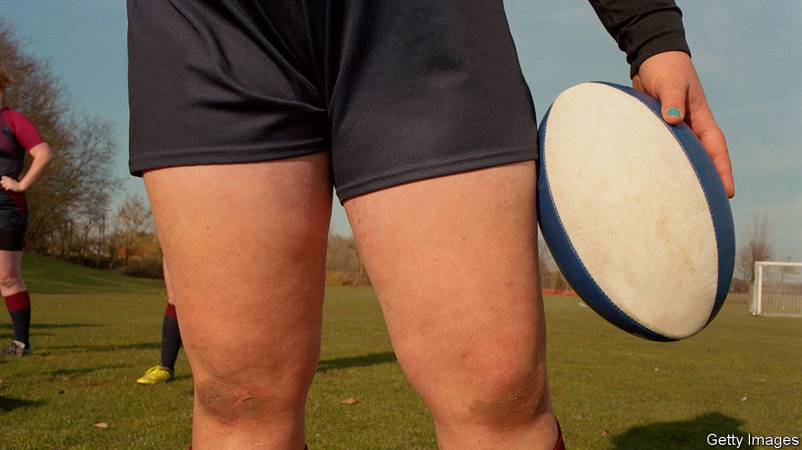

## Transgender rights

# Letting trans women play in women’s sports is often unfair

> Other sports could learn from World Rugby’s approach

> Oct 17th 2020

ON OCTOBER 9TH World Rugby, the global governing body for rugby union, announced that it would bar transgender women—people born male, but who identify as women—from playing in the international women’s game. The decision drew condemnation from some quarters and praise from others; England’s rugby authorities have already said they will carry on allowing trans women to play at all other levels of the game within England. It puts World Rugby at odds with the International Olympic Committee (IOC), whose rules allow trans women to compete in women’s Olympic events, and with several other sports that have followed the IOC’s guidance. Trans women competitors have enjoyed success in sports including weightlifting, cycling and athletics. Yet World Rugby’s decision to exclude them was the right one. Other sports should follow its lead.

The first thing they should note is how the decision was made. The debate over transgender rights, especially online, can be extremely bad-tempered and poisonous. World Rugby brought scientists, ethicists, athletes and lawyers together in person, to present calmer arguments directly to the sport’s administrators. Those presentations were made public, in the interests of transparency. And the decision relied, as far as possible, on the evidence.

They should also note what that evidence shows (see [article](https://www.economist.com//node/21792827)). It came in two strands. One confirmed what everyday experience suggests. Most males are bigger, faster and stronger than most females; some males are bigger, faster or stronger than any female. The second concerned the role of testosterone, the male sex hormone and anabolic steroid that is responsible for much of that sporting advantage. The IOC permits trans women to compete in women’s events only if they suppress the amount of testosterone circulating in their blood.

The evidence presented to World Rugby was not perfect, but it was enough to suggest strongly that this compromise does not work. Suppressing testosterone appears to have only a minor impact on strength—too small to undo the advantages bestowed by male puberty. And no amount of hormone therapy can shrink skeletons. That was enough for World Rugby to decide that the risk posed by trans women to other players in the women’s game would be too great. It has said it is ready to fund more research and will review its decision regularly. But in a risky sport already worried about the long-term impact of common injuries like concussion, its conclusion makes sense.

That evidence matters for non-contact sports, too, for it also concerns fairness. Women’s sport exists precisely to exclude males. That is true at both the elite level, where rewards are greatest, and at the recreational one, where the vast majority of sport is actually played. Without it, half the population would be left struggling against an insurmountable advantage granted by mere biological chance to the other half. If testosterone suppression cannot remove that advantage, then it is unjust for those who still possess it to compete against those who never did. (It is worth noting that this leaves room for trans men—those born female—to play in men’s sports if they wish, since they possess no biological advantage, and in contact sports are unlikely to pose a danger to their fellow competitors.)

Advocates for trans women often argue that inclusion should trump such worries. But sport is a zero-sum game, which means inclusion cuts both ways. If trans women possess a biological advantage, then allowing them to compete risks depriving others of victories they might otherwise have won, or a place in a team they might otherwise have earned. Most sports acknowledge that trade-off, at least in principle. The IOC itself notes that “the overriding sporting objective is and remains the guarantee of fair competition.” It is, in the end, simply a question of fact whether testosterone suppression can guarantee that fair competition in practice. And the evidence so far suggests it cannot. ■

## URL

https://www.economist.com/leaders/2020/10/17/letting-trans-women-play-in-womens-sports-is-often-unfair
