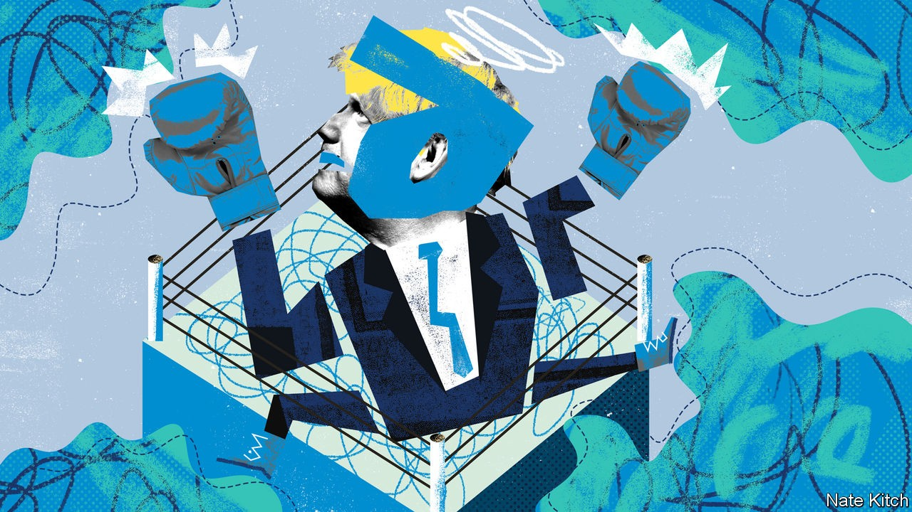

## On the debates, Germany, energy, Colombia, trade, Dominic Cummings

# Letters to the editor

> A selection of correspondence

> Oct 17th 2020

Letters are welcome via e-mail to [letters@economist.com](https://www.economist.com/mailto:letters@economist.com)

[Lexington ](https://www.economist.com//united-states/2020/09/30/the-end-of-the-debate)described the Commission on Presidential Debates as “non-partisan” (October 3rd). It is more accurately bi-partisan, run by Democrats and Republicans. The presidential debates used to be organised by a non-partisan group, the League of Women Voters, which in 1976, 1980 and 1984 chose the dates, locations and moderators. In 1980 the league let John Anderson, an independent candidate, participate in the forum.

But in 1988 Democrats and Republicans presented a list of demands to take control of the debates. The league’s trustees decided to pull out, because the parties wanted to select the questioners, the composition of the audience, access for the press and other issues. It described the ultimatum as “a fraud on the American voter…it has become clear to us that the candidates’ organisations aim to add debates to their list of campaign-trail charades devoid of substance, spontaneity and honest answers to tough questions”. The two parties then formed the Commission on Presidential Debates, giving themselves power over all aspects of the forum that the league had rejected. The parties established a rule that no other political party could participate unless it polled at least 5% before the debates, the selection of polls to be decided by the commission. However, in 1992, when Ross Perot’s Reform Party, did poll above 5% and he was included, the commission increased the threshold to the current 15%.

STEVE RESZReston, Virginia

I enjoyed the article on Germany’s growing leadership role in Europe, but you should note that Felipe González was not the only European leader to support German reunification (“[Waking Europe’s sleeping giant](https://www.economist.com//leaders/2020/10/03/thirty-years-after-reunification-germany-is-shouldering-more-responsibility)”, October 3rd). The Irish presidency of the EU under Charles Haughey in 1990 was instrumental in securing backing for German unity by assuaging French and British concerns. Helmut Kohl recognised this, saying in 1996 that he would “never forget how in a dramatic meeting of the European Union in December 1989, it was not least the Irish prime minister who supported us Germans and myself in a very difficult situation”.

For Ireland, German unification was a geopolitical Goldlöckchen, neither too big for Europe, nor too small for the world, but just right.

ALEXANDER CONWAYGroningen, Netherlands

Your leader on the future of energy did not have much to say about Africa and Asia outside China, continents where the real battle over fossil-fuel use and carbon emissions will play out over the next century (“[Power in the 21st century](https://www.economist.com//leaders/2020/09/17/is-it-the-end-of-the-oil-age)”, September 19th). The practical big win would be to get Asian countries to develop natural gas instead of coal in their next phase of development. This will not appeal to climate-change purists.

Africa will come next. Goma, in the east of the Democratic Republic of Congo, relies almost entirely on wood-sourced fuel. Environmentally, for climate change, and for human health, wood is worse than coal. Practical progress here will not start with high-tech solutions. Instead, it would be beneficial to encourage replacing wood with liquid propane gas, which has been happening in India.

As for wind power, the turbines naturally are at locations and altitudes frequented by migratory birds. The threat to raptors is particularly acute.

R. PAUL DRAKEProfessor emeritus of climate and space sciences and engineering at the University of MichiganGaylord, Michigan

Companies everywhere “need to step up their action against climate change”, you say in your [special report](https://www.economist.com//special-report/2020/09/17/the-great-disrupter) on what business should do to tackle emissions (September 19th). One way would be to leave meat off the company menu. In 2018, WeWork decided no longer to offer meat at its events and stopped reimbursing staff for meals that included meat. It estimated that this will save 202m kilograms of carbon-dioxide emissions by 2023. WeWork’s ban took effect overnight. What other measure could shrink a company’s carbon footprint so quickly?

NICK BRELANDPensacola, Florida

Another “green machine” that helps tackle climate change is the paper book, a good replacement for electronic books. Paper books store carbon and are recyclable. Unlike e-books they require no energy to operate. Moreover, they are safe from hacking and are more difficult for governments to censor.

STEPHEN BORKOWSKIPittsburg, Texas

The synchronised destruction of 95 police facilities, vandalism, looting and arson that took place after the death of a taxi driver can hardly be categorised as a natural expression of citizens’ rage (“[Fight crime, not war](https://www.economist.com//the-americas/2020/09/19/why-colombias-militarised-police-need-reform)”, September 19th). Legitimate protests that broke out after the clearly excessive use of force by the police (seven of whom were immediately suspended) soon turned to chaos. The violence was organised, some by members of the FARC dissident guerrilla group.

The National Police of Colombia is an institution dedicated to law and order, forged in the decades-long fight against the drug cartels and the criminal activities of the insurgents. The reprehensible actions of a few does not define the professionalism of its 167,000 men and women. Last year Colombia had its lowest homicide rate since 1976 and its lowest kidnapping rate since 1984. There has been a steep decrease in crimes like extortion and burglary.

That said, there is always room for improvement. President Iván Duque has launched the Citizen Security Framework Policy, which aims to improve police performance in areas such as education and training, recruitment, transparency and integrity.

ANTONIO J. ARDILA GAmbassador of ColombiaLondon

Investor-state dispute-settlement* In your article on ISDS and the environment (“[How some international treaties threaten the environment](https://www.economist.com//finance-and-economics/2020/10/05/how-some-international-treaties-threaten-the-environment)”, October 5th), you list the value of assets in the power sector covered by ISDS; frequent use of ISDS by fossil-fuel companies evidencing its threat; and potential compensation being unquantifiable, as cause for worry. These are based on several oversimplifications and as a result, come across as scaremongering. 

Arbitrators apply recognised accounting methods tailored to the asset in question so compensation is quantifiable. Moreover, of the seven awards you cite to in order to argue ISDS is a real threat, not one concerns a case in which a state had to compensate a company for enacting regulation designed to curb carbon emissions. The value of assets in the power sector does not have to matter either. Investment treaties permit that states adopt measures for a public purpose, provided these are not discriminatory or violate specific promises given to the company. Therefore states acting accordingly, in theory, do not run risks when passing green regulation. If some companies bring claims, this does not mean they will prevail and whether large sums of money are involved thus becomes irrelevant. Importantly, investment treaties also protect investments in renewable energy. Spain and Italy, for example, have been taken to arbitration for reversing incentives to invest in solar energy. Granted: ISDS is not perfect. But it is not as scary as you make it out to be. OLIVER WHITEHEADAmsterdam, The Netherlands

Yes, the idea of yogurt as strategic is idiotic, but [Charlemagne ](https://www.economist.com//europe/2020/10/03/the-revenge-of-strategic-yogurt)missed the point from his lofty perspective on trade policy (October 3rd). Business is not only global; it affects ordinary life in important ways, which are often ignored by politicians and journalists. The Frenchness of Danone is important to French people, however silly that might appear to everyone else. In Britain there are dark suspicions that Doc Martens boots are of lower quality since most of their manufacture was moved from Northampton to Asia. Norwich is bereft without Colman’s mustard. After the strategic-yogurt imbroglio in 2005, the British were told how grown-up they were for letting Cadbury’s be sold to Kraft. But the American food company changed all the wrappers on Roses chocolates, which many of us thought was a worse blight on Christmas 2016 than Brexit plus Donald Trump combined.

KIERON O’HARAThe Hague

It would be quicker to list the institutions that Boris Johnson and Dominic Cummings are not at war with ([Bagehot](https://www.economist.com//britain/2020/09/19/boris-v-the-blue-blob), September 19th). After Battersea Dogs & Cats Home and the National Trust one tends to run out.

ROD TIPPLECambridge, Cambridgeshire

* Letters appear online only

## URL

https://www.economist.com/letters/2020/10/17/letters-to-the-editor
